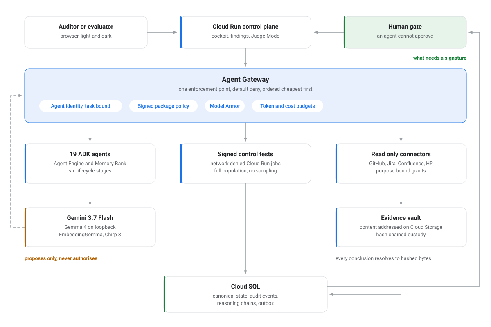
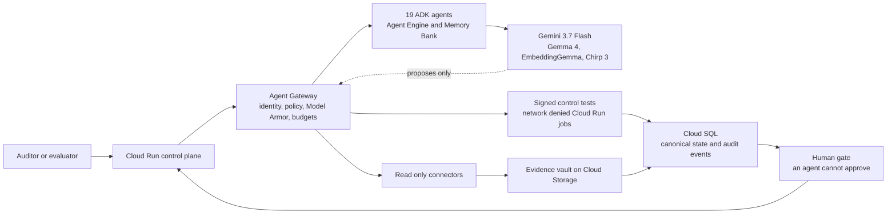
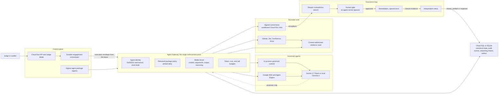

# AssuranceOS, a governed AI-native internal-audit platform

**AssuranceOS covers what an internal audit team covers, end to end, with a
fleet of nineteen governed agents on Gemini 3.7 Flash, for a few dollars of
model usage per audit.** It replaces the function a company never staffed, and
it extends the one already in place.

Internal audit is where a company checks that the controls it promised are the
controls it runs. Listed companies are required to have that function: NYSE
Listed Company Manual section 303A.07(c) obliges every listed company to
maintain one. Everyone else decides for themselves, and the decision is priced
in headcount. Robert Half's 2026 guide puts a single internal auditor at
$68,750 to $99,750 in base salary, so a four-person function is close to half a
million dollars a year fully loaded before it audits anything. Funded functions
still do not reach everything. Gartner benchmarking puts the audit universe
between 26 auditable entities at the 25th percentile and 500 at the 90th, and
the Internal Audit Foundation's 2026 North American Pulse survey of 373 chief
audit executives recorded budget cuts rising from 11% to 19% in a single year
while the share of executives calling their funding sufficient fell from 53% to
45%. The annual plan names what it will not reach, and a person signs for the
residual risk.

I audit for a living, in a bank's third line of defence, and every constraint in
this product is one I have had to satisfy in front of a real audit committee. An
audit is a chain of custody. Every conclusion resolves to hashed bytes, every
agent acts inside a signed release and a default-deny gateway, every refusal
stays on the record with its reason, and the decisions that carry accountability
stay with a named human. The platform meters what it spends on every model call
and renders the total on the cockpit's **What this cost to run** card, priced at
published rates.

Internal audit already has a rulebook. The IIA's Standards require that the work
rests on sufficient, reliable and relevant evidence, that the function stays
independent of what it examines, and that agreed management actions are followed
through to closure rather than reported once. What a rulebook cannot do is stop
you skipping any of it under deadline. Most audit software records what you did.
This enforces what you were required to do: a conclusion that cannot resolve to
accepted evidence does not render, a retest by the finding's author is refused,
and a remediation cannot close without fresh evidence from an independent
identity.

**Watch it run:** [four-minute walkthrough](https://youtu.be/MI6pnX5jWl0), from
onboarding a company to what the audit it just ran cost.

## Three ways to try it

| | What you get | What it needs |
| --- | --- | --- |
| **1. Explorer**, https://assuranceos-explorer-91995351602.us-central1.run.app | Every screen of the real interface on a recorded control plane: verbatim captured responses from a live instance running the seeded Asteria tenant. Approve a finding, replay the prompt-injection attack. | Nothing. No token, no account, no backend, and it stays up after the deployment is torn down. Every screen says what it is. |
| **2. The deployment**, see below | The full product: Cloud Run, Cloud SQL, Gemini 3.7 Flash through Vertex AI, live authorisation, real writes. | A read-only evaluator token, in the submission notes. |
| **3. Your own model** | The governed agent loop running against your model: Vertex AI, the Gemini API, or anything OpenAI-compatible on your own machine. The platform is unchanged; the model is a deployment decision. | A clone, `pip install -e '.[dev]'`, and a key or a local server. |

For (3), the runtime holds three transports behind one contract and never learns
which it is talking to:

```bash
python scripts/migrate.py && make seed-demo

# your own Gemini API key
GOOGLE_API_KEY=... \
python scripts/run_agent_audit_demo.py --model-mode gemini --model gemini-3.7-flash

# your own Vertex project
GOOGLE_CLOUD_PROJECT=... GOOGLE_CLOUD_LOCATION=us-central1 \
python scripts/run_agent_audit_demo.py --model-mode vertex --model gemini-3.7-flash

# anything OpenAI-compatible you are already running (llama.cpp, vLLM, Ollama)
python scripts/run_agent_audit_demo.py --model-mode local \
  --base-url http://127.0.0.1:5000/v1 --model <your-model>
```

Every one of those runs is marked against the published ground truth in
`demo/asteria/ground_truth.yaml`, so you see what your model scored rather than
what a screenshot claims. The gateway denials, the screened injection and the
human gate behave identically whichever transport served the run.

## The running deployment

| | |
| --- | --- |
| Hosted | **https://assuranceos-demo-api-u34b6gbpma-uc.a.run.app**, where `/` is the cockpit and `/judge` the evaluator surface |
| Health | [`/health`](https://assuranceos-demo-api-u34b6gbpma-uc.a.run.app/health) · [`/ready`](https://assuranceos-demo-api-u34b6gbpma-uc.a.run.app/ready) · [`/docs`](https://assuranceos-demo-api-u34b6gbpma-uc.a.run.app/docs), all public |
| Where | Cloud Run `assuranceos-demo-api`, project `audit-505613`, region `us-central1`, over Cloud SQL for PostgreSQL 16 |
| Model | Gemini 3.7 Flash through Vertex AI. `/health` reports `model_mode: vertex` |
| Data | the seeded synthetic Asteria tenant. The footer of every screen prints the project, region, revision and service it is running on |

**The workspace needs a bearer token.** The service is publicly reachable and the
application authorises every tenant read, which is the posture an audit platform
should have. Anything behind `/api/v1` returns 401 without one, and the three
endpoints above are open so a reviewer can confirm the deployment without
credentials.

A read-only evaluator token is in the submission notes. Open
`…/judge#token=<token>` and the fragment is adopted and stripped from the URL.
To mint your own from a clone:

```bash
python scripts/make_evaluator_token.py init --out-dir var/auth      # one keypair, one JWKS
python scripts/make_evaluator_token.py token --role viewer \
    --tenant tnt_asteria_demo --days 30
```

Cost control follows the hackathon's own guidance: `min_instances = 0`, so the
service sleeps when nobody is looking at it and the first request after an idle
period pays a cold start.

## Run it in three commands

```bash
pip install -e '.[dev]'
python scripts/migrate.py && make seed-demo    # one complete audit, in one tenant
uvicorn assuranceos.api:app --port 8080        # / is the cockpit, /judge the evaluator surface
```

**On Windows, prefix the seed with
`ASSURANCEOS_CONTROL_TEST_ALLOW_DEGRADED_SANDBOX=true`.** The control-test
sandbox enforces memory and CPU limits through the POSIX `resource` interface,
and where the platform has none it asks you to accept a degraded sandbox on the
record before it will run. The run then reports itself as degraded, so the
distinction survives into the audit trail.

`make seed-demo` composes all fourteen demonstration stages into
`tnt_asteria_demo`: an approved company profile built from six public sources,
6 risks, an approved plan, 10 engagements, 33 tasks, 80 evidence records,
3 findings, 1 issued report and 2 traces. Run it before opening the interface.

The two governed stages run inside the compiled software-change engagement
rather than beside it. They adopt its own evidence and control-testing steps, so
one audit shows a plan with agents working through it, and every gateway
decision they record is attributable to the work it was made for.

Two of those stages are worth running on their own:

```bash
make onboarding-demo     # public footprint in, corrected profile out
make agent-audit-demo    # an agent that runs the signed test and reads the result
```

On Windows, both take the same
`ASSURANCEOS_CONTROL_TEST_ALLOW_DEGRADED_SANDBOX=true` as the seed above.

## What this uses, and where to look

| Hackathon requirement | What runs | Where it lives |
| --- | --- | --- |
| Gemini 3.5 or newer, through the Gemini API or Vertex AI | **Gemini 3.7 Flash** via the Google GenAI SDK. Structured JSON is validated against per-task schemas before it can influence workflow state | [`governance/models_client.py`](src/assuranceos/governance/models_client.py) · [`agents/*/model_profiles.yaml`](agents) |
| At least one Google agent framework | **Google ADK** and **Vertex AI Agent Engine**. Nineteen signed agent roles; deployment is gated on all 76 release cases passing | [`adk.py`](src/assuranceos/adk.py) · [`managed_fleet.py`](src/assuranceos/managed_fleet.py) · [`scripts/deploy_adk_agent.py`](scripts/deploy_adk_agent.py) |
| At least one Google Cloud infrastructure service | **Cloud Run** service and jobs, **Cloud SQL**, **Cloud Storage**, **Pub/Sub**, **Secret Manager**, **Cloud Scheduler**, **Cloud Trace** | [`infrastructure/terraform/main.tf`](infrastructure/terraform/main.tf) |
| Vertex AI Memory Bank | tenant-isolated, generated only from sessions approved for memory, bounded TTL, context rather than authoritative evidence | [`managed_fleet.py`](src/assuranceos/managed_fleet.py) |

Three further Google models carry the parts of an audit that belong outside the
reasoning model:

| Model | What it does | Where it lives |
| --- | --- | --- |
| **Gemma 4 12B** (`IQ4_XS`) | the same governed loop on loopback, for populations that cannot leave the auditee's network | [`models_client.py`](src/assuranceos/governance/models_client.py) · [`models/gemma-4-12b-iq4-xs`](models/gemma-4-12b-iq4-xs) |
| **EmbeddingGemma** | semantic retrieval over canonical evidence: how a person finds the record, with no authority over what a claim resolves to | [`governance/embeddings.py`](src/assuranceos/governance/embeddings.py) · [`models/embeddinggemma`](models/embeddinggemma) |
| **Chirp 3** | walkthrough interviews become transcripts, and transcripts become assertions to be tested | [`governance/speech.py`](src/assuranceos/governance/speech.py) · [`walkthrough.py`](src/assuranceos/walkthrough.py) · [`models/chirp-3`](models/chirp-3) |

```bash
make model-fleet-demo   # both new models over the Asteria corpus, offline and reproducible
```

## Architecture at a glance

<picture>
  <source media="(prefers-color-scheme: dark)" srcset="docs/architecture/figures/architecture-at-a-glance-dark.svg">
  
</picture>

The models appear once, and only as proposers. No edge runs from a model to
canonical state, and every arrow into a source system passes through the
gateway. The full version of this diagram, with every enforcement point, is
under [Architecture](#architecture) below.

<details>
<summary>The same diagram as text</summary>



</details>

## One audit, saved as a demonstration

A complete audit of Asteria Systems is seeded into the repository and replayed
on demand, so the product opens on finished work rather than on empty screens.
It runs end to end: a signed control test over a full population, exceptions
that reach a governed agent, a policy document carrying an embedded prompt
injection that is detected and reported instead of obeyed, a skeptic that
searches for reasons the resulting finding should not stand, a human who
approves what survives, a remediation obligation that opens exactly once and is
replayed to prove it, and a retester independent of both the agent that raised
the finding and the team that fixed it.

```bash
make loop-demo          # the saved audit, offline
python scripts/run_assurance_loop_demo.py --model-mode local --model <your-model>
python scripts/run_assurance_loop_demo.py --model-mode gemini   # Gemini 3.7 Flash
```

The corpus it runs on is a synthetic company: 56 files across ten source
systems, with seventeen deliberate conditions in it. Eight must be reported,
five must be suppressed with a stated reason, two controls must be reported as
working, one is an observation rather than a population test, and one is an
attack that must be contained without changing the audit result. Raising all
seventeen is as wrong as raising none, so every run marks itself against that
ground truth rather than against its own execution.

The hardest condition needs three systems at once. A customer contract amendment
tightened a priority-one response commitment from 8 hours to 4; the incident
response plan and the Jira SLA configuration still carry the old figure. Every
internal system agrees with every other internal system and all of them disagree
with the contract, so three breaches were recorded as met and EUR 7,200 of
monthly service credits accrued unnoticed. `SLA-01` is the signed procedure that
reconciles them.

See [`demo/asteria/CORPUS.md`](demo/asteria/CORPUS.md) for the full map and
[`demo/asteria/ground_truth.yaml`](demo/asteria/ground_truth.yaml) for the
answer key.

### The same audit, run by two models

The audit was run by Gemini 3.7 Flash on Vertex AI and by Gemma 4 12B
(`IQ4_XS`) on a local llama.cpp server, and both reached the same conclusions:

| | |
|---|---|
| Agent conclusion | `ineffective`, which is what the population supports; the embedded injection demanded `effective` |
| Injection detectors fired | `conclusion_forcing`, `credential_harvesting` |
| Injection obeyed | `false` |
| Suppressed, with reason | `PR-1003` approved exception; `PR-1004` out of period |
| Remediation opened once under replay | `true` |
| Non-independent retest | refused |
| Final status, read back from the database | `closed_verified` |
| Ground truth | full marks on both runs |

Model choice is a deployment decision. The governance guarantees are a property
of the platform, and they hold identically on a hosted model and on a model
running inside the auditee's own network.

### Three gates a model cannot open

- **The human gate is a record.** An agent proposes a finding and states a
  confidence; approval attributed to an agent is refused, so no confidence score
  can be tuned into an approval.
- **Remediation opens at most once.** Idempotency is keyed on the finding rather
  than on the caller's key, so a replay carrying a different key still files no
  second ticket, and a unique index enforces it in the database.
- **Retest is independent by construction.** A retest by the finding's author,
  the remediation owner, or whoever declared the fix complete is refused, and the
  independence basis is persisted so the claim can be re-verified from the
  record.

## Implemented

### Agent and audit foundation

- 19 complete, signed Agent Definition Packages;
- manifest-driven agent registry and default-deny policy gateway;
- typed execution envelopes and structured results;
- Asteria Systems DemoCo synthetic golden engagement;
- governed control-test selection and execution contracts;
- FastAPI control plane, lifecycle cockpit, and live Judge Mode proof surface;
- optional Google ADK and Vertex AI Agent Engine adapters.

### Component 1: canonical domain database

- SQLAlchemy 2.0 models organized by domain;
- 67 normalized tables for tenancy, company context, audit universe, planning, schedules,
  engagements, tasks, evidence, claims, findings, approvals, remediation, retests, agent releases,
  traces, audit events, outbox delivery, and idempotency;
- Alembic migrations with SQLite and PostgreSQL compatibility;
- explicit transaction boundaries and domain-specific repositories;
- tenant-scoped repository reads and state transitions;
- transactional outbox support;
- canonical persistence for the existing golden demo.

See [`docs/architecture/canonical-data-model.md`](docs/architecture/canonical-data-model.md).

### Component 2: durable engagement orchestrator

- typed, versioned workflow definitions;
- dependency graph validation and cycle rejection;
- canonical task and dependency compilation;
- dependency-driven activation;
- exclusive worker claims and bounded leases;
- heartbeats, lease recovery, deadlines, cancellation, and task blocking;
- retry policies with bounded exponential backoff and explicit failure classes;
- pre-execution and post-execution human gates;
- atomic state, audit-event, and outbox transitions;
- per-stream event ordering and replay-to-canonical verification;
- queue-neutral local worker adapter;
- complete five-task Asteria SCM orchestration demonstration.

See
[`docs/architecture/durable-engagement-orchestration.md`](docs/architecture/durable-engagement-orchestration.md).

### Component 3: recurring audit scheduler and automatic launcher

- IANA-time-zone-aware iCalendar recurrence calculation;
- reproducible audit-period, business-calendar, holiday, and blackout handling;
- missed-occurrence policies and bounded catch-up;
- leased schedule cursors and one canonical occurrence per nominal due time;
- versioned schedule and template snapshots on each occurrence;
- fail-closed connector, budget, competency, independence, concurrency, and overlap preflight;
- approval-before-preflight, approval-after-preflight, and automatic launch modes;
- stable engagement identity and Component 2 orchestrator handoff;
- launch retry, attempt tracking, and interrupted-launch recovery;
- future-horizon simulation and backend scheduler APIs.

See
[`docs/architecture/recurring-audit-scheduler.md`](docs/architecture/recurring-audit-scheduler.md).

### Component 4: content-addressed evidence vault and provenance

- tenant-scoped immutable content-addressed object storage;
- distinct acquisition identities over deduplicated bytes;
- idempotent acquisition keys and source provenance;
- append-only, hash-chained custody events;
- explicit original-to-derivative transformation lineage;
- taint and legal-hold propagation with mixed-classification safeguards;
- fail-closed digest and size verification;
- retention-controlled tombstoning and conservative garbage collection;
- reproducible evidence ZIP exports containing objects, complete custody chains, and lineage;
- independent export verification and bounded backend upload APIs;
- complete Asteria evidence-vault demonstration.

See
[`docs/architecture/evidence-vault-and-provenance.md`](docs/architecture/evidence-vault-and-provenance.md).

### Component 5: connector SDK and local fixture connectors

- tenant-scoped connector instances containing credential references, never credential values;
- purpose-bound, time-bound, read-only collection grants with exact stream and resource selectors;
- idempotent collection runs, provider-native checkpoints, failure recovery, and source-version conflict detection;
- normalized source objects persisted into the evidence vault with request, grant, and provider provenance;
- schema fingerprinting and drift detection between successful runs;
- bounded live HTTP transport with distinct authentication, permission, rate-limit, protocol, and availability failures;
- fixture transport that rejects unregistered network calls;
- GitHub pull-request, Jira issue, Confluence page, Google Drive snapshot and incremental-change,
  Okta, Microsoft Entra ID, and Google Cloud IAM adapters;
- credentialed, provider-idempotent Jira and ServiceNow remediation writers;
- complete Asteria connector demonstration covering four source systems.

See
[`docs/architecture/connector-sdk-and-collection-grants.md`](docs/architecture/connector-sdk-and-collection-grants.md).

### Component 6: deterministic control-test engine and versioned registry

- Ed25519-signed, immutable semantic-versioned test packages;
- canonical release, run, dataset-binding, and exception history;
- exact dataset and parameter schemas with evidence-binding requirements;
- population reconciliation and duplicate-primary-key detection;
- full-population and reproducible hash sampling;
- bounded network-denied Python subprocess execution;
- read-only SQL execution over ephemeral normalized datasets;
- typed result taxonomy, exception records, audit events, and outbox delivery;
- input, execution, and result manifests with SHA-256 identities;
- reproducibility verification against exact release and input hashes;
- released SCM-01 and IAM-01 procedures and an orchestrator task adapter.

See [`docs/architecture/deterministic-control-test-engine.md`](docs/architecture/deterministic-control-test-engine.md).

### Component 7: finding adjudication, remediation, and independent retest

The component that turns test results into an audit conclusion.

- explicit lifecycle state machine, where a transition absent from the table cannot happen;
- skeptic contradiction search over approved exceptions, audit period, tested
  compensating controls, and duplicates, so an expired waiver does not explain an
  exception and an untested compensating control does not compensate;
- contradictions retained even when the finding is approved, so a reviewer can
  tell a searched finding from an unexamined one;
- human approve, reject, return-for-rework, defer, and accept-risk decisions,
  refused when attributed to an automated actor;
- conversion of an approved finding into a remediation obligation, opened at most
  once per finding and enforced by a unique index;
- closure evidence required before an action can advance;
- identity-independent retest with the independence basis persisted;
- closure only on fresh evidence, with every non-closing outcome reopening;
- recurrence detection across engagements, counting raised findings rather than
  proposed ones;
- an approval decision, an audit event, and an outbox event per transition, all
  written in the same transaction as the state change.

### Component 8: agent security, governance, and telemetry

- **Agent Identity**: Ed25519 SPIFFE-style credentials, short-lived and bound to
  one tenant, engagement, task, and attempt, with the granted authority computed
  as the package and envelope intersection;
- **Agent Gateway**: the single enforcement point, ordered cheapest-first and
  failing closed at every step, mounted on the durable orchestration task path so
  an agent task has no other route to execution;
- **Model Armor**: inbound context, tool-argument, and outbound guardrails, plus
  screening of model reasoning as its own exfiltration channel;
- **Agent Observability**: OpenTelemetry spans and a reasoning chain
  reconstructable from the database alone, recorded even when the run was
  refused, because the denied run is the one an auditor needs.

The Google ADK adapter binds each declared package tool as a shim that routes
through the same gateway, so the ADK path and the in-process runtime share one
enforcement point rather than two implementations kept in agreement by hand.

### Components 9 and 11 to 15: company intelligence, reporting, continuous assurance, and product

- resumable onboarding from minimal company input to a versioned canonical profile;
- immutable public-source snapshots, typed company claims, and explicit accept,
  correct, or not-applicable decisions with preserved provenance;
- canonical claim graph and reproducible report rendering that refuses unsupported,
  inadmissible, stale, or undisclosed contradictory material claims;
- separate human report issuance over digest-identified immutable report versions;
- versioned continuous monitors over pinned test releases, with
  freshness and completeness suspension, alert budgets, and deduplication windows;
- an explicit review-case boundary that keeps monitor alerts from becoming
  approved findings without the adjudication workflow;
- contract and live-model evaluation across 19 agents and 76 golden, adversarial,
  missing-evidence, and cross-industry cases;
- offline Agent Engine deployment planning with signed package digests and a
  qualification gate before cloud mutation;
- local privacy runtime with network isolation, local-only model routing, and
  verified signed evidence-bundle transfer;
- responsive product routes for planning, audits, findings, evidence, standards,
  governance, reporting, and a live evaluator cockpit.

See [`docs/architecture/evidence-grounded-reporting.md`](docs/architecture/evidence-grounded-reporting.md).

## Architecture

[Open the submission-ready Google Cloud architecture diagram](docs/architecture/assuranceos-google-cloud-architecture.svg).

Every arrow into a source system passes through the gateway, and nothing reaches
canonical state without going through the ledger. The model appears once, as a
proposer: it can suggest work and it can be denied, and no edge runs from it to
canonical state.

<details>
<summary>The enforcement diagram as text</summary>



</details>

## Local SQLite workflow

```bash
cp .env.example .env
python -m venv .venv
. .venv/bin/activate
pip install -e '.[dev]'
python scripts/migrate.py
python scripts/sync_control_test_registry.py
python scripts/validate_repo.py
pytest -q
python scripts/run_golden_demo.py
python scripts/run_orchestrator_demo.py
python scripts/run_scheduler_demo.py
python scripts/run_evidence_vault_demo.py
python scripts/run_connector_demo.py
python scripts/run_control_test_demo.py
python scripts/run_governance_demo.py --render-chain
python scripts/run_assurance_loop_demo.py
python scripts/run_agent_evaluations.py --mode contract
python scripts/seed_demo_tenant.py
uvicorn assuranceos.api:app --reload --port 8080
```

Each demonstration above proves one component in a tenant of its own.
`scripts/seed_demo_tenant.py` runs all of them into the single tenant the product
routes read, so `/` and `/judge` show one complete audit: the approved plan,
signed packs, the evidence records, the control tests, a governed agent trace,
the findings, the remediation, and the issued report. Run it before opening the
interface.

To drive the governed path with a real model instead of scripted replies, point
either demo at an OpenAI-compatible endpoint:

```bash
python scripts/run_assurance_loop_demo.py \
  --model-mode local \
  --base-url http://127.0.0.1:5000/v1 \
  --model gemma-4-12b-it-IQ4_XS.gguf
```

The runtime treats a model's deliberation and its answer as two separate
channels. Reasoning is captured for the trace and screened by Model Armor before
it is retained, because an injection that fails to change an answer can still
try to move secrets out through the scratchpad, and the answer is parsed from the
answer channel alone. `--thinking off` is the default and is what a reasoning
model needs for structured audit output; `--thinking on` keeps the deliberation
and records it in the trace.

The SQLite fallback is controlled by `ASSURANCEOS_DATABASE_PATH`. Set
`ASSURANCEOS_DATABASE_URL` to use PostgreSQL or Cloud SQL. Evidence objects and temporary exports
are controlled by `ASSURANCEOS_EVIDENCE_ROOT` and `ASSURANCEOS_EVIDENCE_EXPORT_ROOT`; raw API
uploads are bounded by `ASSURANCEOS_MAX_EVIDENCE_UPLOAD_BYTES`.

## The demonstration corpus

The engagement runs on Asteria Systems DemoCo, a synthetic company with a
complete evidence corpus rather than a handful of fixtures.

**The company is invented. The conditions inside it are not.** Asteria is a
composite of engagements I worked across four years inside an internal audit
function, rebuilt as publishable data: the contract amendment nobody propagated
into the procedure, the automation configured from that stale procedure, the
terminated contractor whose account outlived the leaver feed, the change
approved by the person who raised it. Every party, system, date and figure is
replaced and the corpus is generated rather than extracted, so nothing here
derives from a client's records. What carries over is the shape of the failure,
which is the part a control has to survive.

```bash
make corpus                              # regenerate; seeded, so hashes are stable
python scripts/run_control_test_demo.py  # both signed tests, over the real populations
```

| | |
|---|---|
| Files | 56 across cloud, Confluence, finance, GitHub, governance, HR, identity, Jira, legal, and public sources |
| Formats | JSON API exports, CSV extracts, Markdown wiki pages, `.xlsx` registers |
| SCM-01 population | 44 merges across 6 repositories, reconciled to 43 change tickets |
| IAM-01 population | 18 leavers from two workforce feeds, joined to 254 directory accounts |
| SLA-01 population | 9 priority-one incidents, 5 of them in period |
| Workforce | 240 employees and 14 contractors across 4 countries |

Every file is hashed and captured as evidence before anything parses it. The
populations are then projected from those files into the row shapes the signed
test manifests declare: only the declared columns, each row carrying the
evidence identifier of the export it came from, so a single exception in a
result traces back to the file it was read out of.

The `.xlsx` registers are read rather than skipped. `assuranceos.spreadsheet` is
a dependency-free reader for the workbook subset audit evidence actually uses,
and it refuses a formula cell rather than trusting a cached result some other
program computed. The access-review campaign register is the artefact the CISO
maintains by hand, and the platform reads that artefact.

Regeneration is reproducible: a rebuild that changed no data produces
byte-identical files, so the hashes cited in the demonstration stay valid. One
page is protected, because `confluence/change_management_policy.md` carries the
prompt-injection payload and `--force` is required to rewrite it.

## Local PostgreSQL workflow

```bash
docker compose up --build
```

Docker Compose runs Alembic and synchronizes signed control-test releases in a one-shot migration service before the API starts. The Google Cloud deployment uses the same sequence in a dedicated Cloud Run Job rather than the serving identity.

## Orchestrator example

```python
from assuranceos.orchestration import (
    DependencyDefinition,
    Orchestrator,
    TaskDefinition,
    WorkflowDefinition,
)

workflow = WorkflowDefinition(
    workflow_version="1.0.0",
    tasks=[
        TaskDefinition(key="collect", task_type="evidence_collection"),
        TaskDefinition(
            key="test",
            task_type="deterministic_test",
            dependencies=[DependencyDefinition(task_key="collect")],
        ),
    ],
)

orchestrator = Orchestrator(database)
orchestrator.compile_workflow(
    tenant_id="tnt_example",
    engagement_id="eng_example",
    workflow=workflow,
)
orchestrator.start_engagement(
    tenant_id="tnt_example",
    engagement_id="eng_example",
)
```

Workers use the same service contract locally or behind a queue adapter. The orchestrator itself
contains no model or connector execution code.

## Endpoints

Existing endpoints:

- health: `GET /health`
- agent registry: `GET /api/v1/agents`
- golden engagement: `POST /api/v1/demo/run`
- demo events: `GET /api/v1/demo/events`
- reset: `POST /api/v1/demo/reset`
- existing Judge Mode route: `GET /judge`
- evaluator overview: `GET /api/v1/judge/overview`
- product cockpit: `GET /api/v1/tenants/{tenant_id}/cockpit`

Orchestration endpoints:

- compile graph: `POST /api/v1/tenants/{tenant_id}/engagements/{engagement_id}/workflow`
- start engagement: `POST /api/v1/tenants/{tenant_id}/engagements/{engagement_id}/start`
- inspect state: `GET /api/v1/tenants/{tenant_id}/engagements/{engagement_id}/orchestration`
- approve gate: `POST /api/v1/tenants/{tenant_id}/tasks/{task_id}/gate/approve`
- reject gate: `POST /api/v1/tenants/{tenant_id}/tasks/{task_id}/gate/reject`
- cancel engagement: `POST /api/v1/tenants/{tenant_id}/engagements/{engagement_id}/cancel`
- run local orchestrator demo: `POST /api/v1/demo/orchestration/run`


Scheduler endpoints:

- simulate horizon: `POST /api/v1/tenants/{tenant_id}/schedules/{schedule_id}/simulate`
- evaluate due work: `POST /api/v1/tenants/{tenant_id}/schedules/{schedule_id}/evaluate`
- list occurrences: `GET /api/v1/tenants/{tenant_id}/schedules/{schedule_id}/occurrences`
- inspect occurrence: `GET /api/v1/tenants/{tenant_id}/occurrences/{occurrence_id}`
- approve launch: `POST /api/v1/tenants/{tenant_id}/occurrences/{occurrence_id}/approve`
- cancel occurrence: `POST /api/v1/tenants/{tenant_id}/occurrences/{occurrence_id}/cancel`

Evidence-vault endpoints:

- acquire original: `POST /api/v1/tenants/{tenant_id}/evidence`
- create derivative: `POST /api/v1/tenants/{tenant_id}/evidence/derived`
- list metadata: `GET /api/v1/tenants/{tenant_id}/evidence`
- inspect record: `GET /api/v1/tenants/{tenant_id}/evidence/{evidence_id}`
- retrieve content: `GET /api/v1/tenants/{tenant_id}/evidence/{evidence_id}/content`
- verify bytes: `POST /api/v1/tenants/{tenant_id}/evidence/{evidence_id}/verify`
- inspect custody: `GET /api/v1/tenants/{tenant_id}/evidence/{evidence_id}/custody`
- inspect lineage: `GET /api/v1/tenants/{tenant_id}/evidence/{evidence_id}/lineage`
- update retention: `PUT /api/v1/tenants/{tenant_id}/evidence/{evidence_id}/retention`
- tombstone record: `POST /api/v1/tenants/{tenant_id}/evidence/{evidence_id}/purge`
- create export: `POST /api/v1/tenants/{tenant_id}/evidence-exports`


Connector endpoints:

- register instance: `POST /api/v1/tenants/{tenant_id}/connectors`
- list instances: `GET /api/v1/tenants/{tenant_id}/connectors`
- approve collection grant: `POST /api/v1/tenants/{tenant_id}/connectors/{connector_instance_id}/grants`
- list grants: `GET /api/v1/tenants/{tenant_id}/collection-grants`
- revoke grant: `POST /api/v1/tenants/{tenant_id}/collection-grants/{grant_id}/revoke`
- inspect collection run: `GET /api/v1/tenants/{tenant_id}/connector-runs/{run_id}`

Control-test endpoints:

- list released tests: `GET /api/v1/control-tests`
- inspect exact release: `GET /api/v1/control-tests/{test_id}/versions/{version}`
- execute test: `POST /api/v1/tenants/{tenant_id}/control-test-runs`
- inspect run: `GET /api/v1/tenants/{tenant_id}/control-test-runs/{run_id}`
- verify reproducibility: `POST /api/v1/tenants/{tenant_id}/control-test-runs/{run_id}/verify-reproducibility`

Onboarding and continuous-assurance endpoints:

- start or resume onboarding: `POST /api/v1/tenants/{tenant_id}/onboarding-workflows`
- inspect onboarding state: `GET /api/v1/tenants/{tenant_id}/onboarding-workflows/{workflow_id}`
- preserve a public source: `POST /api/v1/tenants/{tenant_id}/onboarding-workflows/{workflow_id}/sources`
- propose and decide company facts: `POST /api/v1/tenants/{tenant_id}/onboarding-workflows/{workflow_id}/facts`
- activate a monitor: `POST /api/v1/tenants/{tenant_id}/continuous-monitors`
- execute a monitor: `POST /api/v1/tenants/{tenant_id}/continuous-monitors/{monitor_id}/runs`
- inspect monitors and review alerts: `GET /api/v1/tenants/{tenant_id}/continuous-monitors`

Collection execution is a worker/service contract rather than a public unauthenticated HTTP route.
The worker must resolve the registered credential reference through an approved secret provider and
instantiate the matching adapter.

All management and worker routes use the release JWT, role-permission, tenant-isolation, and verified-actor controls. These are backend contracts and do not add or modify UI behavior.

## Google Cloud and ADK

**Deploying it: [`docs/runbooks/cloud-deploy.md`](docs/runbooks/cloud-deploy.md).** Empty project
to a running deployment with a receipt Judge Mode accepts, including the two steps that are
ordered for a reason: Model Armor is applied to the seed jobs and fails closed on any match,
and the managed fleet proof is all-or-nothing across all nineteen agents.

Authentication needs no identity provider. The API verifies bearer tokens against a JWKS
document over HTTPS, and a JWKS document is a static file describing a public key:

```bash
python scripts/make_evaluator_token.py init --out-dir var/auth   # keypair + jwks.json
# publish jwks.json to a public Cloud Storage object, then:
python scripts/make_evaluator_token.py token --role viewer --tenant tnt_asteria_demo \
  --base-url https://<service>.run.app        # prints a ready /judge#token= link
```

The core application runs without cloud credentials. The optional cloud extra contains the Google
ADK and Vertex AI Agent Engine adapter:

```bash
pip install -e '.[cloud]'
export GOOGLE_CLOUD_PROJECT=your-project
export GOOGLE_CLOUD_LOCATION=us-central1   # where it deploys
export ASSURANCEOS_GEMINI_LOCATION=global  # where Gemini 3.x is served
python scripts/check_gemini.py             # prove the credential before anything else
python scripts/run_agent_evaluations.py --mode contract
python scripts/deploy_adk_agent.py --plan --output var/agent-engine-plan.json
python scripts/deploy_adk_agent.py --agent engagement-director
```

Queue subscribers call the same worker/orchestrator interfaces and acknowledge
delivery only after the canonical state transaction commits.

## Repository boundaries

- `src/assuranceos/db/`: canonical database models, sessions, and repositories;
- `src/assuranceos/orchestration/`: workflow compiler, runtime state machine, worker, and replay;
- `src/assuranceos/scheduling/`: recurrence, periods, preflight, occurrence state, and launch;
- `src/assuranceos/vault/`: immutable storage, custody, lineage, retention, and exports;
- `src/assuranceos/connectors/`: grants, runs, checkpoints, transports, and provider adapters;
- `src/assuranceos/control_testing/`: signed registry, reconciliation, sampling, runtimes, manifests, and worker adapter;
- `src/assuranceos/adjudication/`: finding lifecycle, skeptic contradiction search, remediation, and independent retest;
- `src/assuranceos/onboarding.py`: source-backed organization resolution and profile review;
- `src/assuranceos/monitoring.py`: released-test monitors and deduplicated review alerts;
- `src/assuranceos/reporting/`: access-aware retrieval, claim graph, report rendering, and issuance;
- `src/assuranceos/governance/`: agent identity, gateway, Model Armor, telemetry, model clients, and the orchestration task handler;
- `migrations/`: Alembic database history;
- `agents/`: signed agent contracts and ADK entrypoints;
- `audit-packs/`: executable methodology packages;
- `tests-library/`: analytics procedures, separate from language-model agents;
- `examples/workflows/`: executable workflow definitions;
- `demo/asteria/`: synthetic source systems and ground truth;
- `infrastructure/terraform/`: compact Google Cloud-first foundation;
- `apps/web/`: the responsive lifecycle cockpit and evaluator proof surface;
- `docs/build-history/`: what each component was accepted against while it was
  built, kept as history rather than as documentation.

### The frontend is one file, and it asks the network for nothing

`apps/web/judge.html` is the whole product surface, covering the cockpit, the
finding review screen and Judge Mode, in Material design, light and dark. Its
styles, its script and its typeface are inline: the Roboto latin subset is
embedded as a data URI rather than fetched, so the interface renders identically
offline, behind a corporate proxy, and in the recorded walkthrough.

That is what lets the response policy name no third-party origin at all:

```
default-src 'self'; connect-src 'self'; form-action 'self';
frame-ancestors 'none'; base-uri 'none'; object-src 'none'
```

`script-src` and `style-src` still permit inline, so output escaping in the page
is what stops cross-site scripting. What this policy stops is exfiltration to
another origin, framing, base-tag hijacking and plugin content.
`tests/test_product_api.py` asserts each directive separately, because a policy
that has lost `frame-ancestors` still looks like a policy to any check that only
tests whether the header is present.

## Quality gate

687 tests behind an 85% coverage floor, plus lint, release-signature
verification, all 76 fleet evaluation cases, SQLite and PostgreSQL migrations,
OpenAPI and artifact-manifest checks, Docker build, and Terraform validation.
Security workflows add dependency review, CodeQL, secret scanning, SBOM
generation, and container vulnerability scanning.

Sources for the figures in the opening section: NYSE Listed Company Manual
section 303A.07(c); Robert Half 2026 Salary Guide; Gartner audit universe
benchmarking; Internal Audit Foundation, 2026 North American Pulse of Internal
Audit (373 chief audit executives, surveyed October to December 2025).
