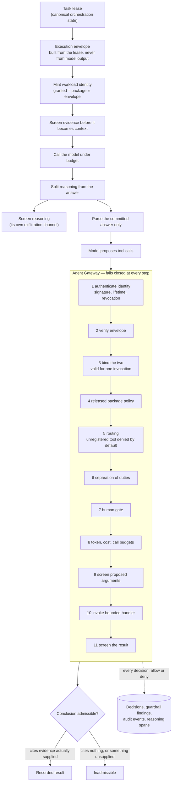
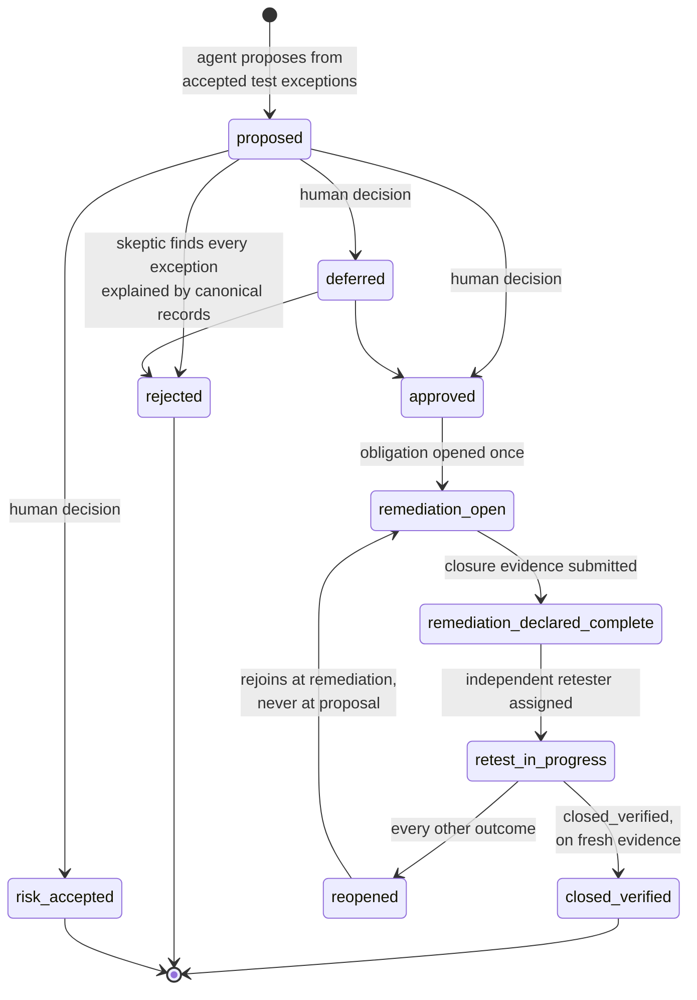

# Agent governance and the assurance loop

Two things have to be true at once for an autonomous audit to be worth anything.
The agent has to actually do the work — collect, test, conclude, chase the fix,
verify it — and a reader has to be able to check the result without trusting the
agent. This document describes how the second is arranged so the first is safe.

The organising idea is that **the model proposes and the control plane decides**.
Authority always flows from canonical state outward to the model, never back. A
model can produce text that looks like a permission, a conclusion, or an
approval, and none of those become one.

## The enforcement path

Every agent call takes the same route. There is no second path to a tool, which
is what makes the guarantees checkable: to reason about what the fleet can do,
you read `governance/gateway.py` and the signed packages, not each agent's code.

Ordering is deliberate. Cheap checks precede expensive ones, authentication
precedes authorisation, and a denial at any step produces an attributable record
and never reaches the tool.

### Why the answer channel is separated

Reasoning models emit deliberation and answer on two channels. Splitting them is
not cosmetic. A reasoning model routinely rehearses the output object inside its
own scratchpad, so parsing an unsplit reply can lift a conclusion the model
explicitly backed away from — the observed shape is a model that considers a
passing conclusion, then declines in its actual answer, and a naive extractor
returns the rehearsal.

Reasoning is still captured, because "how did it reach that" is the point of a
reasoning-chain trace. It is screened by Model Armor first: an injection that
fails to change the answer can still try to move secrets out through the
scratchpad.

### Why an unresolvable citation is fatal

Requiring a conclusion to cite *some* evidence is not enough. A live model cites
plausible-looking identifiers it was never given — a label copied out of a
context header, or an id invented wholesale. An unresolvable citation is
indistinguishable from a fabricated one, and an audit conclusion whose evidence
cannot be resolved is not weak evidence; it is no evidence. Citations are
therefore checked against the evidence actually supplied to the task.

## The assurance loop

A transition absent from that table cannot happen. The lifecycle is reviewable
without reading the service, and a caller that has mis-sequenced the workflow
finds out at the point of the mistake rather than downstream.

Three properties are enforced structurally rather than by convention, because
each is a place where an autonomous system would otherwise quietly award itself
authority it should not have.

**The human gate is a record, not a threshold.** An agent may propose a finding
and state a confidence. Approval attributed to an automated actor is refused, so
no confidence score can be tuned into an approval.

**Remediation opens at most once.** Replay is a normal condition in a durable
orchestrator, and a workflow that files a second ticket on every retry is worse
than no automation. Idempotency is keyed on the *finding*, not the caller's key,
so a replay carrying a different key still cannot open a second action, and a
unique index enforces it in the database rather than trusting the service.

**Retest is independent by construction.** A retest performed by the author of
the finding, the owner of the remediation, or whoever declared it complete is not
weaker evidence — it is not evidence. The comparison is case-insensitive, since
an identity differing only in case is the same actor. The independence basis is
persisted so the claim can be re-verified from the record.

## What the skeptic is for

A deterministic control test says "this row breaks the rule". That is not yet a
finding. The exception may be a registered waiver, may fall outside the audit
period, or may be covered by a tested compensating control. Promoting every
exception to a finding is how an automated audit loses the room: it teaches the
audit function to ignore its own output.

The search is deterministic and evidence-driven rather than delegated to a model,
because these contradictions must never depend on a model's mood. Two details
matter more than they look:

- an **expired** waiver does not explain an exception, so a stale exception
  register cannot quietly suppress a real finding;
- an **untested** compensating control does not compensate.

Contradictions are retained even when the finding is approved. "We considered
this and it did not hold" is part of the record, and discarding it would leave a
later reviewer unable to tell a searched finding from an unexamined one.

## Failure classification

Governed outcomes map onto the orchestrator's retry semantics by what a retry
would actually achieve.

| Status | Retry | Why |
|---|---|---|
| `model_unavailable` | yes | The only failure another attempt can fix. |
| `denied` | no | Policy will deny it identically next time. |
| `schema_invalid` | no | The model answered; the answer was inadmissible. |
| `model_truncated` | no | The output ceiling is too small for this model. No number of attempts enlarges it. |

`model_truncated` is deliberately distinct from `schema_invalid`. Both fail
closed, but collapsing them sends an operator to rewrite a prompt that was never
the problem.

A failed run is recorded *before* the failure is raised. The denied run is
precisely the one an auditor needs to be able to reconstruct.
