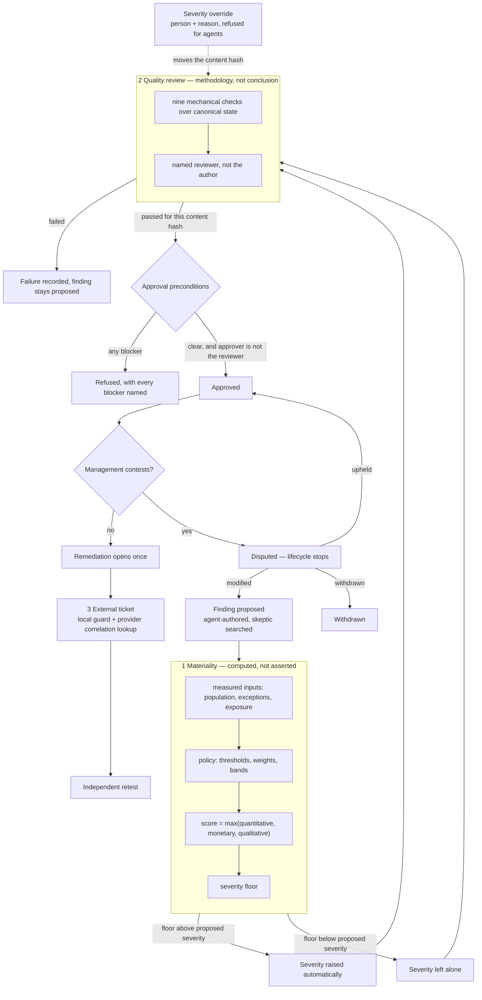

# Materiality, quality review, disputes, and external remediation

The assurance loop already refused to let an agent approve its own finding. That
is necessary and it is not sufficient: an organisation can produce a perfectly
attributable human approval of work that was never reviewed, of a severity nobody
computed, over a disagreement nobody resolved. This document describes the four
steps that close those gaps, and the single idea they share.

That idea is **binding a decision to the text it was made about**. Every gate here
records a `content_hash` — a digest of the finding's material content. Editing the
finding moves the hash, and any gate bound to the old one stops applying. A status
column cannot express "this was reviewed, and then it changed"; a hash can.

## 1. Materiality is arithmetic over declared inputs

`adjudication/materiality.py` is pure: no database, no clock, no model. It takes
measured inputs and a policy and returns a score, its terms, and a severity floor.
Two people with the same inputs get the same number, which is what lets a reviewer
who does not trust the assessment recompute it.

Three terms, combined by **`max`** rather than by sum or average:

| term | source | suppressed when |
|---|---|---|
| quantitative | exception rate against a policy threshold | population is below the policy floor |
| monetary | exposure against a policy threshold | no threshold or no exposure declared |
| qualitative | weights of the asserted factors | no factors asserted |

`max` is the load-bearing choice. A finding that is one-in-a-thousand and
reportable to a regulator is material, and averaging the terms would dilute
precisely the factor that should dominate. The trade is that the score cannot
express "several mild factors compound"; qualitative weights sum among themselves,
which covers the realistic version of that case.

**The one control on inflation is evidence.** A qualitative factor is a
`FactorAssertion`, and its `evidence_ids` list is non-empty at the type boundary.
An agent that wants a higher severity has to point at a record. The closed factor
enum matters for the same reason: free-text factors cannot be weighted by a
policy, compared across engagements, or audited for over-use.

**The population must reconcile.** `exception_count > population_size` is rejected
as an arithmetic error rather than scored. An audit that reports a 140% exception
rate has already lost the argument.

### Escalation is automatic, de-escalation is a decision

If the computed floor is above the proposed severity, the finding is raised there
and the escalation is recorded. If it is below, nothing happens — the assessment
never lowers a severity by itself.

Lowering is `override_severity`: a separate call, refused for automated actors,
refused when it does not actually lower anything, and recorded with an actor and a
reason. Folding it into the assessment would let a rescore perform a de-escalation
as a side effect, which is the version of this that goes unnoticed.

## 2. Quality review is a different question from approval

Approval asks whether the organisation stands behind a conclusion. Quality review
asks whether the work behind it was performed properly. Collapsing them means a
badly supported finding and a well supported one reach the audit committee through
the same door.

`adjudication/quality.py` computes nine checks from canonical state rather than
offering a reviewer nine boxes:

`evidence_cited` · `contradictions_searched` · `population_reconciled` ·
`criteria_stated` · `condition_observed` · `materiality_assessed` ·
`severity_supported` · `limitations_disclosed` · `not_self_reviewed`

A checklist a person fills in records what they believed. A checklist the system
computes records what was true. The reviewer is still required — the gate does not
pass without a named reviewer who is not the author — but their judgement is added
to the mechanical checks, not substituted for them. Their notes are stored and are
deliberately not an input to the evaluation: a note cannot turn a failed check into
a pass, and accepting one would suggest it could.

Two of the checks are worth calling out.

**`contradictions_searched` reads a timestamp, not a list.** An empty contradiction
list means either "searched and found nothing" or "never searched", and the gate
has to tell those apart. `findings.skeptic_reviewed_at` is written at proposal
time whether or not anything was found. Migrated rows keep `NULL`, which reads as
"not searched" — the conservative direction for a gate.

**`limitations_disclosed` fires only when contradictions exist.** Suppressing two
of three exceptions and not telling the reader is what the pack's
"contradictory evidence must be disclosed" rule is about. An absence of
contradictions needs no limitation.

A failed review is **recorded, not raised**. The reviewer's job is to report what
they found; refusing to store a failure would leave the only durable trace of a
badly supported finding in the application logs.

### Three people, enforced twice

Preparer, reviewer and approver being three people is the ordinary shape of an
audit file. It is enforced in two places, and both are needed:

- in the **service**, which refuses an approval by whoever performed the passing
  quality review;
- in the **permission model**, where `findings:review` is held by `auditor` and
  `findings:adjudicate` by `approver`, and no non-admin role holds both. The
  service check fires only once someone has reached both endpoints; disjoint
  permissions mean they cannot.

`worker` — the role agent execution runs under — holds neither. An agent must not
be able to pass its own work through the methodology gate.

### The gate can be waived, but only out loud

`AdjudicationService(require_quality_review=False)` exists so an engagement type
that genuinely has no second reviewer is a stated setting rather than an
undocumented code path. Materiality is still required when it is waived.

## 3. Disputes stop the lifecycle

Management contests findings. A system where that is a comment field has not
modelled the thing that actually happens.

A dispute names a **ground** from a closed set — `criteria_incorrect`,
`condition_inaccurate`, `severity_overstated`, `materiality_disputed`,
`evidence_superseded`, `compensating_control_omitted`, `out_of_scope` — because
"we disagree" is not reviewable and "the criteria cite a superseded policy version"
is.

Raising one moves the finding to `disputed`, and `disputed` has no transition to
`remediation_open`. That is structural rather than a check: opening a remediation
obligation records that the organisation accepted the finding, and doing it under
an open disagreement would put an agreement on the record that nobody made.

Resolution has three outcomes with three different costs:

| resolution | result | what it costs |
|---|---|---|
| `upheld` | returns to the status the dispute interrupted | nothing; the disagreement stays on the record |
| `modified` | returns to `proposed` | the approval is void, and the passing review is spent when the text changes |
| `withdrawn` | terminal | the finding is dropped |

Rounds are numbered, not overwritten. Past `max_dispute_rounds` a dispute is
flagged `escalated` rather than refused — blocking it would leave management with
no route except acceptance, which is not a dispute process.

The resolver may not be the party that raised the dispute, may not be the author of
the finding, and may not be an automated actor. Letting either side resolve its own
disagreement is not adjudication.

## 4. A remediation ticket is filed at most once

This is the first place AssuranceOS writes into a system of record. A write is
where an idempotency mistake stops being an internal inconsistency and becomes
twenty duplicate tickets in somebody's queue.

Duplication is prevented twice, and both are load-bearing:

1. **Locally.** `remediation_actions.external_ref` is set; if it is present, no
   provider call is made. This makes the ordinary retry free.
2. **At the provider.** Every create is preceded by a lookup on a correlation key
   derived from the action id. This is the half that survives the interesting
   failure: a crash *after* the provider created the ticket and *before* the local
   commit leaves local state saying "no ticket" and the provider disagreeing. Only
   the remote lookup settles that, so it is not an optimisation to skip when local
   state looks clean.

Correlation uses a native field on each provider — ServiceNow's `correlation_id`,
a reserved Jira label — rather than matching on summary text, because a ticket
someone renamed must still be recognised as the same ticket. Two records under one
correlation key is refused, not resolved by picking one: the invariant is already
broken and choosing a winner would hide it.

### The provider call sits between two transactions

`sync_remediation_ticket` reads in one transaction, calls the provider with no
transaction held, and writes in another. Two reasons, and the first was found by a
test rather than by design:

- recording a failure in the same transaction that then raises **rolls the record
  back**, producing a method that documents a behaviour it does not have;
- holding a database transaction open across a network round trip is its own
  mistake.

The second transaction re-reads the action. If another worker filed concurrently,
its reference wins — the provider's correlation lookup guarantees both workers are
talking about the same ticket, so overwriting achieves nothing but a second write.

Filing and reconciling emit **different events**. `remediation.ticket_filed` says a
ticket exists because we made one; `remediation.ticket_reconciled` says one already
existed and local state has caught up. Collapsing them would make the
duplicate-ticket bug indistinguishable from its absence.

## What this component still does not do

Stated plainly rather than left to be discovered:

- The Jira and ServiceNow writers are exercised against recorded transports, not a
  live tenant. The adapter code paths — correlation JQL, the create body, the
  second-sync lookup — are the ones that would run, but provider-side field
  validation, permission schemes and custom workflows are unverified.
- The API's ticket endpoint has no writer wired to live credentials. An action
  registered against Jira is **refused** there rather than filed nowhere, which is
  the honest behaviour, but it means the endpoint currently serves only the
  internally-tracked case.
- Materiality policies are supplied per request. There is no per-tenant policy
  registry with its own approval lifecycle; a deployment that wants one would add
  it alongside the standards service.
- Dispute escalation sets a flag. Routing an escalated dispute to a named
  arbiter is a workflow this component does not own.
