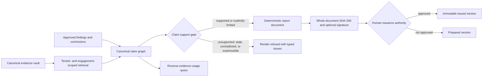

# Evidence-grounded reporting and issuance

The reporting boundary enforces one rule: **a material claim resolves to admissible
evidence, carries a stated limitation, or the report does not render**. Rendering
and issuance are separate acts. The first proves that the document is supportable;
the second records the organization's decision to communicate it.

## Retrieval exposes bounded evidence views

Retrieval returns immutable evidence metadata rather than database rows or raw
storage credentials. Every query is tenant-scoped and can be engagement-scoped.
Classifications outside the caller's visible set are excluded, preserving both
content and existence confidentiality. Deleted records are excluded by default.

Search is a candidate-discovery mechanism. Claims cite explicit evidence IDs, so
the support set recorded in a report is stable and reproducible even if discovery
indexes evolve.

## The claim graph is canonical

Claims and their evidence relationships are stored before rendering. Each link is
typed as `supports`, `contradicts`, or `qualifies`; contradictory material cannot
disappear inside narrative generation. The graph supports both directions:

- a reader can move from a report claim to its source record, digest, and locator;
- an auditor can move from a superseded record to every claim and report that used it.

Claim types distinguish observation, conclusion, opinion, recommendation,
context, and limitation. Materiality defaults to `true`, making an omitted
classification conservative at the API boundary.

## Rendering is a deterministic policy gate

The renderer evaluates the complete report request against the resolved evidence
views, the report period, and a declared evidence policy. It returns a typed issue
for every failed condition and produces no document while any blocking issue
remains.

| refusal | enforced condition |
|---|---|
| missing support | a material claim has neither admissible support nor a stated limitation |
| unavailable record | a cited evidence ID cannot be resolved in the tenant |
| inadmissible record | evidence is unaccepted, deleted, or has failed integrity verification |
| stale support | evidence exceeds the declared freshness policy without disclosure |
| out-of-period reuse | evidence falls outside the report period without an approved justification |
| cross-engagement reuse | another engagement's evidence lacks an approved reuse rationale |
| undisclosed contradiction | contradictory evidence exists and the claim does not disclose it |
| tainted sole support | guardrail-tainted material is the only support where policy forbids it |
| incomplete template | required sections or referenced claim keys are absent |

The successful document includes the rendered claims, evidence index, applied
policy, reuse approvals, and issue-free gate result. Canonical serialization gives
the whole document one SHA-256 digest; an optional release signer binds that digest
to a key identity.

## Issuance remains human-accountable

A prepared report is durable but is not an issued opinion. Issuance requires a
named non-automated actor and operates only on a report version that already
passed rendering. Issuance does not reconstruct the document: the exact prepared
JSON, digest, evidence index, and signature are retained as the statement made at
that moment. Audit and outbox events make downstream publication observable and
replay-safe.

## Trust boundaries

- The evidence vault owns bytes, integrity, custody, and lineage.
- The claim graph owns what each sentence rests on.
- The renderer owns support-policy evaluation and deterministic document creation.
- The issuer owns the organizational decision to communicate the report.
- Export signing proves package provenance; it does not replace issuance authority.
