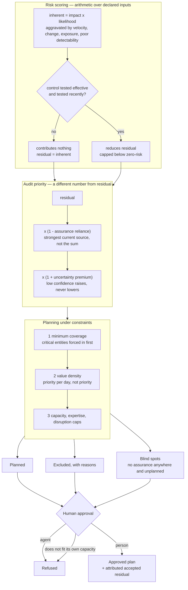

# Risk assessment and portfolio planning

Everything downstream in AssuranceOS answers *did this control work*. This
component answers the question in front of it: **which controls are worth asking
about this year, and what does choosing them leave uncovered**.

It is the part of an audit function most prone to becoming decoration. Everything
is amber, nothing is downgraded on evidence, and the plan that falls out of the
ratings is the plan somebody wanted anyway. Three rules are enforced structurally
rather than encouraged, and each targets one of those failures.

## Rule 1 — an untested control reduces nothing

The single most consequential line in `portfolio/scoring.py`. Management asserting
that a control works is not evidence that it does. A control with no test result on
record leaves inherent risk exactly where it was, however mature it is claimed to
be and however completely it claims to cover the risk.

Without this rule, a risk register can be talked down to green without anyone
testing anything: assert a mature control, claim full coverage, publish. With it,
the only way to move a rating down is to produce a test result — which is what the
rest of the platform exists to do.

Three supporting constraints follow from it:

- **A tested control must carry a date and cite evidence.** An undated result
  cannot be aged; an uncited one is an assertion wearing a result's clothes. Both
  are rejected at the type boundary.
- **Test results expire.** Beyond the policy's currency window a result stops
  contributing, so a control tested once in 2023 does not hold a rating down
  forever.
- **No control set takes a risk to zero.** Contributions are capped by
  `max_control_reduction`, which is strictly below 1. A model that can express
  "this risk is eliminated" will eventually be used to argue exactly that.

Multiple controls combine **multiplicatively over the residual gap**, so two
controls each covering half the risk do not sum to complete coverage.

## Rule 2 — uncertainty raises priority and never lowers it

A rating held with low confidence is not a low risk. It is a risk nobody has looked
at, and the two must not produce the same plan.

So confidence is applied as an **audit-priority multiplier**, not as a discount on
the residual score. A risk with no controls tested, no evidence cited and no
current assurance carries a premium on top of its residual; a fully evidenced one
carries none. Knowing more removes the surcharge — it never buys a discount below
residual.

Confidence itself is **derived from what is on the record**, not stated by the
assessor: whether any control was tested, whether the rating cites evidence,
whether the control results cite evidence, whether any assurance is current. An
assessor-supplied confidence would be the same unverifiable assertion the module
exists to remove.

## Rule 3 — assurance lowers the need for work, not the risk

Coverage obtained elsewhere — a prior internal audit, an external audit, a
continuous monitor, management self-testing — reduces the need for *fresh audit
work*. It does not reduce the risk. So reliance is applied to audit priority and
never to residual; folding it into the residual score would let a function argue a
risk down by having looked at it once.

Two details matter:

- **Sources are not equal.** Management self-testing is worth something and is
  worth clearly less than independent work. A platform that scored them the same
  would let a function assure itself.
- **The strongest source counts, not the sum.** Three sources looking at the same
  thing do not triple the assurance, and adding them would let weak coverage be
  stacked into an argument for not auditing.

## Planning: value density, then the two constraints in front of it

Selection is ordered by **value density** — audit priority per day of effort —
rather than by priority alone. Ranking by priority systematically buys one large
engagement instead of three smaller ones worth more in total, which is how a
capacity-constrained function ends up covering less than it could.

Two constraints run before the ranking:

**Minimum coverage.** Entities above a criticality threshold that have not been
audited within the rolling interval are forced into the plan regardless of where
they would have ranked. Otherwise a perpetually low-scoring but critical entity is
never visited — the exact pattern a regulator asks about.

**Capacity, with contingency held back.** A fixed fraction of available days is
reserved. A plan that consumes every available day has no room for the reason audit
functions exist to be available.

Two further filters refuse rather than assume:

- an audit requiring expertise the function does not hold is **excluded with that
  reason**, because a plan that assumes skills nobody has will not be delivered;
- high-disruption engagements are capped, because a plan the business cannot absorb
  is not a plan either.

When mandatory coverage alone exceeds capacity, the planner **reports the overrun
and marks the plan undeliverable**. It does not trim a required audit to fit the
budget: that is a decision for the audit committee, not for a ranking rule, and the
approval endpoint refuses an undeliverable plan.

Selection is deterministic — value density with a stable tiebreak on key — because
a planner whose output moves between runs cannot be reviewed.

## The output nobody publishes

A `PlanRecommendation` carries three lists, and the second and third are the point:

| list | what it is |
|---|---|
| `planned` | what the plan covers, with the reason each item is in |
| `excluded` | what it declined, with the reason and the priority left behind |
| `blind_spots` | risks with **no current assurance from any source** *and* no place in the plan |

A risk that is unplanned but continuously monitored is not blind. A risk that is
unplanned and unmonitored is, and it is named.

## Approval accepts the residual, attributably

Approving a plan is a human act — the service refuses an automated actor, and the
`portfolio:approve` permission is held by the approver role and not by the auditor
or worker roles.

On approval the exclusions and blind spots are written into the proposal as
**accepted residual**, stamped with the approver and the time. An audit committee
that accepted a plan accepted what it left out; this makes that fact retrievable a
year later rather than inferable from two documents.

## Ratings are versioned; overrides are visible

Assessments are appended, never updated. "What did we think this risk was last
year, and on what basis" is the question asked whenever a rating moves, and a
mutable rating column cannot answer it. Each assessment stores its policy, its
declared factors, its computed components and its `as_at` date — which is distinct
from when it was recorded, because ratings are recomputed retrospectively often
enough that conflating the two makes staleness unmeasurable.

A person may set the computed rating aside. Doing so records their name, their
reason, and **keeps the computed value beside the override**. The register reports
both, so a reader can see where the two disagree without reading the history.

## Scenarios write nothing

`simulate` recomputes a plan under a hypothetical and touches no state. The question
a head of audit is asked in a budget conversation is "what stops if we lose two
people", and answering it must not create a plan proposal. It sits behind the read
permission for the same reason.

## What this component does not do

- **Candidates are supplied, not generated.** Effort estimates, disruption ratings
  and required expertise are declared by the caller. A planner that estimates its
  own costs produces recommendations nobody can argue with — but it also means the
  quality of the plan is bounded by the quality of those declarations.
- **Approving a plan does not create schedules.** It creates an approved
  `AuditPlan` that Component 3's scheduler can hang schedules from; wiring each
  planned item to a recurring schedule and an Audit Pack is a step an operator
  still takes.
- **The entity graph is thin.** Entities and relationships exist and are keyed for
  idempotent re-import, but nothing yet propagates risk along relationships — a
  critical system's rating does not raise the business unit that depends on it.
- **Risk factors are per-risk, not modelled jointly.** Correlated risks that would
  materialise together score independently.
