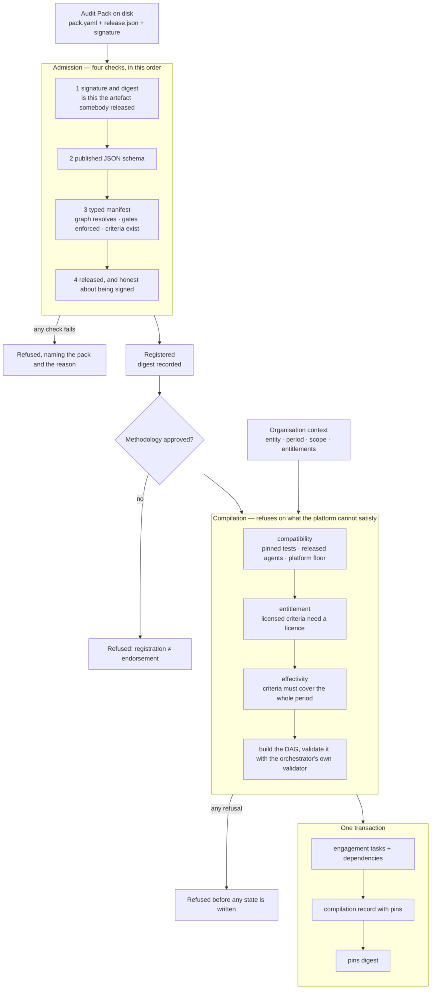

# Standards, criteria, and Audit Pack compilation

Before this component, an engagement's workflow was hand-authored. Someone wrote a
task list they believed matched the methodology, and the only thing connecting the
two was that belief. The methodology lived in a document; the work lived in a task
table; nothing made them agree, and nothing noticed when they stopped.

After it, **the workflow is the pack**. An engagement's task graph is a
deterministic function of a signed artefact and an organisation context, and every
version it depended on is written into the record it was compiled from.

That single change is what makes the rest of the platform's claims checkable. A
finding can cite its criteria because the task that produced it carried them. An
audit committee can ask whether two units ran the same methodology and get an
answer by comparing two digests rather than two task lists. And a pack upgrade can
be shown *not* to have altered a historical engagement, because the old engagement
still points at the old digest.

## Admission: four checks, and the order matters

Cheapest-first would put schema validation before signature verification. Signature
goes first anyway, because **parsing an unverified artefact makes the parser the
attack surface**. By the time YAML is loaded, the bytes have already been proven to
be the ones somebody released.

Check three is the one a JSON schema cannot express. The typed manifest enforces
that the procedure graph resolves, that every cited criterion exists, that a
`control_test` step pins a test — and that **every declared human gate is attached
to a procedure**. A gate in the methodology that no step enforces is worse than no
gate: it satisfies a reviewer reading the pack and stops nothing.

## Compilation: what is pinned, and why

The compilation record stores:

| pinned | why it matters |
|---|---|
| pack id, version, **package digest** | the artefact, not the label |
| release key id | which trust root admitted it |
| standard code and version | ISO 27001:2013 is not ISO 27001:2022 |
| criteria and their citations | a finding can cite without a model remembering |
| control-test versions | evaluation evidence applies to the version it was run against |
| agent role versions | which released prompts and policies ran |
| platform version | the floor the pack declared it needed |
| organisation profile version | what the platform believed about the entity |

Everything above is hashed into a **pins digest**. Comparing two digests answers
"did these two engagements run the same methodology" without diffing two task
graphs — which is the question an audit committee actually asks when two business
units report different results.

### Determinism, stated precisely

The same pack digest and the same context produce the same task keys, the same
dependency edges, the same gates, and the same pins digest. They do **not** produce
the same task *ids*: two engagements running one pack are two engagements. Claiming
otherwise would be a stronger statement than the one that is true.

Two mechanisms make it hold. Procedures compile in `(step, key)` order, so two
procedures at the same step do not compile in whatever order YAML happened to
produce. And the compiler is a pure function of its arguments — the released-test
and released-agent inventories are passed in, not looked up — so the same call can
be made against a hypothetical inventory to answer "would this pack still compile
if we withdrew that test".

## Six refusals, each with its own sentence

Distinguishing them is not pedantry. An unsigned pack is a supply-chain event; an
unentitled one is a licensing event; an out-of-period criterion is a methodology
error. A caller that can only see "compilation failed" cannot route any of them.

| refusal | raised by | condition |
|---|---|---|
| `PackSignatureError` | registry | unsigned, wrong key, or modified after release |
| `PackCompatibilityError` | compiler | pinned test missing or at another version, agent role unreleased, platform below the pack's floor |
| `PackEntitlementError` | compiler | licensed standard, no entitlement |
| `CriteriaEffectivityError` | compiler | criteria do not cover the whole audit period |
| `PackNotReleasedError` | service | pack is a draft, not approved, or its disk digest differs from the approved one |
| `PackCompilationError` | service | the engagement is already compiled |

Three of them are raised by the compiler **before any state is written**, which is
why they can be asked speculatively — "would this pack compile for this period" is
answerable without touching the engagement.

Two design choices inside them are worth stating:

**Control tests are pinned exactly, not "at least".** A pack validated against
`SCM-01@2.0.0` has not been validated against `2.1.0`. Accepting the newer version
silently would make the pack's evaluation evidence apply to a procedure nobody ran
it against.

**Effectivity requires whole-period coverage.** A criterion in force from the
middle of the period cannot support a conclusion about the period. Partial overlap
is treated as failure, not as a warning, because the alternative is an audit that
reports findings against months the rule did not apply to.

## Entitlements: read, never asserted

The compile endpoint builds the organisation context server-side and fills
`entitlements` from canonical state. The request body has no field that could
supply them. An entitlement a caller can assert is not an entitlement.

Expiry is filtered at read time rather than at grant time. A licence checked only
when it was granted is a licence that never expires; filtering on read means a
compilation run after expiry fails, which is what the licence actually requires.

## Pack upgrades do not rewrite history

A new pack version registers, is approved, and compiles into *new* engagements.
Existing engagements keep the digest they pinned. `upgrade_impact` reports both
halves — what changed between the versions, and which engagements are unaffected —
so the second half is checkable rather than asserted.

An engagement compiles once. The uniqueness constraint is on the table, not only in
the service: recompiling would replace the methodology an engagement is already
running under, and a service check is a weaker guarantee than a schema one.

## Two release keys

Audit Packs are signed by `audit-pack-release-public.pem`, agent packages by
`agent-release-public.pem`. Different artefact classes, different authors,
different review paths — a single key means compromising either review compromises
the other. In a deployed environment these become two KMS keys with different IAM
bindings. The separation is asserted by a test that verifies the *wrong* key fails,
so it cannot quietly collapse back to one key.

## The three published packs

| pack | what it exercises |
|---|---|
| `software-change-management@2.0.0` | the full loop: eleven procedures, four gates, a pinned deterministic test |
| `identity-access@1.0.0` | a second pack that compiles to a *different* graph from the same compiler, plus a criteria crosswalk |
| `privileged-access@1.0.0` | a licensed standard requiring an entitlement, and a design-only pack that correctly pins no test |

`procure-to-pay` remains contract-defined: a README, no `pack.yaml`, and therefore
no claim that it runs.

## What this component does not do

- **The pack is not enforced at execution time.** Compilation puts the procedures,
  gates and criteria into canonical task state, and the orchestrator runs that
  state. A worker that ignores its `execution_policy` is not stopped by this
  component; the Agent Gateway is what constrains what a task may actually do.
- **Criteria text is stored, not interpreted.** Nothing checks that a finding's
  cited criterion is the *right* one for the condition observed. That is a
  judgement the quality gate asks a reviewer to make.
- **Crosswalks are asserted, not derived.** Every edge carries its rationale and
  the party that asserted it, which is the honest treatment; it is not a claim that
  the equivalence is correct.
- **`min_platform_version` compares a constant.** `PLATFORM_VERSION` is a literal
  in the compiler rather than something derived from the release artefact, so a
  deployment running older code than it claims is not detected here.
