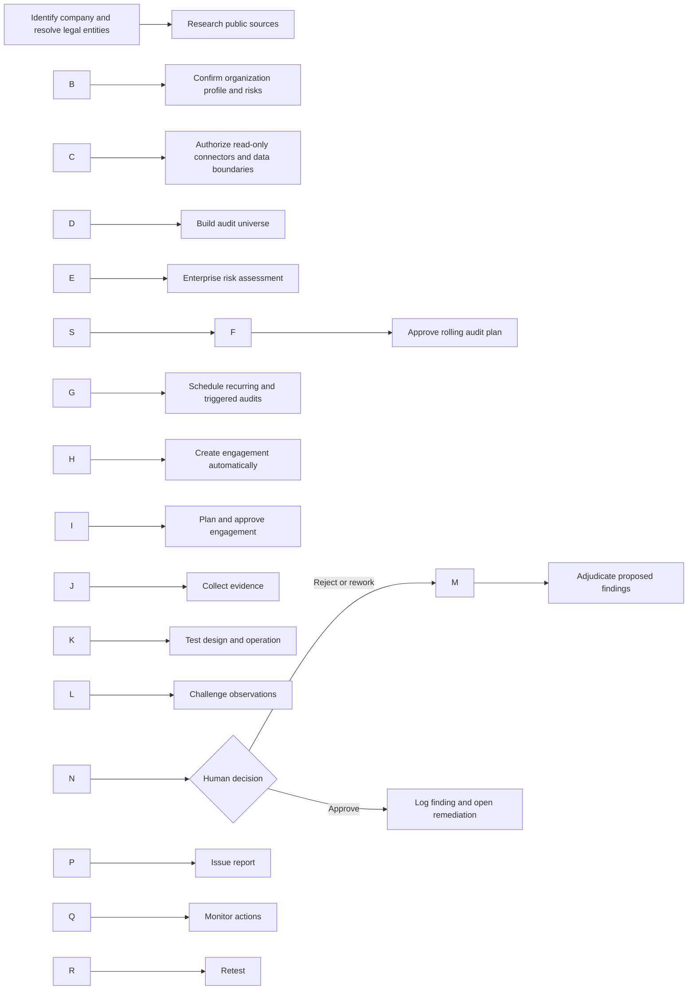
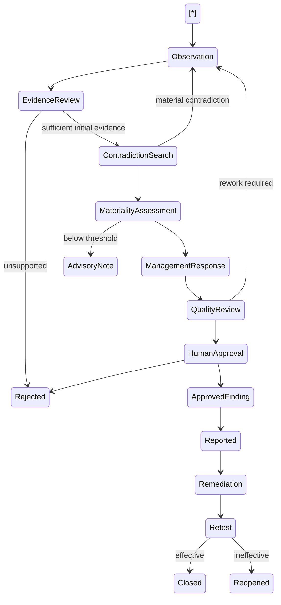
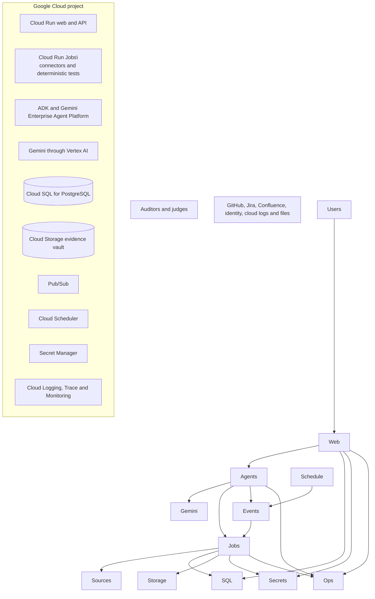
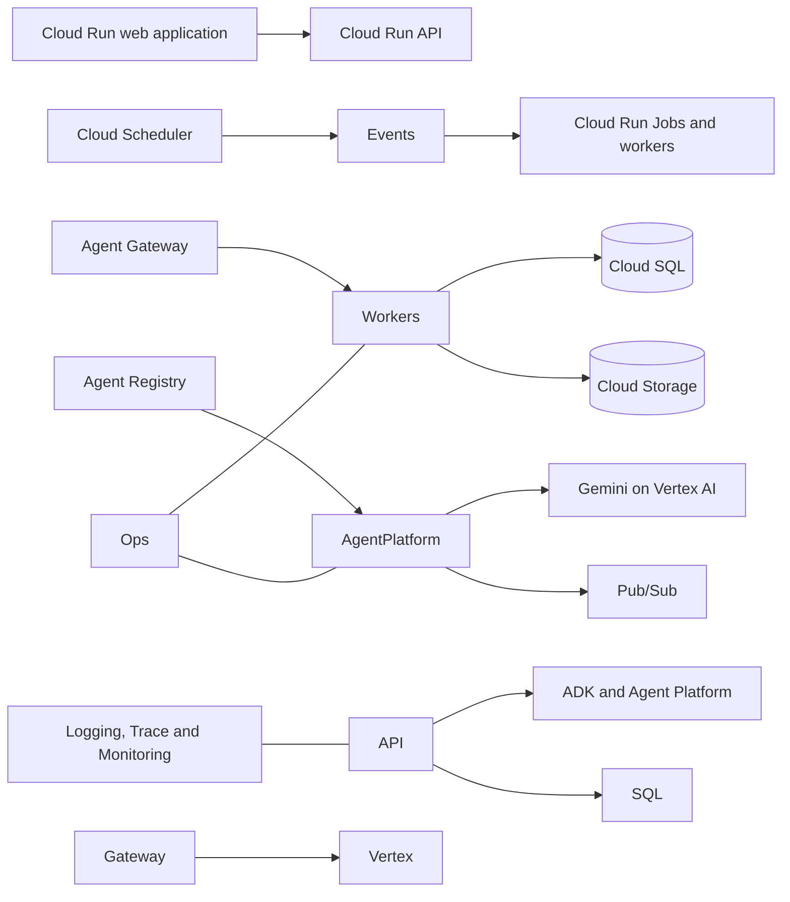
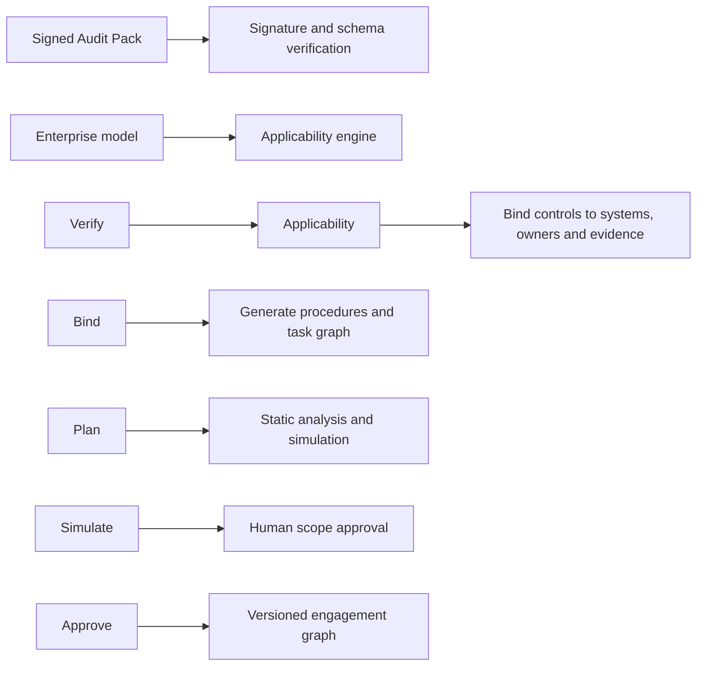
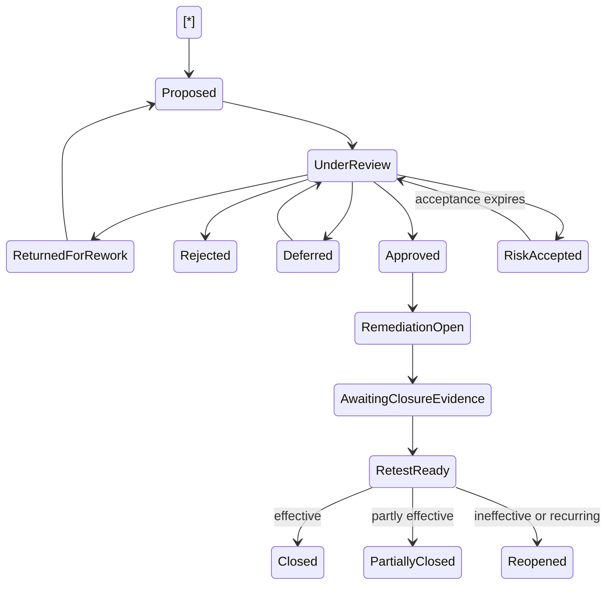

# AssuranceOS

## Hackathon Implementation Plan for an Adaptive, AI-Native Internal Audit Platform

**Document status:** Google Cloud-first hackathon architecture and delivery blueprint  
**Target:** Fully deployable enterprise-grade hackathon project (demo of the project on cloud, GitHub with docker code that can work locally or on the cloud)   
**Primary platform:** Google Cloud and Gemini Enterprise Agent Platform  
**Primary agent framework:** Google Agent Development Kit (ADK)  
**Audience:** Companies with no audit function, comanies with limited audit functions, and hackathon judges  


1\. Executive summary

AssuranceOS gives any organization access to an adaptive internal audit capability, including companies that do not maintain a permanent internal audit department. Financial institutions commonly operate formal internal audit functions because regulation, supervisory expectations, governance requirements, and risk complexity make them necessary. Many companies in other industries have comparable operational, cybersecurity, financial, strategic, supply-chain, privacy, and technology risks but lack the scale, budget, or obligation to employ a complete audit team.

AssuranceOS closes that gap. It combines a governed fleet of specialized AI agents, executable audit methodologies, enterprise connectors, deterministic control-testing engines, professional human oversight, and a tamper-evident evidence system. The platform adapts to each company’s business model, systems, risk profile, industry, jurisdiction, maturity, and objectives. It can establish an audit universe, recommend a risk-based plan, execute individual audit engagements, document findings, coordinate management responses, monitor remediation, and continuously retest selected controls.

The first use of the platform is itself an auditable workflow. The user provides the company name, primary domain, headquarters, and any known legal entities. A bounded Company Intelligence fleet researches authoritative public sources, resolves the organization’s identity, proposes its industry, business model, geographic footprint, technology signals, regulatory exposure, and initial risk hypotheses, and presents every claim with its source, date, confidence, and uncertainty. Public information is treated as a hypothesis-building layer. The user confirms or corrects the resulting company profile before it becomes canonical.

The platform then presents a curated connector and data-access menu. Every integration explains why it is recommended, which audits it enables, the exact read-only scopes requested, which objects will be collected, the applicable retention and residency rules, and the consequences of omitting it. Identity, ERP, cloud, repositories, ticketing, knowledge bases, file stores, collaboration tools, and email can be connected through delegated least-privilege access, customer-hosted gateways, or controlled uploads. Setup concludes only after the organization profile, initial audit universe, and connector preflight have been approved.

The production system is a **continuous-assurance operating system** with an explicit chain from business objective to risk, control, procedure, evidence, result, finding, remediation, and retest.

AssuranceOS also operates the company’s risk-based audit plan as a durable schedule. Approved audits can recur automatically—for example every six months, annually, quarterly, after a material system change (new push to a sensitive GitHub repo for example). A scheduler creates the engagement in the background, performs connector and independence preflight checks, fixes the audit period, pins the applicable methodology versions, starts the agent fleet, and surfaces only decisions that require human attention. This prevents audit coverage from depending on memory or ad hoc executive requests.

Findings are first-class governed records. Proposed findings remain clearly separated from approved findings. The user can approve, reject, return for rework, defer, or accept the associated risk. Every decision requires a reason and is immutably recorded. Approval opens a remediation obligation with an owner, due date, action plan, escalation policy, and independent retest requirement. The interface exposes a complete claim-to-evidence and decision trail so that a non-auditor can understand what happened and why.

The platform includes a controlled **Standards and Criteria Knowledge Layer** covering professional internal-audit standards, risk and control frameworks, cybersecurity and application-security frameworks, management-system standards, regulations, and industry-specific criteria. Standards are versioned, licensed, mapped, and applied as explicit audit criteria; they are never reduced to uncited model memory.

The key product abstraction is an **Audit Pack**: a signed, versioned, executable package containing the audit objective, professional methodology, risk taxonomy, expected controls, evidence requirements, testing logic, sampling rules, interview guides, materiality rules, human approvals, report templates, and quality criteria. The platform compiles an Audit Pack against a company’s enterprise model and produces a durable engagement graph executed by a governed agent fleet.

The key technical asset is the **Enterprise Evidence Fabric**, built around:

* a strongly consistent relational and property-graph system of record;
* immutable source evidence with cryptographic provenance;
* a normalized enterprise ontology;
* temporal lineage that preserves what was true during the audit period;
* access-aware semantic retrieval;
* a reproducible analytical test engine;
* complete agent, model, prompt, tool, and approval traceability.

The hackathon deployment is a **Google Cloud-hosted container application**. Google ADK and the Gemini Enterprise Agent Platform govern the agent fleet; Gemini through Vertex AI provides hosted model inference; Cloud Run hosts the application and workers; Cloud SQL stores canonical workflow and evidence metadata; Cloud Storage preserves evidence objects; Pub/Sub and Cloud Scheduler support asynchronous and recurring execution; Secret Manager isolates credentials; and Cloud Operations provides judge-visible traces.

For organizations with strict confidentiality requirements, the same application can optionally run on customer-controlled hardware through Docker Compose with local PostgreSQL, encrypted local evidence storage, and a pinned `llama.cpp` endpoint serving Gemma 4 26B-A4B `IQ4\_XS`: it can run locally on any 8gb Vram/16gb RAM machine. This privacy mode is optional. The Google Cloud deployment remains the primary product and hackathon submission path.

A fully autonomous system must not issue statutory audit opinions, legal conclusions, regulatory certifications, or unsupported guarantees. Final consequential findings and audit reports require accountable human approval. The system is designed to automate evidence-intensive fieldwork, testing, documentation, challenge, and follow-up while preserving independence, professional judgment, confidentiality, and due care.

\---

## 2\. Product mission and market thesis

### 2.1 Mission

> Give every organization a credible, adaptive, and continuously available internal audit capability, regardless of company size or industry.

### 2.2 Problem statement

Companies outside highly regulated sectors often face four structural problems:

1. **No permanent audit function.** Internal audit is considered overhead until a control failure, cyber incident, fraud, failed acquisition, regulatory inquiry, or operational breakdown occurs.
2. **Fragmented assurance.** Cybersecurity, finance, compliance, legal, operations, and external consultants evaluate isolated areas using inconsistent methods and duplicated evidence requests.
3. **Periodic rather than continuous coverage.** Traditional audits examine a sample at a point in time, often months after the underlying activity.
4. **High professional labor cost.** Skilled auditors spend a substantial portion of an engagement collecting evidence, reconciling formats, following up on requests, preparing workpapers, and repeating standard tests.

AssuranceOS turns audit from an occasional consulting project into an accessible operating capability.

### 2.3 Product category

AssuranceOS sits at the intersection of:

* internal audit management;
* governance, risk, and compliance;
* compliance automation;
* process mining;
* enterprise data integration;
* control analytics;
* agent governance;
* continuous monitoring;
* managed assurance services.

Its differentiated function is the autonomous execution of an audit methodology under enforceable governance.

### 2.4 Core value propositions

For a company without internal audit:

* establish an auditable risk universe;
* obtain an annual audit plan proportionate to the business;
* conduct domain-specific audits without building a full department;
* obtain board-ready findings and monitored action plans;
* preserve professional oversight through assigned accountable reviewers.

For an existing internal audit team:

* increase coverage without proportional headcount growth;
* automate evidence collection and population testing;
* use full-population analytics rather than small samples where possible;
* reduce administrative fieldwork;
* standardize methodology and quality review;
* convert audit tests into continuous controls.

For boards and executives:

* obtain a current view of assurance coverage and unresolved exposure;
* distinguish management assertion from independently verified evidence;
* monitor remediation and recurring deficiencies;
* understand limitations and evidence gaps rather than receive false certainty.

\---

## 3\. Product boundaries and professional positioning

### 3.1 What the platform does

AssuranceOS can:

* construct an audit universe from company data and interviews;
* perform enterprise and engagement-level risk assessments;
* recommend and maintain a risk-based audit plan;
* compile and execute audit methodologies;
* collect, normalize, and preserve evidence;
* test control design and operating effectiveness;
* perform transaction, identity, configuration, process, and document analysis;
* request and conduct structured interviews (through email generation that needs to be approved by a Human before being sent);
* identify contradictions and missing evidence;
* propose findings and severity;
* generate workpapers and management reports;
* create and monitor remediation actions;
* retest completed actions;
* continuously monitor selected controls and indicators.

### 3.2 What the platform does not claim

AssuranceOS must not claim that it:

* replaces board or management accountability;
* eliminates the need for qualified human judgment;
* provides legal advice;
* guarantees compliance;
* grants certification;
* issues an external statutory financial audit opinion;
* detects all fraud or misconduct;
* determines that a strategy is objectively correct;
* infers misconduct from personality, sentiment, or communication style;
* has reviewed systems to which it did not receive access;
* provides assurance beyond the procedures and evidence actually completed.

\---

## 5\. Product scope and modules

### 5.1 Company Intelligence and Guided Onboarding

* company-name, domain, legal-entity, and jurisdiction resolution;
* controlled public-web reconnaissance using authoritative and attributable sources;
* official website, corporate registry, securities filing, regulator, trust-center, status-page, public repository, and reputable-news discovery where legally available;
* source-quality scoring, date tracking, contradiction detection, and confidence labels;
* industry, business-model, value-chain, customer, product, geography, and technology inference;
* initial regulatory and standards applicability;
* risk-hypothesis generation;
* recommended audit domains, cadence, required evidence, expected value, and implementation effort;
* user confirmation and correction before profile facts become canonical;
* resumable setup state machine;
* data-residency, retention, privacy, employee-monitoring, and legal-boundary configuration;
* connector recommendation, exact-scope preview, read-only authorization, sample-data validation, and revocation;
* baseline ingestion and completeness scoring;
* initial audit universe, first-year plan, recurring schedule, and first-audit approval.

### 6.2 Audit Universe and Planning

* organizational discovery;
* business-process inventory;
* system and data inventory;
* legal-entity and location model;
* strategic objective model;
* risk taxonomy;
* prior findings and incidents;
* inherent and residual risk scoring;
* assurance coverage mapping;
* annual, multi-year, and rolling audit plans;
* minimum-coverage policies by auditable entity and risk tier;
* recurring engagement templates and calendar schedules;
* event-triggered and risk-triggered audit initiation;
* automatic period calculation and background engagement creation;
* missed-run, overlap, blackout-window, and catch-up policies;
* scenario-based plan recalculation.

### 6.3 Engagement Management

* manual, scheduled, and event-triggered engagement creation;
* reusable engagement templates;
* automatic preflight and conflict checks;
* scope and period;
* objectives and criteria;
* materiality;
* resource and agent plan;
* milestones;
* evidence requests;
* interviews;
* testing progress;
* issue and finding workflow;
* approval, rejection, rework, deferral, and risk-acceptance decisions;
* review notes;
* management responses;
* final reporting;
* closure.

### 6.4 Enterprise Evidence Fabric

* connectors and collection;
* source snapshots;
* evidence vault;
* chain of custody;
* classification and redaction;
* document parsing;
* structured data normalization;
* entity resolution;
* temporal evidence graph;
* semantic retrieval;
* evidence reuse;
* legal hold and retention.

### 6.5 Agent Fleet and Governance

* agent registry;
* agent identities;
* model and prompt registry;
* tool registry;
* policies;
* execution budgets;
* autonomy levels;
* trace and evaluation views;
* kill switches;
* incident handling;
* change approval.

### 6.6 Control Test Studio

* visual and code-based test authoring;
* approved test library;
* SQL, Python, graph, and rule execution;
* sampling;
* population reconciliation;
* exception triage;
* reproducibility;
* performance benchmarking;
* continuous-monitor conversion.

### 6.7 Audit Pack Studio and Standards Library

* pack authoring;
* methodology templates;
* standards and regulatory criteria registry;
* requirement-level mappings and crosswalks;
* applicability and jurisdiction rules;
* source-license enforcement;
* standards change monitoring and impact analysis;
* schema validation;
* simulation;
* test fixtures;
* digital signing;
* peer review;
* independent release approval;
* version migration;
* controlled import and export;
* signed distribution across approved environments and tenants;
* standards-content entitlement enforcement.

### 6.8 Finding and Remediation Management

* structured proposed and approved findings;
* severity, confidence, and evidence-sufficiency dimensions;
* causal analysis;
* management response;
* explicit approve, reject, return-for-rework, defer, and risk-accept actions;
* immutable decision rationale and approval trail;
* automatic conversion of approved findings into remediation obligations;
* action plan;
* owner and due date;
* escalation and extension policy;
* risk acceptance;
* evidence of closure;
* independent retesting;
* recurrence detection.

### 6.9 Reporting and Assurance Cockpit

* board dashboard;
* executive summary;
* engagement report;
* workpaper package;
* regulator or external-auditor evidence package;
* cross-engagement themes;
* risk and control trends;
* coverage and limitation reporting;
* configurable exports and APIs.

\---

## 7\. Audit methodology model

The platform’s methodology should conform to recognized principles of internal auditing, including objectivity, competence, due professional care, independence, strategic planning, quality, effective engagement planning, engagement execution, communication, and monitoring of action plans. The methodology engine must be adaptable to industry and jurisdiction, but it cannot be an unconstrained prompt.

### 7.1 Audit lifecycle



### 7.2 Audit universe

The audit universe is a living graph of auditable entities:

* legal entities;
* business units;
* products and services;
* business processes;
* systems and data assets;
* strategic initiatives;
* locations;
* vendors;
* regulatory obligations;
* material financial accounts;
* technology platforms;
* major change programs;
* emerging risks.

Each entity has criticality, relevant objectives, risks, controls, incidents, prior findings, data availability, regulatory relevance, and last-assessed date.

### 7.3 Enterprise risk assessment

The risk model separates:

* inherent impact;
* inherent likelihood;
* velocity;
* persistence;
* detectability;
* control maturity;
* assurance coverage;
* change intensity;
* external exposure;
* residual risk;
* confidence in the assessment.

Risk scoring must be configurable. The system stores both numeric values and the evidence supporting them. A model may propose a rating, but configured rules and human approval determine the official result.

### 7.4 Engagement planning

An engagement plan contains:

* objective;
* scope and exclusions;
* audit period;
* criteria;
* relevant risks;
* expected controls;
* materiality;
* testing approach;
* population and sampling method;
* evidence sources;
* interview plan;
* specialists;
* milestones;
* data limitations;
* human approval gates;
* communication protocol.

### 7.5 Test result taxonomy

Every test concludes as one of:

* effective;
* partially effective;
* ineffective;
* not applicable;
* not tested;
* insufficient evidence;
* population incomplete;
* source unreliable;
* test failed technically;
* scope limitation.

The system must never silently convert technical failure or missing evidence into a control failure or an effective result.

### 7.6 Claim taxonomy

All narrative statements are tagged as:

* **Observed fact** — directly supported by source evidence;
* **Computed result** — produced by a reproducible deterministic test;
* **Management assertion** — stated by a person but not independently verified;
* **Inference** — reasoned from multiple evidence items and accompanied by uncertainty;
* **Auditor judgment** — professional conclusion requiring approval;
* **Unknown** — evidence is inadequate;
* **Scope limitation** — relevant work could not be performed.

### 7.7 Finding structure

A finding is a structured domain object, not free-form prose:

* identifier and version;
* title;
* business objective affected;
* risk statement;
* criteria;
* observed condition;
* cause;
* consequence;
* affected population and quantified exposure;
* supporting evidence;
* contradictory or mitigating evidence;
* compensating controls;
* severity;
* confidence and limitations;
* management response;
* recommendation;
* action plan;
* due date;
* risk acceptance, where applicable;
* approval history;
* retest result.

### 7.8 Finding adjudication flow



### 7.9 Risk-based audit plans and recurring schedules

The audit plan is an executable governance object rather than a static annual spreadsheet. It contains approved coverage obligations, engagement templates, recurrence rules, trigger conditions, capacity constraints, required competencies, and escalation policies.

A schedule may be:

* calendar-based, such as every six months, quarterly, annually, or on the first business day after period close;
* risk-based, such as when residual risk exceeds a threshold or a critical control degrades;
* event-based, such as after an acquisition, ERP migration, major security incident, product launch, regulatory change, or material change in leadership;
* hybrid, such as semiannual by default but accelerated after a material incident;
* continuous, where approved tests run frequently and aggregate into a formal periodic audit conclusion.

Each schedule defines:

* audit plan and engagement-template identifiers;
* Audit Pack and allowed version policy;
* recurrence expression using an iCalendar-compatible rule;
* organization time zone and business calendar;
* audit-period calculation rule;
* scope selectors and exclusions;
* required connectors and minimum source-health state;
* minimum human and agent competencies;
* approval policy for automatic start;
* blackout windows and change freezes;
* maximum concurrent engagements;
* overlap and duplicate-prevention rules;
* missed-occurrence and catch-up behavior;
* notification and escalation policy;
* retention and evidence-reuse policy;
* conditions that pause or invalidate the schedule.

An approved schedule can create and begin an engagement without another manual start action. It must still stop at configured consequential gates, including material scope changes, inaccessible critical systems, independence conflicts, high-severity finding approval, and report issuance.

The scheduler performs the following transactionally:

1. calculates the due occurrence and audit period;
2. checks whether an equivalent engagement already exists;
3. validates tenant status, connector health, credentials, source coverage, budgets, competencies, and independence;
4. resolves and pins the applicable standards, Audit Pack, test, model-policy, and agent versions;
5. creates the engagement and initial task graph;
6. writes an immutable schedule-occurrence record;
7. emits the engagement-start event through the transactional outbox;
8. notifies the sponsor and engagement lead;
9. monitors whether the planned coverage objective was actually achieved.

The coverage engine continuously compares the audit universe with plan obligations. It reports subjects that are overdue, repeatedly deferred, under-scoped, or covered only by management monitoring rather than independent assurance. High-risk auditable entities cannot be silently removed from the plan; removal requires a documented governance decision.

\---

## 8\. Functional requirements

### 8.1 Organization onboarding

The platform shall implement onboarding as a durable, resumable, policy-controlled workflow rather than a sequence of disposable forms.

#### 8.1.1 Minimum user input

The first screen requests only:

* company name;
* primary website domain (if available);
* headquarters country;
* optional industry or known legal entity.

All other organization facts are proposed from attributable public sources or requested later only when they are required for a specific audit decision.

#### 8.1.2 Public company intelligence

After domain submission, a bounded public-intelligence workflow shall:

* resolve the website, redirects, aliases, brands, and likely legal entities;
* search authoritative sources before secondary sources;
* retrieve only publicly accessible material allowed by source policy;
* collect the official website, product pages, trust and security pages, privacy notices, terms, careers pages, status pages, public documentation, public code repositories, corporate registries, securities filings, regulator registers, government licenses, and reputable reporting where available;
* infer industry, business model, customer types, products, revenue model, operating geography, value chain, critical dependencies, technology signals, and probable regulatory exposure;
* identify inconsistent names, dormant entities, acquisitions, subsidiaries, and domain ambiguity;
* retain source URL, publisher, retrieval time, content hash, effective date, excerpt location, and source-quality classification;
* distinguish observed public facts from model inferences;
* refuse to infer sensitive employee attributes, misconduct, solvency, legal violations, or non-public facts;
* avoid authenticated, paywalled, personal, leaked, or unlawfully obtained data;
* comply with rate limits, source terms, robots policy where applicable, and jurisdictional restrictions;
* use an allowlisted egress broker with malware scanning, content isolation, and prompt-injection defenses;
* expire or revalidate time-sensitive public claims.

Search-result snippets are discovery aids, not canonical evidence. The service must fetch and preserve the underlying source before a claim can be proposed.

#### 8.1.4 Source-backed profile review

The user receives an editable profile organized into claim cards:

* legal identity;
* ownership and group structure;
* industry and subindustry;
* products and services;
* customer and revenue model;
* operating countries;
* workforce and location estimates;
* critical third parties;
* technology and cloud signals;
* public certifications and commitments;
* regulatory and contractual exposure;
* known public incidents or material events;
* unresolved unknowns.

Each card displays:

* the proposed value;
* an **Accept**, **Correct**, or **Not applicable** action.

Accepted items become versioned canonical organization facts. Corrected items retain both the public proposal and user correction in the provenance trail. User confirmation does not convert an unsupported assertion into independently verified evidence.

#### 8.1.5 Initial risk and audit recommendation engine

The Risk and Audit Portfolio Agent shall combine the confirmed profile with the Standards and Criteria Knowledge Layer to propose:

* strategic, operational, financial, technology, cybersecurity, privacy, legal, compliance, third-party, resilience, fraud, people, product, AI, and sector-specific risks;
* inherent-risk drivers and uncertainty;
* applicable public standards, regulations, contractual commitments, and internal-policy needs;
* an initial audit universe;
* a prioritized first-year and three-year rolling audit plan;
* recommended audits, objectives, scope, criteria, cadence, data requirements, estimated fieldwork, expected business value, and residual blind spots;
* continuous-monitor candidates;
* subjects that require qualified external specialists;
* subjects that the platform cannot responsibly assess with available information.

Recommendations are explainable and source-backed. A recommendation card must answer:

1. Why is this audit relevant to this company?
2. Which risks and objectives does it cover?
3. Which standards or obligations support it?
4. Which systems and evidence are required?
5. What can and cannot be concluded?
6. What cadence is recommended and why?
7. What human expertise and approvals are required?
8. What is the estimated cost, duration, and disruption?
9. What changes if the user declines or defers it?

Public-source research may prioritize audit candidates, but it cannot establish control effectiveness.

#### 8.1.6 Connector and access menu

The connector menu shall be generated from the approved organization profile and recommended audit portfolio. It is grouped by business purpose rather than vendor logo:

* identity and workforce;
* ERP, finance, procurement, and treasury;
* cloud and infrastructure;
* source code, CI/CD, and change management;
* tickets, incidents, and service management;
* policies and knowledge;
* file and document stores;
* CRM, sales, and customer support;
* collaboration and approved communications;
* security, endpoint, SIEM, and vulnerability management;
* warehouses and databases;
* industry-specific systems.

Each connector card shows:

* audits enabled;
* required versus optional status;
* exact OAuth, API, database, folder, mailbox, label, project, repository, or table scopes;
* read-only status and any source-specific limitations;
* data categories and sensitivity;
* expected object count and synchronization volume;
* collection frequency;
* tenant region and processing path;
* retention and deletion behavior;
* whether raw content or only metadata is needed;
* access owner and approval requirement;
* last test and connector validation status;
* a link to least-privilege setup instructions;
* **Connect**, **Test**, **Limit scope**, **Use gateway**, **Upload instead**, and **Skip with limitation** actions.

The default is read-only, tenant-scoped, and time-bound. The authorization service must reject write scopes during onboarding unless the user enters a separately governed remediation setup. Credentials are never exposed to the model.

#### 8.1.8 Baseline discovery and access validation

After authorization, connectors run a bounded baseline scan that:

* validates authentication and refresh;
* confirms read-only behavior;
* samples representative objects;
* measures population completeness and date coverage;
* maps owners, systems, processes, policies, and identifiers;
* detects source overlap and conflicting systems of record;
* estimates data volume and ongoing cost;
* identifies stale data, missing periods, inaccessible objects, and permission drift;
* runs prompt-injection, malware, schema, and parser safety checks;
* proposes classification and retention;
* never starts an audit test before the user approves the resulting data map.

The interface displays a source-coverage matrix and allows the user to inspect sample metadata without exposing unnecessary content.

#### 8.1.10 Initial plan and recurring audit activation

The system produces:

* a confirmed organization profile;
* an audit universe with confidence and blind spots;
* initial enterprise risk assessment;
* proposed first-year and rolling three-year audit plan;
* recommended recurring schedules, including six-month cadences where appropriate;
* required human-review capacity;
* expected connector and model cost;
* conflicts and blackout periods;
* minimum coverage by risk tier;
* proposed first engagement;
* continuous monitors that may run between audits.

The user can approve the plan as a whole or edit individual audits. Automatic execution has three modes:

* **Notify and require start approval**;
* **Run preflight automatically, require approval to begin fieldwork**;
* **Start automatically when preflight passes**.

The selected mode is versioned by schedule. High-sensitivity or investigation-oriented audits default to explicit approval.

### 8.2 Connector management

The platform shall:

* support OAuth, service accounts, workload identity federation, API tokens, database credentials, SFTP, file upload, and customer-hosted gateways;
* store credentials only in approved secret systems;
* prefer delegated, read-only, least-privilege access;
* support incremental synchronization and source snapshots;
* expose connector health, last successful sync, permissions, rate limits, and data coverage;
* record the exact query, API request, page token, and source identifier for collected evidence;
* support dry-run access validation;
* detect schema drift and permission drift;
* stop ingestion if source behavior violates configured policy.

### 8.3 Engagement execution

The platform shall:

* compile an engagement into a durable task graph;
* execute asynchronous tasks over days or weeks;
* pause for human input or source availability;
* retry transient failures without duplicate side effects;
* enforce task-specific budgets and deadlines;
* preserve engagement and pack versions;
* permit approved scope amendments with full history;
* expose real-time progress and blockers;
* support cancellation, suspension, and emergency termination.

### 8.4 Evidence management

The platform shall:

* hash original evidence at ingestion;
* preserve immutable originals separately from derived representations;
* maintain transformation lineage;
* capture source time and collection time;
* apply classification and access policy;
* support redacted derivatives;
* record relationships between evidence and claims;
* support evidence reuse subject to period, purpose, freshness, and permission;
* enforce retention, deletion, and legal-hold policies;
* export a verifiable evidence manifest.

### 8.5 Human collaboration

The platform shall:

* issue structured evidence requests;
* support secure interviews and questionnaires;
* allow control owners to annotate or dispute observations;
* show exactly which evidence supports a question;
* permit reviewers to leave review notes and require rework;
* maintain decision and approval records;
* route sensitive matters to restricted case rooms;
* prevent retaliation-sensitive or whistleblower information from broad visibility.

### 8.6 Reporting

The platform shall generate:

* audit committee summaries;
* executive reports;
* full engagement reports;
* detailed workpapers;
* findings registers;
* remediation dashboards;
* assurance maps;
* coverage and limitation statements;
* technical evidence packages;
* machine-readable exports.

All generated prose must cite internal evidence identifiers. The report renderer must fail closed if material claims lack accepted evidence links.

### 8.7 Audit-plan automation and scheduling

The platform shall:

* allow users to create reusable engagement templates;
* support iCalendar recurrence rules, business calendars, time zones, blackout periods, and fiscal periods;
* automatically create and start pre-approved audits in the background;
* support six-month, annual, quarterly, monthly, event-driven, and risk-triggered cadences;
* calculate audit periods deterministically and display them before approval;
* run connector, permission, data-freshness, budget, competency, and independence preflight checks;
* prevent duplicate or overlapping engagements unless explicitly authorized;
* define skip, delay, merge, and catch-up behavior for missed occurrences;
* pause automatic execution when critical evidence sources are unavailable;
* preserve the exact schedule and template version that created an engagement;
* notify sponsors of start, blocked state, material scope change, proposed findings, and report readiness;
* measure actual coverage against the approved audit plan;
* expose overdue coverage and repeated deferrals to the board or audit sponsor;
* support event-triggered audits through signed, allowlisted events and policy evaluation;
* allow emergency suspension and a global tenant-level automation kill switch.

\---

## 10\. Reference architecture

### 10.1 Primary deployment decision

The hackathon submission is **Google Cloud-first**. AssuranceOS is packaged as containers, but the primary judged deployment runs on Google Cloud and visibly uses Gemini, Google ADK, and the Gemini Enterprise Agent Platform. Containerization improves reproducibility and does not replace or conceal the Google Cloud architecture.

The primary deployment is deliberately compact:

* a web application and API on Cloud Run;
* background workers and deterministic audit tests on Cloud Run Jobs;
* Gemini models through Vertex AI;
* Google ADK and the Gemini Enterprise Agent Platform for governed agent execution;
* Cloud SQL for PostgreSQL as the canonical application, workflow, evidence-metadata, and relationship store;
* Cloud Storage for immutable evidence objects and export packages;
* Pub/Sub for asynchronous task and event delivery;
* Cloud Scheduler for recurring audit launches;
* Secret Manager for connector and service credentials;
* Artifact Registry for signed container images;
* Cloud Logging, Trace, and Monitoring for correlated operational evidence.

The architecture avoids GKE, Spanner, BigQuery, a global control plane, regional cells, and additional security products unless the implemented demo proves a specific requirement that cannot be met by the compact stack.

### 10.2 Google Cloud system context



### 10.3 Container deployment model

Application components are built as OCI-compatible container images and stored in Artifact Registry. The same source tree supports:

1. **Google Cloud deployment:** images run as Cloud Run services and Cloud Run Jobs with Google Cloud identities, managed secrets, managed databases, and platform telemetry.
2. **Optional on-premises privacy deployment:** the same application images run through Docker Compose on customer-controlled hardware with a local database, local evidence storage, and an optional local model endpoint.

The hackathon video and architecture evidence must lead with the Google Cloud deployment. The on-premises mode is a privacy extension, not the primary submission path and not a substitute for the required Gemini and Google Cloud implementation.

### 10.4 Necessary Google Cloud services

|Capability|Service|Why it is required|
|-|-|-|
|Agent framework|Google ADK|Defines the governed multi-agent workflows and typed tools.|
|Hosted models|Gemini through Vertex AI|Primary reasoning, extraction, contradiction analysis, and structured generation.|
|Enterprise agent governance|Agent Registry, Runtime, Sessions, Memory Bank, Identity, Gateway, Model Armor, Evaluation and Observability|Directly addresses the Fortified Enterprise Fleet requirements for lifecycle, durable execution, identity, policy enforcement, security, evaluation, and traceability.|
|Application hosting|Cloud Run|Hosts the web application, API, connector services, and lightweight workers from containers.|
|Batch and deterministic tests|Cloud Run Jobs|Executes bounded connector syncs, SQL/Python tests, report builds, and replayable golden runs.|
|Canonical database|Cloud SQL for PostgreSQL|Stores tenants, company profiles, engagements, task state, approvals, evidence metadata, relationships, findings, schedules, and idempotency records.|
|Evidence objects|Cloud Storage|Stores immutable originals, derived artifacts, hashes, retention metadata, and export packages.|
|Asynchronous events|Pub/Sub|Delivers agent tasks and connector events with application-level idempotency.|
|Recurring audits|Cloud Scheduler|Starts approved periodic audit occurrences.|
|Secrets|Secret Manager|Keeps connector credentials and service secrets outside model context.|
|Container images|Artifact Registry|Stores versioned application images used by Cloud Run.|
|Operational proof|Cloud Logging, Trace and Monitoring|Provides the correlated deployment and execution evidence shown to judges.|

No service is included solely to enlarge the architecture diagram.

### 10.5 Optional on-premises privacy deployment

Organizations that cannot send confidential evidence to a hosted model can deploy an optional local package:

* Docker Compose application stack;
* local PostgreSQL database;
* encrypted local evidence directory or object-store-compatible volume;
* local task worker;
* local Agent Gateway and policy bundle;
* optional `llama.cpp` model server bound to loopback;
* explicit outbound-network deny policy;
* signed import and export packages.

When local privacy mode is active, customer evidence, prompts, retrieved passages, workpapers, and traces remain on the device. The interface must show `LOCAL PRIVACY MODE`, identify which cloud capabilities are unavailable, and prevent silent fallback to Vertex AI or any other external endpoint.

The local deployment does not attempt to reproduce the full Gemini Enterprise Agent Platform. It uses the same Agent Definition Manifests, prompts, schemas, Audit Packs, deterministic tests, and tool contracts, while local PostgreSQL and the local trace ledger preserve canonical state.

### 10.6 Local Gemma model profile

The primary local reasoning profile is **`google/gemma-4-26B-A4B-it`**, the instruction-tuned Gemma 4 26B-A4B model. The deployment profile uses a GGUF artifact quantized as **`IQ4\_XS`** and served by a pinned `llama.cpp` build.

The release manifest records:

* exact Google model identifier and revision;
* GGUF conversion revision;
* tokenizer and chat template;
* importance matrix and quantization command;
* `IQ4\_XS` artifact digest;
* `llama.cpp` commit and build flags;
* CPU, GPU, memory, operating system, and backend;
* context limit and reasoning configuration;
* evaluation results for every approved agent task.

### 10.7 Gemma-specific runtime optimization

The local runtime is tuned for the exact model and hardware profile rather than exposing arbitrary `llama.cpp` flags to end users.

Optimization work includes:

* backend-specific builds for Metal, CUDA, or Vulkan;
* fused or specialized `IQ4\_XS` dequantization and matrix-multiplication kernels where supported and benchmarked;
* optimized Mixture-of-Experts routing and grouped matrix operations;
* Flash Attention only on qualified backends;
* GPU-layer offload sized to avoid operating-system swapping;
* quantized key/value cache experiments such as Q8 cache formats, enabled only after audit-quality regression testing;
* stable prompt-prefix caching for the system prompt, Agent Definition Manifest, Audit Pack, and schema prefix;
* cache reuse for repeated evidence-analysis tasks with identical immutable prefixes;
* bounded context windows and retrieval-based evidence selection instead of automatically allocating the full 256K context;
* hardware-specific batch, micro-batch, thread, NUMA, and concurrency settings;
* one or a small number of model slots to avoid cache duplication on memory-constrained laptops;
* pinned reasoning-budget and Jinja chat-template settings;
* cold-start and warm-cache benchmarks recorded in the model release manifest.

Model-specific optimizations must preserve deterministic tool contracts and structured outputs. Any runtime, cache, kernel, backend, or context change creates a new model profile and triggers the release evaluation suite.

### 10.8 Additional Google model integrations

Additional models are included only where they improve the audit workflow:

1. **Gemma 4 E4B for local transcription.** This audio-capable Gemma variant can transcribe short recorded interviews or evidence explanations into text without sending audio off-device. Transcriptions remain management assertions until corroborated.
2. **EmbeddingGemma for local retrieval.** EmbeddingGemma creates multilingual local embeddings for evidence discovery and similarity search. Vectors are non-authoritative indexes; final conclusions must resolve to source evidence.
3. **Gemini 3.1 Flash TTS Preview (or 3.6 flash if available) in the Google Cloud deployment.** This optional model can read approved summaries, accessibility content, or interview questions aloud. It is not used to generate evidence or audit conclusions. No local Google speech-synthesis model is claimed in the on-premises profile.

These integrations are separately identified in the architecture and submission. They are not added merely for bonus points and must have a visible, relevant workflow and evaluation.

### 10.9 Major runtime components



The canonical application state is in Cloud SQL. Agent sessions and Memory Bank provide operational context but never replace accepted company facts, evidence records, approvals, or engagement state.

## 11\. Durable engagement orchestration

### 11.1 Rationale

Audit engagements are long-running, stateful, asynchronous, and interruption-prone. They may wait days for evidence or approvals. Orchestration must survive deployment changes, model failures, connector outages, region failover, and human delays.

Agent chat history is not sufficient workflow state. The engagement orchestrator is a deterministic, event-sourced service backed by Cloud SQL for PostgreSQL.

### 11.2 Engagement graph

The Audit Pack Compiler generates a directed graph containing:

* tasks;
* dependencies;
* conditions;
* retries;
* timeouts;
* required evidence;
* assigned agent role;
* permitted tools;
* human gates;
* budgets;
* expected output schema;
* quality checks;
* compensation actions;
* escalation paths;
* schedule-occurrence identity and coverage obligation;
* next-run and deadline semantics.

### 11.3 State model

Each task has:

* immutable task definition version;
* engagement and tenant identifiers;
* status;
* attempt count;
* lease owner and expiry;
* input references;
* output references;
* idempotency key;
* execution policy;
* model policy;
* tool policy;
* timestamps;
* error classification;
* review status.

### 11.4 Transactional outbox

A Cloud SQL transaction updates task state and writes an outbox event atomically. A publisher service emits the outbox event to Pub/Sub and marks it delivered. Consumers use an idempotency key and a result ledger to prevent duplicate external effects.

Pub/Sub exactly-once delivery can be enabled for regional pull subscriptions, but application-level idempotency remains mandatory because publishers, connectors, and external systems can still create duplicate effects.

### 11.5 Failure classes

* transient infrastructure failure;
* connector rate limit;
* authentication expiration;
* source schema change;
* model timeout;
* model policy violation;
* malformed structured output;
* deterministic test failure;
* insufficient evidence;
* conflicting evidence;
* human response overdue;
* revoked authorization;
* security incident.

Each class has a distinct retry and escalation policy. The system does not retry non-idempotent actions without a verified effect status.

### 11.6 Workflow versioning

An engagement pins:

* Audit Pack version;
* compiler version;
* agent versions;
* prompt template versions;
* model policies;
* tool versions;
* ontology version;
* test library versions.

Mid-engagement upgrades require a migration plan and explicit approval. Historical engagements remain reproducible.

### 11.7 Plan scheduler and automatic engagement launcher

The plan scheduler is a dedicated control-plane service with regional execution handoff. It is not implemented as an agent prompt. Cloud Scheduler or an equivalent timer wakes the service, but due-occurrence calculation, deduplication, policy evaluation, and engagement creation occur in application code backed by Cloud SQL transactions.

Core invariants are:

* at most one canonical occurrence exists for a schedule and nominal due time;
* an occurrence either references one engagement or records a deliberate skip, cancellation, or merge decision;
* the audit period cannot move after fieldwork begins without a versioned scope amendment;
* automatic launch never bypasses mandatory human gates;
* failures are retried idempotently and become visible before coverage is missed;
* schedule edits do not mutate past occurrences;
* disabling a schedule records who disabled it, why, and what coverage becomes exposed.

The scheduler supports dry-run simulation over a future 36-month horizon. The UI can therefore show expected workload, audit coverage, connector demand, model cost, human-review demand, and collisions before a plan is approved.

\---

## 12\. Multi-agent architecture

### 12.1 Design rule

Agents are organizational roles with bounded authority, not personas created for presentation. Each agent has a professional mandate, identity, tools, data scope, evaluation suite, budget, and accountable human owner.

### 12.2 Core agent fleet

#### Onboarding Director Agent

Responsibilities:

* manage the durable onboarding state machine;
* request only the minimum user input needed for the current decision;
* coordinate public reconnaissance, profile confirmation, connector setup, baseline discovery, and plan review;
* track unresolved unknowns, blocked approvals, and accepted limitations;
* produce the versioned onboarding summary.

Restrictions:

* cannot silently accept inferred company facts;
* cannot grant connector permissions;
* cannot approve the audit plan on behalf of the customer;
* cannot mark setup ready while a mandatory policy gate is blocked.

#### Public Company Intelligence Agent

Responsibilities:

* resolve the company’s official web presence, brands, candidate legal entities, and public identifiers;
* collect attributable public sources through the controlled web-egress service;
* extract business model, products, locations, customer types, public commitments, technology signals, and regulatory indicators;
* identify contradictory or stale sources;
* create typed source-backed organization claims.

Restrictions:

* can access only approved public sources through an allowlisted broker;
* cannot use leaked, authenticated, personal, or unlawfully obtained material;
* cannot treat search snippets as evidence;
* cannot infer wrongdoing, protected employee characteristics, or non-public facts;
* public claims remain proposals until user confirmation or authoritative internal evidence.

#### Risk and Audit Portfolio Agent

Responsibilities:

* translate the confirmed organization profile into an initial risk universe;
* consult the Standards and Criteria Service for industry and jurisdiction applicability;
* recommend audit domains, scope, criteria, connector requirements, human expertise, and cadence;
* propose a first-year and rolling three-year plan;
* explain the benefit, limitations, disruption, and coverage consequences of each recommendation;
* revise recommendations after baseline connector discovery.

Restrictions:

* cannot conclude that a control is effective from public information;
* cannot declare a legal obligation without a cited authoritative criterion and appropriate review;
* cannot approve its own plan recommendations.

#### Engagement Director Agent

Responsibilities:

* supervise the engagement graph;
* allocate tasks;
* track coverage and dependencies;
* identify blockers;
* enforce methodology;
* prepare status summaries;
* escalate exceptions.

Restrictions:

* cannot approve final findings;
* cannot access sources outside the engagement scope;
* cannot write to customer systems except approved collaboration actions.

#### Scope and Materiality Agent

Responsibilities:

* analyze organization context;
* propose risks and scope;
* propose materiality and sampling parameters;
* document assumptions and exclusions;
* estimate coverage.

Required human gate: engagement scope approval.

#### Organization Discovery Agent

Responsibilities:

* build entity, system, process, owner, and policy maps;
* reconcile conflicting organizational descriptions;
* identify shadow systems and missing owners;
* calculate discovery confidence.

#### Evidence Custodian Agent

Responsibilities:

* collect evidence through approved connectors;
* verify hashes, timestamps, and source identifiers;
* classify evidence;
* create provenance records;
* maintain custody and retention metadata.

Restrictions:

* cannot determine control effectiveness;
* cannot modify source data.

#### Policy and Documentation Agent

Responsibilities:

* extract requirements, roles, frequencies, approvals, and exceptions;
* compare document versions;
* identify ambiguous or conflicting policy language;
* link policies to controls and processes.

#### Process Mining Agent

Responsibilities:

* reconstruct observed process flows from event logs;
* compare expected and actual paths;
* identify bypasses, rework, unusual sequences, and bottlenecks;
* quantify affected populations.

#### Control Design Agent

Responsibilities:

* assess whether a stated control can address the risk;
* evaluate ownership, frequency, precision, evidence, and escalation design;
* identify control gaps and overlapping controls.

#### Operating Effectiveness Agent

Responsibilities:

* invoke deterministic tests;
* evaluate control operation during the audit period;
* reconcile population completeness;
* classify exceptions;
* request additional evidence.

#### Transaction Analytics Agent

Responsibilities:

* select approved analytical tests;
* execute SQL, Python, and graph analysis in a sandbox;
* produce reproducible result manifests;
* quantify anomalies and exceptions.

Restrictions:

* generated code requires static analysis, sandbox policy, resource limits, and approved libraries;
* no unrestricted network egress.

#### Interview Agent

Responsibilities:

* conduct structured evidence interviews;
* ask adaptive follow-up questions;
* distinguish assertion from corroborated evidence;
* produce participant-confirmed notes;
* detect contradictions with known evidence.

Restrictions:

* must not evaluate honesty from emotion or linguistic style;
* must disclose that it is an AI system;
* sensitive employment matters route to a human.

#### Skeptic Agent

Responsibilities:

* attempt to disprove every proposed observation;
* search for contrary evidence, compensating controls, period mismatch, sampling bias, source unreliability, and alternative explanations;
* identify unsupported causal claims.

This agent uses an independent context and does not receive the drafting agent’s internal rationale, only the evidence and structured claim.

#### Finding Adjudicator Agent

Responsibilities:

* assemble criteria, condition, cause, consequence, and exposure;
* propose severity and confidence;
* assess whether evidence thresholds are met;
* prepare management discussion materials.

Required human gate: finding approval.

#### Quality Reviewer Agent

Responsibilities:

* independently assess methodology compliance;
* identify unsupported claims;
* review severity consistency;
* verify required workpapers;
* detect duplicated or contradictory findings;
* challenge scope limitations.

The quality agent is deployed under a separate identity and policy bundle from engagement execution agents.

#### Remediation Coordinator Agent

Responsibilities:

* propose corrective-action options without assuming management ownership;
* create approved tasks in Jira or ServiceNow through idempotent action policies;
* track milestones, extensions, dependencies, risk acceptance, and closure evidence;
* initiate a handoff to the independent Retest Verification Agent when management declares an action complete;
* escalate overdue, blocked, repeatedly extended, or inadequately evidenced actions.

Restrictions:

* may not approve its own remediation design as effective;
* may not close a finding or perform the independent retest;
* write access requires approved action policy and human confirmation for high-impact systems.

#### Retest Verification Agent

Responsibilities:

* verify that remediation and control ownership are independent from the retest identity;
* pin the original finding, criteria, affected population, and approved retest procedure;
* collect fresh closure evidence and execute approved deterministic retests;
* compare the current condition with the original condition and management claim;
* return `closed`, `partially remediated`, `ineffective`, `insufficient evidence`, or `reopen` as a typed recommendation.

Restrictions:

* cannot modify the remediated control or source evidence;
* cannot rely solely on the remediation owner’s assertion;
* consequential closure requires the configured human approval.

#### Continuous Monitoring Agent

Responsibilities:

* schedule recurring approved tests;
* detect control drift and recurring exceptions;
* open review cases;
* avoid creating duplicate incidents;
* measure trends.

Restrictions:

* cannot convert a monitor alert directly into an approved finding;
* must suspend conclusions when source freshness or population completeness falls below the configured threshold;
* cannot alter thresholds, deduplication rules, or escalation policy without approved monitor-version change.

### 12.3 Agent execution contract

Every task invocation includes a signed execution envelope:

```json
{
  "task\_id": "tsk\_01J...",
  "engagement\_id": "eng\_01J...",
  "tenant\_id": "tnt\_01J...",
  "agent\_role": "operating\_effectiveness",
  "agent\_version": "3.2.1",
  "purpose": "Test SCM-01 for the approved audit period",
  "allowed\_evidence\_scopes": \["github:org/acme", "jira:project/CHANGE"],
  "allowed\_tools": \["evidence.query", "tests.execute", "request.create"],
  "forbidden\_actions": \["source.write", "user.impersonate"],
  "model\_policy": "audit-high-reasoning-v4",
  "token\_budget": 60000,
  "cost\_budget\_usd": 8.00,
  "deadline": "2026-08-20T17:00:00Z",
  "output\_schema": "assurance.test\_result.v2",
  "human\_gate": null,
  "trace\_level": "full-metadata-redacted-content"
}
```

The tool gateway validates the envelope on every call. Model output alone never grants authority.

### 12.4 Structured outputs

Agents return typed objects validated through JSON Schema or Pydantic. A result must include:

* conclusion category;
* evidence references;
* missing evidence;
* contradictory evidence;
* confidence dimensions;
* assumptions;
* recommended next action;
* policy and methodology checks;
* machine-readable rationale summary.

Free-form prose is generated only after the structured result is accepted.

### 12.5 Model routing

A model policy selects models according to task risk and complexity:

* high-reasoning Gemini model for planning, contradiction analysis, and complex synthesis in approved connected deployments;
* low-latency Gemini model for classification, extraction, and routine drafting in approved connected deployments;
* a locally served Gemma 4 26B-A4B `IQ4\_XS` profile through pinned `llama.cpp` for specifically qualified agent tasks in local privacy deployments;
* embedding models or approved local embedding alternatives for non-authoritative semantic indexes;
* deterministic code for numerical or rule-based work.

Controls:

* model versions pinned per engagement;
* temperature and tool policy fixed by task type;
* no automatic migration to a new model version;
* pre-release evaluation required before model changes;
* fallback models limited to pre-approved equivalents;
* model-policy release status is specific to deployment mode, model artifact, quantization, runtime revision, hardware class, prompt version, and task type;
* local privacy mode never falls back to a hosted model and rejects any tool route that would require network access;
* model unavailability produces a visible degraded state, not silent substitution.

### 12.6 Memory model

The system uses four distinct forms of memory:

1. **Canonical engagement state:** Cloud SQL for PostgreSQL; source of truth.
2. **Evidence and enterprise relationships:** Cloud SQL relationship tables and the Cloud Storage evidence vault.
3. **Short-term agent session state:** Agent Platform Sessions.
4. **Approved long-term preference or context memory:** Agent Platform Memory Bank, limited to non-authoritative assistance and explicitly scoped by tenant.

Model memory must never be the sole basis for an audit fact. Every authoritative fact resolves to evidence or canonical state.

### 12.8 Production Agent Definition Manifest and prompt package

A short role description is not sufficient to deploy an audit agent. Every registered agent version must be built and released as a complete, signed **Agent Definition Package**. The package is immutable after release and contains:

1. stable agent identifier, semantic version, display name, and accountable human owner;
2. professional mandate and explicit non-goals;
3. trigger conditions, preconditions, and permitted caller roles;
4. typed input schema and canonical company-context version;
5. permitted evidence classes, tenant, engagement, period, and purpose boundaries;
6. permitted tools, operations, destinations, filesystem paths, network routes, and side-effect classes;
7. forbidden actions and prohibited inference categories;
8. required decision procedure and mandatory Audit Pack steps;
9. typed output schema, evidence-link requirements, and confidence dimensions;
10. abstention, blocking, escalation, and human-gate conditions;
11. memory read, write, expiration, and revalidation policy;
12. privacy, confidentiality, residency, privilege, legal-hold, and source-taint rules;
13. retry, timeout, idempotency, cancellation, and compensation semantics;
14. token, cost, latency, concurrency, and context budgets;
15. model policy, allowed deployment modes, and validated model-runtime profiles;
16. golden, ambiguous, negative, multilingual, cross-industry, and adversarial evaluation sets;
17. blocking release thresholds, non-blocking warnings, and rollback criteria;
18. approved examples, counterexamples, and known limitations;
19. prompt template, prompt hash, change history, reviewers, and release signatures;
20. required trace fields, metrics, alerts, and incident playbook.

The repository layout for every production agent is:

```text
agents/<agent\_id>/
├── manifest.yaml
├── system\_prompt.md
├── input.schema.json
├── output.schema.json
├── company\_context.schema.json
├── tools.yaml
├── policy.yaml
├── model\_profiles.yaml
├── evaluations.yaml
├── golden\_cases/
├── adversarial\_cases/
├── cross\_industry\_cases/
├── known\_limitations.md
└── README.md
```

The system prompt is an executable policy artifact, not prose documentation. At minimum it contains `ROLE`, `AUTHORITY`, `NON\_GOALS`, `CANONICAL\_CONTEXT`, `OBJECTIVE`, `REQUIRED\_PROCEDURE`, `TOOL\_RULES`, `EVIDENCE\_RULES`, `ABSTAIN\_OR\_ESCALATE\_WHEN`, `OUTPUT`, and `SELF\_CHECK` sections. Prompts must direct the agent to return a typed object, cite accepted evidence, expose missing and contradictory evidence, and prefer `unknown` or `scope limitation` over unsupported completion.

No agent version may enter the release registry when any manifest field is absent, a tool is not represented in the policy bundle, the prompt and output schema are inconsistent, or the required evaluation suite has not run against every allowed model-runtime profile.

### 12.9 Common company-adaptation contract

Agents adapt to different companies through governed context and executable Audit Packs, not through an instruction to “be generic” or through unconstrained model knowledge. Every company-sensitive agent receives a pinned `assurance.organization\_context.v1` object containing:

* verified organization and legal-entity identifiers;
* parent, subsidiary, brand, location, and operating-unit relationships;
* industry, subindustry, business model, value chain, products, services, and customer types;
* operating countries, relevant jurisdictions, languages, currencies, calendars, and time zones;
* workforce scale, transaction volume, organizational maturity, and technology operating model;
* strategic objectives, risk appetite, approved risk taxonomy, materiality policy, and severity matrix;
* applicable standards, regulations, contracts, internal policies, and their effective dates;
* systems of record, authoritative-source hierarchy, entity aliases, and identifier precedence;
* approved connectors, evidence scopes, unavailable sources, known data-quality limitations, and accepted exclusions;
* data classification, privacy, privilege, residency, retention, and employee-monitoring restrictions;
* applicable Audit Pack, procedure, criteria, ontology, test, and report-template versions;
* required human competencies, approval authorities, independence conflicts, and escalation routes;
* preferred language, report locale, terminology, accessibility requirements, and board-reporting conventions;
* confirmed facts, management assertions, public-source hypotheses, unresolved contradictions, and explicit unknowns.

All company-sensitive prompts enforce the following adaptation rules:

1. never replace absent company facts with generic industry assumptions;
2. label generic professional knowledge as a hypothesis until confirmed or linked to authoritative criteria;
3. distinguish canonical company facts, management assertions, public proposals, model inferences, and unknowns;
4. resolve obligations only through the versioned Standards and Criteria Service and applicable-jurisdiction rules;
5. scale depth, sampling, materiality, disruption, and reporting to the organization’s size, maturity, risk, and evidence availability;
6. preserve legal-entity, jurisdiction, audit-period, and effective-date boundaries;
7. use the organization’s approved terminology and identifiers without silently merging similarly named entities;
8. abstain when the Audit Pack, required competence, evidence source, or jurisdictional criterion is missing;
9. expose which recommendation or conclusion would change if a material context fact changes;
10. remain portable across cloud and disconnected execution because authoritative context is model-independent and signed.

Cross-company adaptability is a release property. Each material agent version must pass a portfolio containing at least a cloud-native software company, retailer, manufacturer, professional-services company, nonprofit, and regulated financial or healthcare scenario. These cases test different entity structures, calendars, jurisdictions, control designs, evidence sources, materiality models, terminology, and data restrictions. Passing one synthetic SaaS engagement is not sufficient to claim horizontal readiness.

### 12.10 Agent-specific production-readiness requirements

The following requirements extend the shared manifest and execution contract. They are mandatory design inputs for the corresponding system prompts, policies, schemas, and evaluations.

|Canonical agent|Production-ready requirements|
|-|-|
|**Onboarding Director**|Complete state-transition table; mandatory and optional data by state; resume, expiry, abandonment, and correction behavior; blocking policy gates; readiness-report schema; no transition to `READY` with unresolved mandatory checks.|
|**Public Company Intelligence**|Source hierarchy; query and crawl budget; source-quality and freshness scoring; legal-entity resolution thresholds; contradiction procedure; claim and citation schema; robots, terms, rate-limit, personal-data, and prohibited-source rules; mandatory user confirmation for proposed profile facts.|
|**Risk and Audit Portfolio**|Configurable risk-scoring methodology; uncertainty dimensions; coverage-optimization rules; organization-size and maturity adjustment; jurisdiction and sector applicability; capacity and competence constraints; cadence-selection logic; rationale and blind-spot schema; no control-effectiveness conclusion from public evidence.|
|**Engagement Director**|Delegation and task-priority policy; maximum delegation depth; dependency and loop detection; worker and connector failure handling; scope-change protocol; completion and cancellation criteria; escalation thresholds; no authority to approve its own findings.|
|**Scope and Materiality**|Domain-specific materiality models for financial, cyber, operational, privacy, compliance, and safety work; audit-period rules; sampling and coverage formulas; risk-appetite inputs; scope-exclusion rationale; data-availability effects; documented human override.|
|**Organization Discovery**|Canonical entity-resolution rules; merge, split, alias, parent-child, and temporal identity handling; source precedence; confidence thresholds; shadow-system indicators; owner conflict handling; unresolved-entity output; no silent merge.|
|**Evidence Custodian**|Evidence acceptance and rejection criteria; malware, prompt-injection, corruption, and duplicate treatment; hash and timestamp verification; PII, privilege, and confidentiality classification; redacted derivative rules; legal hold and retention; chain-of-custody schema; no source modification.|
|**Policy and Documentation**|Document authority hierarchy; effective and superseded dates; jurisdiction conflict handling; extraction-versus-interpretation boundary; exception and waiver handling; licensing controls; ambiguous-policy escalation; criteria mappings with confidence and rationale rather than unsupported equivalence.|
|**Process Mining**|Required event schema; case and activity identifiers; timestamp and time-zone normalization; missing, duplicate, and out-of-order event treatment; conformance algorithm; variant and significance thresholds; incomplete-log limitations; deterministic result manifest.|
|**Control Design**|Formal rubric for risk linkage, preventive or detective nature, ownership, frequency, precision, timeliness, evidence, escalation, segregation of duties, override, and compensating controls; explicit prohibition on concluding operating effectiveness.|
|**Operating Effectiveness**|Test-selection rules; population reconciliation thresholds; sampling methodology; audit-period matching; exception taxonomy; technical-failure treatment; evidence-sufficiency gates; compensating-control checks; independent retest route; no conversion of missing evidence into pass or fail.|
|**Transaction Analytics**|Approved-test registry; generated-code static analysis; schema, type, null, duplicate, join-cardinality, and time-zone checks; deterministic seeds; resource and egress limits; statistical thresholds; reproducible query and result manifest; required peer review for novel tests.|
|**Interview**|Participant identity and authority; disclosure and consent; approved question bank; non-leading and non-accusatory rules; assertion-versus-evidence tagging; participant confirmation; recording and retention policy; dispute handling; immediate human routing for privileged, whistleblower, medical, or sensitive employment matters.|
|**Skeptic**|Independent identity and context; burden-of-proof standard; mandatory counter-hypotheses; contradiction, period, source-reliability, population, bias, approved-exception, and compensating-control checks; stopping conditions; disagreement schema; prohibition on suppressing a supported issue merely because an unsubstantiated alternative is conceivable.|
|**Finding Adjudicator**|Criteria-condition-cause-consequence-exposure schema; severity and confidence matrices; materiality thresholds; causal-claim standard; affected-population quantification; duplicate and recurrence rules; mitigating evidence; management-response workflow; minimum human approval by severity and domain.|
|**Quality Reviewer**|Independence verification; mandatory methodology checklist; workpaper sampling; defect taxonomy; blocking versus advisory review notes; unsupported-claim and severity-consistency checks; rework and release-decision schema; authority to block issuance.|
|**Remediation Coordinator**|Separation between advisory recommendation and management ownership; action feasibility and dependency checks; approved side-effect policies; idempotency and effect verification; extension, escalation, and risk-acceptance rules; closure-evidence requirements; no authority to verify its own remediation.|
|**Retest Verification**|Separate identity from remediation and original control ownership; pinned original finding and criteria; approved retest procedure; fresh evidence requirement; population and period rules; closure, partial closure, failure, and reopen taxonomy; immutable comparison with the original condition.|
|**Continuous Monitoring**|Baseline and threshold construction; seasonality and expected-change handling; source-freshness and completeness gates; drift and recurrence logic; deduplication window; alert budget; monitor activation, tuning, suspension, and retirement; review-case escalation; no direct conversion of an alert into an approved finding.|

### 12.11 Canonical agent and deterministic-service taxonomy

The Agent Registry uses stable identifiers independently from display labels. The canonical production identifiers are:

```text
agent.onboarding\_director
agent.company\_intelligence
agent.risk\_portfolio
agent.engagement\_director
agent.scope\_materiality
agent.organization\_discovery
agent.evidence\_custodian
agent.policy\_documentation
agent.process\_mining
agent.control\_design
agent.operating\_effectiveness
agent.transaction\_analytics
agent.interview
agent.skeptic
agent.finding\_adjudicator
agent.quality\_reviewer
agent.remediation\_coordinator
agent.retest\_verification
agent.continuous\_monitoring
```

Deterministic application components use a separate namespace and must never be presented as language-model agents:

```text
service.public\_source\_capture
service.schedule\_engine
service.preflight
service.policy\_decision
service.evidence\_ingestion
service.test\_execution
service.report\_renderer
service.action\_dispatch
service.local\_model\_gateway
```

Canonical naming rules are:

* `Discovery Agent` is always `Organization Discovery Agent` / `agent.organization\_discovery`;
* `Policy and Standards Agent` is always `Policy and Documentation Agent` / `agent.policy\_documentation`; standards applicability remains a deterministic service call;
* `Remediation and Retest Agent` is prohibited as a combined role; remediation coordination and independent retest use separate identities, prompts, policies, and approvers;
* `Schedule and Preflight` is a deterministic service, not an agent;
* display-name changes do not change stable identifiers, evidence ownership, or historical traces;
* every task, trace, evaluation, approval, and report stores both the stable identifier and released version.

### 12.12 Separation of duties and consequential boundaries

The following combinations are prohibited within the same execution identity or unreviewed policy bundle:

* control implementation and control-effectiveness approval;
* remediation design or execution and closure verification;
* finding drafting and final high-severity finding approval;
* engagement execution and independent quality release;
* connector administration and audit-evidence deletion approval;
* public company-profile inference and canonical profile approval;
* Audit Pack authorship and sole release approval;
* local model administration and unilateral alteration of signed evidence or evaluation results.

A task graph may route work between these roles, but each transition must carry immutable inputs, output schemas, identity, policy decision, and approval state. Independence is verified during preflight and again before finding approval, report issuance, remediation closure, and retest.

### 12.13 Agent-specific evaluation and release gates

Fleet-level averages cannot release a consequential agent. Every agent version must pass its own blocking thresholds for every approved model and runtime profile, including Gemini deployments and the local Gemma 4 26B-A4B `IQ4\_XS` profile. Evaluation results are keyed by agent version, prompt version, model artifact, quantization, runtime commit, hardware class, tool versions, Audit Pack version, language, and industry scenario.

Common blocking gates are:

* 100% output-schema validity on the release suite;
* zero unauthorized tool calls, scope expansions, secret retrievals, unapproved external actions, or canonical-state mutations;
* zero unsupported material claims in golden release cases;
* 100% reproducibility for deterministic results and result manifests;
* 100% correct handling of mandatory human gates and prohibited autonomy levels;
* zero critical tenant, engagement, legal-entity, period, or jurisdiction boundary violations;
* no unresolved critical or high model-safety, prompt-injection, privacy, or independence defect;
* successful rollback to the previous approved version without changing historical engagement state.

Agent-specific minimum gates are:

|Agent|Blocking release measures|
|-|-|
|Onboarding Director|Zero illegal state transitions or mandatory-gate bypasses; 100% resume and correction-path consistency.|
|Public Company Intelligence|Zero critical false entity merges; citation precision at least 98%; stale or contradictory authoritative-source detection at least 95%; zero prohibited-source use.|
|Risk and Audit Portfolio|100% coverage of seeded critical risks; zero unsupported legal obligations; at least 90% expert agreement on material audit-domain recommendations.|
|Engagement Director|Zero orphaned mandatory tasks, unbounded delegation loops, or silent scope changes; 100% blocker escalation in golden cases.|
|Scope and Materiality|Zero seeded material scope omissions; 100% disclosure of assumptions, exclusions, and unsupported sampling conditions.|
|Organization Discovery|Zero critical false merges; at least 98% canonical-identifier accuracy; 100% unresolved-conflict disclosure.|
|Evidence Custodian|100% hash, source, time, and lineage integrity; zero source mutation; 100% correct taint, privilege, and retention routing.|
|Policy and Documentation|Zero use of superseded criteria when an effective version is available; at least 98% requirement-extraction precision; 100% ambiguity escalation for blocking criteria.|
|Process Mining|100% deterministic replay; at least 98% seeded path and bypass classification accuracy; no conclusion when minimum event completeness fails.|
|Control Design|At least 90% specialist agreement on material design conclusions; zero operating-effectiveness claims.|
|Operating Effectiveness|100% recall for seeded critical defects; false-positive rate no greater than 2% on the golden suite; 100% correct `insufficient evidence`, technical-failure, and population-incomplete classification.|
|Transaction Analytics|100% deterministic reproduction; zero sandbox or egress escape; zero silent row loss, join multiplication, or time-zone corruption in seeded cases.|
|Interview|100% AI disclosure and required-consent handling; zero prohibited sensitive inference; 100% human routing for seeded privileged or sensitive cases.|
|Skeptic|At least 95% rejection of seeded false positives and invalid causal claims; zero suppression of seeded fully supported critical findings.|
|Finding Adjudicator|Zero unsupported material finding elements; at least 90% specialist severity agreement; 100% evidence-threshold and approval-gate enforcement.|
|Quality Reviewer|100% detection of seeded blocking methodology defects; zero release of a report with an unsupported material claim.|
|Remediation Coordinator|Zero duplicate external actions; zero closure without approved evidence; 100% overdue and risk-acceptance escalation in golden cases.|
|Retest Verification|Zero independence violations; 100% correct close, partial, fail, and reopen outcomes; no reliance solely on remediation-owner assertions.|
|Continuous Monitoring|At least 90% alert precision on validated monitors; zero duplicate case creation for the same deduplication key; 100% suspension when source completeness or freshness falls below threshold.|

## 13\. Audit Pack system

### 13.1 Purpose

An Audit Pack converts professional audit methodology into executable software. It prevents the system from improvising audit standards from a prompt.

### 13.2 Pack contents

A pack contains:

* manifest and semantic version;
* supported industries and jurisdictions;
* objective and intended assurance use;
* prerequisites;
* risk taxonomy;
* control library;
* evidence source requirements;
* audit procedures;
* deterministic test references;
* sample-selection rules;
* materiality and severity rules;
* interview guides;
* document extraction schemas;
* expected limitations;
* human approval gates;
* report templates;
* quality checks;
* validation fixtures;
* migration scripts;
* license and publisher identity;
* cryptographic signature.

### 13.3 Example Audit Pack DSL

```yaml
apiVersion: assuranceos.io/v1alpha2
kind: AuditPack
metadata:
  id: software-change-management
  version: 1.4.0
  publisher: assuranceos.core
  title: Software Change Management Audit
  signature: cosign://sha256:...

applicability:
  industries: \["\*"]
  minimumSources:
    anyOf:
      - \["source\_control", "deployment\_logs", "change\_management"]
  jurisdictions: \["\*"]

engagement:
  objective: >
    Determine whether production changes are authorized, tested, reviewed,
    traceable, appropriately segregated, and subject to controlled emergency procedures.
  defaultPeriod: P6M
  requiredHumanGates:
    - scope\_approval
    - high\_finding\_approval
    - report\_issue

risks:
  - id: SCM-R1
    statement: Unauthorized or inadequately tested changes disrupt services or compromise data.
    defaultInherentImpact: high

controls:
  - id: SCM-C1
    riskRefs: \[SCM-R1]
    description: Every production deployment is linked to an approved change record and reviewed code change.
    expectedFrequency: per\_event
    expectedOwnerRole: engineering\_management

procedures:
  - id: SCM-P1
    controlRef: SCM-C1
    population:
      entity: production\_deployment
      completenessChecks:
        - test: deployment\_population\_reconciles\_to\_runtime\_logs
    evidence:
      required:
        - deployment\_event
        - commit
        - pull\_request
        - change\_ticket
    test:
      implementation: registry://tests/scm/deployment\_authorization@2.1.0
      parameters:
        requireApprovalBeforeDeployment: true
        approvedEmergencyWindowHours: 24
    exceptionRules:
      - when: service.criticality == "critical"
        materiality: any
      - when: service.criticality != "critical"
        materiality: "count > 2 or rate > 0.02"
    review:
      skepticRequired: true
      domainReviewerRequiredWhen:
        - "severity >= high"

reporting:
  templates:
    executive: registry://templates/executive-standard@3
    workpaper: registry://templates/scm-workpaper@2
```

### 13.4 Compiler pipeline



### 13.5 Static validation

Before execution, the compiler verifies:

* required source types are connected;
* all controls map to at least one risk;
* every conclusion has evidence requirements;
* test implementations are signed and approved;
* human gates exist for consequential actions;
* agent permissions do not exceed pack requirements;
* sampling and materiality rules are syntactically and semantically valid;
* report templates do not request unavailable claims;
* prohibited circular roles are absent;
* cost and time estimates remain within customer policy.

### 13.6 Pack validation and release approval

Pack quality states:

* draft;
* internally validated;
* domain reviewed;
* independently approved;
* deprecated;
* revoked.

Release approval includes:

* professional methodology review;
* synthetic engagement tests;
* seeded-defect detection;
* false-positive measurement;
* jurisdiction review;
* security review;
* model evaluation across approved versions;
* documentation review;
* signed release artifacts.

\---

## 14\. Enterprise Evidence Fabric

### 14.1 Evidence layers

1. **Original evidence:** immutable source representation.
2. **Normalized evidence:** parsed, typed representation.
3. **Derived evidence:** chunks, embeddings, joins, summaries, and calculated fields.
4. **Analytical result:** reproducible test output.
5. **Claim linkage:** relation between evidence and audit statement.

Originals are never overwritten by normalized or derived forms.

### 14.2 Evidence object schema

```json
{
  "evidence\_id": "evd\_01J...",
  "tenant\_id": "tnt\_01J...",
  "source": {
    "connector\_id": "con\_github\_prod",
    "system": "github",
    "native\_id": "org/repo/pull/812",
    "api\_version": "2022-11-28",
    "request\_fingerprint": "sha256:..."
  },
  "temporal": {
    "source\_created\_at": "2026-07-02T10:02:11Z",
    "source\_updated\_at": "2026-07-02T12:40:00Z",
    "collected\_at": "2026-08-07T09:20:11Z",
    "valid\_from": "2026-07-02T10:02:11Z",
    "valid\_to": null,
    "audit\_period\_relevance": "in\_period"
  },
  "integrity": {
    "content\_hash": "sha256:...",
    "storage\_generation": "174...",
    "collector\_identity": "spiffe://.../evidence-custodian",
    "transformation\_chain": \[]
  },
  "classification": {
    "level": "confidential",
    "categories": \["source\_code\_metadata", "employee\_identifier"],
    "residency": "eu",
    "retention\_policy": "audit-7y"
  },
  "authorization": {
    "policy\_tags": \["engagement:eng\_01J...", "role:auditor"],
    "legal\_hold": false
  },
  "object\_uri": "gs://tenant-vault/...",
  "normalized\_entity\_refs": \["pr\_812", "commit\_a91...", "employee\_224"],
  "status": "verified"
}
```

### 14.3 Enterprise ontology

Core node types:

* Tenant;
* OrganizationProfile;
* OrganizationClaim;
* PublicSource;
* PublicSourceSnapshot;
* LegalEntityCandidate;
* RiskHypothesis;
* AuditRecommendation;
* CollectionGrant;
* ReadinessAssessment;
* LegalEntity;
* BusinessUnit;
* Location;
* Person;
* Role;
* Team;
* Vendor;
* CustomerSegment;
* Product;
* Service;
* Process;
* ProcessStep;
* Application;
* InfrastructureAsset;
* DataAsset;
* Repository;
* StrategicObjective;
* Initiative;
* Requirement;
* Risk;
* Control;
* Policy;
* Transaction;
* Event;
* AuditEngagement;
* Procedure;
* TestRun;
* Evidence;
* Observation;
* Finding;
* RemediationAction;
* Approval.

Core edge types:

* sourced\_from;
* proposed\_by;
* confirmed\_by;
* corrects;
* resolves\_to;
* recommends;
* requires\_connector;
* authorized\_by;
* owns;
* operates;
* reports\_to;
* supports;
* depends\_on;
* processes;
* stores;
* governed\_by;
* subject\_to;
* mitigates;
* implemented\_by;
* evidenced\_by;
* tested\_by;
* contradicts;
* corroborates;
* resulted\_in;
* remediated\_by;
* approved\_by;
* supersedes;
* valid\_during.

### 14.4 Canonical evidence relationships in Cloud SQL

Cloud SQL for PostgreSQL stores authoritative audit entities and their typed relationships in relational tables. This keeps approvals, versions, schedules, findings, evidence metadata, and relationship traversal in one transactional system for the hackathon scope.

Relationship tables support questions such as:

* Which critical services depend on a repository whose branch protection was disabled?
* Which findings share a root cause, owner, vendor, or system?
* Which employees retained access to assets after termination?
* Which evidence items support or contradict a finding?

Recursive SQL, indexed edge tables, materialized views, and JSONB attributes are sufficient for the demonstrated engagement. A separate managed graph database is not required for the submission.

### 14.5 Temporal model

The platform must preserve bitemporal facts:

* **valid time:** when the fact was true in the business;
* **system time:** when AssuranceOS learned or stored the fact.

This supports retrospective audit questions and prevents current-state configuration from being mistaken for historical control operation.

### 14.6 Evidence vault

Cloud Storage buckets are separated by tenant and evidence class where required. Controls include:

* uniform bucket-level access;
* object versioning;
* retention policies and Bucket Lock for records requiring immutability;
* lifecycle transitions;
* access logging;
* hash verification;
* malware and content scanning;
* quarantine prefixes;
* signed, short-lived access URLs only through the evidence service.

Agents do not receive general bucket credentials. They request specific evidence through the Evidence API, which enforces purpose, engagement, classification, and row-level policy.

### 14.7 Semantic retrieval

Retrieval uses hybrid search:

* exact metadata filtering;
* graph-neighborhood expansion;
* keyword search;
* vector similarity;
* temporal and source constraints;
* source reliability ranking;
* access-policy enforcement before ranking;
* evidence diversity rules.

The retrieval service returns evidence excerpts with immutable identifiers and source metadata. It does not return unscoped raw documents. Embedding indexes are isolated by cell and, for dedicated tiers, by tenant.

### 14.8 Prompt-injection treatment

All connected content is untrusted data. It cannot modify the instruction hierarchy or tool authorization.

Controls:

* evidence enclosed in typed data structures rather than concatenated into system prompts;
* source-content taint labels propagated through the pipeline;
* Model Armor and content inspection;
* instruction-like content detected and annotated;
* model tools issued only by the platform, never by evidence text;
* egress allowlists;
* output schema validation;
* data-loss-prevention checks before any external communication;
* adversarial connector test corpus.

### 14.9 Seeded adversarial evidence and security-attack flow

The hackathon environment includes a controlled prompt-injection attack embedded inside an Asteria policy or Confluence evidence item. The malicious passage attempts to instruct an agent to ignore the approved Audit Pack, retrieve credentials, expand its source scope, and mark the relevant controls effective.

The platform must demonstrate the complete containment path:

1. the connector preserves the original document and hash while marking all source content as untrusted evidence;
2. the parser propagates taint and excerpt-location metadata into the evidence object;
3. Model Armor and content inspection detect and annotate the instruction-like payload;
4. the Evidence Custodian exposes the legitimate policy text through typed fields rather than promoting the embedded instruction into the agent instruction hierarchy;
5. the attempted unauthorized secret, network, or write-tool request reaches Agent Gateway under the calling agent's Agent Identity;
6. policy evaluation denies the request because it exceeds the engagement task envelope and approved collection grant;
7. the denial, model response, agent identity, tool arguments, policy decision, and evidence identifier are correlated in one trace;
8. the engagement continues using the legitimate evidence content, with the security event visible to the authorized reviewer;
9. no finding, control conclusion, connector scope, or canonical state is changed by the malicious passage.

The attack is deterministic and replayable. It proves that source evidence can influence audit reasoning only as data and cannot grant itself authority, credentials, tools, or approval rights.

## 15\. Connector platform

### 15.1 Connector categories

#### Public intelligence and organization resolution

* official corporate websites and subdomains;
* corporate and beneficial-ownership registries where lawfully accessible;
* securities filings and exchange disclosures;
* regulator registers and public licenses;
* government open-data portals;
* public trust centers, security pages, privacy notices, and terms;
* public status pages and incident histories;
* public documentation, package registries, and source-code repositories;
* public procurement and grant data where relevant;
* reputable news and industry sources used only with source-quality labels;
* customer-supplied authoritative legal-entity documents.

Public-source connectors are discovery and context sources. They are not a substitute for internal evidence of control design or operation.

#### Enterprise applications

* SAP;
* Oracle Fusion;
* NetSuite;
* Microsoft Dynamics;
* Workday;
* Salesforce;
* ServiceNow;
* Coupa;
* procurement, treasury, manufacturing, and industry systems.

#### Collaboration and knowledge

* Confluence;
* Google Drive;
* Microsoft SharePoint and OneDrive;
* Slack;
* Microsoft Teams;
* Notion;
* email repositories where permitted.

#### Engineering and cloud

* GitHub;
* GitLab;
* Bitbucket;
* Jira;
* Google Cloud;
* AWS;
* Azure;
* Kubernetes;
* CI/CD systems;
* observability and SIEM tools.

#### Identity and endpoint

* Google Workspace;
* Microsoft Entra ID;
* Okta;
* Active Directory;
* endpoint-management systems;
* privileged-access management.

#### Data sources

* BigQuery;
* Cloud SQL;
* PostgreSQL;
* MySQL;
* SQL Server;
* Snowflake;
* Databricks;
* SFTP;
* secure file upload;
* customer data lake.

### 15.2 Read-only capability profiles

Every connector publishes a signed capability profile containing:

* authentication method;
* exact read scopes;
* optional metadata-only mode;
* supported resource filters;
* write capabilities, disabled by default;
* incremental and snapshot semantics;
* source-side audit logging;
* rate limits;
* data classes;
* residency behavior;
* deletion behavior;
* expected evidence lineage;
* supported audit packs;
* known completeness limitations;
* validation version.

The onboarding UI requests a **collection grant**, not a generic connection. A collection grant binds:

* tenant;
* source;
* approved purpose;
* allowed engagements or audit domains;
* resource filters;
* date range;
* fields;
* raw-content versus metadata access;
* retention;
* region;
* authorizing person;
* expiration;
* revocation policy.

Any requested scope outside the signed capability profile fails closed. Read-only is verified by attempting prohibited test operations against a connector sandbox or source-specific permission introspection—not by trusting a textual scope name.

### 15.3 Connector SDK

The Connector SDK includes:

* source authentication adapters;
* schema declaration;
* pagination and cursor state;
* rate-limit management;
* incremental sync;
* source snapshot semantics;
* data classification hooks;
* normalization mappings;
* evidence-provenance generation;
* health probes;
* test harness;
* replay fixtures;
* policy manifest;
* least-privilege documentation;
* sample-object preview;
* purpose-bound collection grants;
* consent and employee-data policy hooks;
* public-source attribution and source-quality metadata.

### 15.4 Customer-hosted connector gateway

A small, signed gateway can run inside a customer VPC or on-premises network. It:

* establishes outbound mutual TLS to the tenant cell;
* receives signed collection jobs;
* validates job purpose and source scope;
* reads local systems using customer-managed credentials;
* optionally performs local filtering, tokenization, aggregation, or testing;
* sends approved evidence or results;
* exposes no inbound public port;
* supports remote revocation and version attestation.

### 15.5 Connector security

* credentials stored in the customer environment or Secret Manager;
* no credential values available to the language model;
* Agent Gateway or connector service performs token exchange;
* short-lived credentials preferred;
* source API scopes documented and tested;
* every call logged with purpose and engagement;
* write scopes rejected unless separately approved;
* connector binaries signed and attested;
* schema drift creates a quarantine condition;
* public web access allowed only through a dedicated egress service with domain policy, content isolation, malware scanning, rate limits, and DLP;
* email and collaboration queries require purpose, custodian or channel scope, date bounds, and approval metadata;
* expansion beyond an approved source scope creates a new approval request rather than an automatic retry.

### 15.6 Connector validation tests

* authentication and renewal;
* least-privilege validation;
* prohibited-write verification;
* pagination completeness;
* deletion handling;
* time-zone correctness;
* rate-limit recovery;
* duplicate detection;
* source-field lineage;
* schema drift;
* large-volume performance;
* malformed source data;
* prompt-injection payloads;
* privacy classification;
* employee-data scoping;
* public-source attribution;
* idempotency;
* disaster recovery.

\---

## 16\. Deterministic control testing and analytics

### 16.1 Principle

The LLM chooses or parameterizes an approved test. It does not perform unverified calculations over large populations.

### 16.2 Test types

* SQL queries;
* graph queries;
* Python analytical functions;
* declarative rules;
* process-mining algorithms;
* identity and segregation-of-duty graph checks;
* configuration policy evaluation;
* statistical sampling;
* sequence and temporal validation;
* anomaly detection;
* document-to-system consistency checks.

### 16.3 Test registry

Every test has:

* identifier and semantic version;
* publisher;
* source code;
* compiled artifact digest;
* input schema;
* output schema;
* parameter schema;
* supported data models;
* expected complexity;
* resource limits;
* unit tests;
* property tests;
* golden fixtures;
* known limitations;
* approval and signature;
* deprecation state.

### 16.4 Sandboxed execution

Generated or parameterized code executes in an isolated worker pool:

* ephemeral container or microVM;
* read-only mounted inputs;
* no unrestricted network;
* approved package allowlist;
* CPU, memory, disk, and execution limits;
* syscall filtering;
* non-root identity;
* signed base images;
* output size limits;
* malware and secret scanning;
* full execution manifest.

Production audit conclusions should preferably use pre-approved test implementations. Generated code is permitted for exploratory analysis but requires review before supporting a material finding.

### 16.5 Population completeness

Before testing a population, the system reconciles:

* source record counts;
* period boundaries;
* extraction success;
* missing partitions;
* duplicate identifiers;
* deleted or archived records;
* time-zone conversion;
* source-system totals where available.

A test cannot report “effective” when population completeness is unknown.

### 16.6 Sampling

The sampling engine supports:

* full-population testing;
* random sampling with reproducible seed;
* monetary-unit sampling;
* stratified sampling;
* risk-based sampling;
* systematic sampling;
* attribute sampling;
* anomaly-enriched sampling.

The result stores the population definition, seed, algorithm, sample, exclusions, and statistical assumptions.

### 16.7 Example software-change test

```sql
SELECT
  d.deployment\_id,
  d.service\_id,
  d.deployed\_at,
  pr.pull\_request\_id,
  pr.approved\_at,
  ct.ticket\_id,
  ct.status AS ticket\_status,
  CASE
    WHEN pr.pull\_request\_id IS NULL THEN 'missing\_pull\_request'
    WHEN pr.approved\_at IS NULL THEN 'unapproved\_pull\_request'
    WHEN pr.approved\_at >= d.deployed\_at THEN 'approval\_after\_deployment'
    WHEN ct.ticket\_id IS NULL THEN 'missing\_change\_ticket'
    WHEN ct.status NOT IN ('APPROVED', 'EMERGENCY\_APPROVED') THEN 'ticket\_not\_approved'
    ELSE NULL
  END AS exception\_type
FROM audit\_population.deployments d
LEFT JOIN audit\_population.pull\_requests pr
  ON d.commit\_sha = pr.merge\_commit\_sha
LEFT JOIN audit\_population.change\_tickets ct
  ON d.change\_ticket\_key = ct.ticket\_id
WHERE d.environment = 'production'
  AND d.deployed\_at >= @period\_start
  AND d.deployed\_at < @period\_end;
```

The test manifest records query digest, parameters, source table snapshots, row count, execution identity, start/end times, and output hash.

### 16.8 Continuous control conversion

An approved engagement test can become a monitor only after:

* population definition is stable;
* false-positive rate is acceptable;
* owner and response process exist;
* duplicate-alert suppression is configured;
* severity and escalation rules are approved;
* operational SLO and budget are defined;
* monitoring does not compromise audit independence.

\---

## 17\. Core data model

### 17.1 Transactional entities

* Tenant;
* RegionCell;
* OnboardingWorkflow;
* OnboardingStateTransition;
* DomainVerification;
* OrganizationProfile;
* OrganizationProfileVersion;
* OrganizationClaim;
* OrganizationClaimDecision;
* LegalEntityCandidate;
* PublicSourceSnapshot;
* PublicSourceClaim;
* RiskHypothesis;
* AuditRecommendation;
* ConnectorRecommendation;
* CollectionGrant;
* DataBoundary;
* ReadinessAssessment;
* OnboardingApproval;
* User;
* RoleAssignment;
* PolicyBinding;
* Connector;
* SourceSystem;
* AuditPack;
* AuditPackVersion;
* AuditPlan;
* AuditPlanVersion;
* CoverageRequirement;
* EngagementTemplate;
* AuditSchedule;
* AuditScheduleVersion;
* ScheduleOccurrence;
* ScheduleException;
* BusinessCalendar;
* Engagement;
* EngagementVersion;
* Task;
* TaskAttempt;
* AgentDeployment;
* ToolDefinition;
* ToolInvocation;
* EvidenceObject;
* EvidenceTransformation;
* TestDefinition;
* TestRun;
* Observation;
* Finding;
* FindingVersion;
* FindingDecision;
* FindingAuditTrailEntry;
* ManagementResponse;
* RemediationAction;
* Retest;
* Approval;
* ReviewNote;
* Report;
* Export;
* LegalHold;
* Incident.

### 17.2 Identifier strategy

* ULID or UUIDv7 for globally sortable identifiers;
* tenant identifier included in all partitioning and authorization paths;
* native source identifiers stored separately;
* public display IDs distinct from internal IDs;
* no personally identifying information embedded in IDs.

### 17.4 Data versioning

* append-only version tables for methodology, findings, reports, and approvals;
* immutable original evidence;
* supersession links rather than destructive edits;
* soft deletion only where retention permits;
* cryptographically signed export manifests.

### 17.5 Analytical model

Deterministic audit tests run in bounded Cloud Run Jobs. For the hackathon population size, jobs use SQL against Cloud SQL and may use an embedded analytical engine such as DuckDB for large local joins or file-based evidence.

The analytical layer contains:

* normalized source snapshots;
* audit-period populations;
* test outputs;
* process events;
* exception facts;
* aggregate metrics;
* model and agent quality metrics;
* result manifests and reproducibility hashes.

Every analytical result records the source snapshot, query or code version, parameters, row counts, reconciliation checks, and result digest.

## 18\. API and event design

### 18.1 API principles

* REST/JSON for public integrations;
* gRPC/Protobuf for internal service communication;
* OpenAPI 3.1 published for customer APIs;
* idempotency keys on all write endpoints;
* optimistic concurrency through version fields or ETags;
* cursor pagination;
* explicit tenant and region routing;
* problem-details error format;
* complete audit logging;
* no hidden model invocation from read endpoints.

### 18.2 Core API domains

* `/v1/tenants`;
* `/v1/onboarding-workflows`;
* `/v1/organization-profiles`;
* `/v1/public-intelligence`;
* `/v1/organization-claims`;
* `/v1/risk-hypotheses`;
* `/v1/audit-recommendations`;
* `/v1/data-boundaries`;
* `/v1/connectors`;
* `/v1/collection-grants`;
* `/v1/sources`;
* `/v1/audit-universe`;
* `/v1/audit-plans`;
* `/v1/coverage-requirements`;
* `/v1/engagement-templates`;
* `/v1/audit-schedules`;
* `/v1/schedule-occurrences`;
* `/v1/engagements`;
* `/v1/tasks`;
* `/v1/evidence`;
* `/v1/tests`;
* `/v1/observations`;
* `/v1/findings`;
* `/v1/finding-decisions`;
* `/v1/actions`;
* `/v1/reports`;
* `/v1/packs`;
* `/v1/agents`;
* `/v1/evaluations`;
* `/v1/exports`.

### 18.3 Example onboarding creation

```http
POST /v1/onboarding-workflows
Idempotency-Key: 4a21...
Content-Type: application/json

{
  "company": {
    "display\_name": "Asteria Systems DemoCo",
    "primary\_domain": "asteria-demo.team-domain.example",
    "headquarters\_country": "FR",
    "known\_legal\_entity": null
  },
  "public\_research\_policy": "authoritative\_and\_reputable\_public\_sources\_v1"
}
```

The response returns the workflow ID, current state, source policy, and the first public-research tasks. Public reconnaissance begins immediately after the workflow is created.

### 18.4 Example engagement creation

```http
POST /v1/engagements
Idempotency-Key: 3c0f...
If-Match: "audit-plan-v12"
Content-Type: application/json

{
  "audit\_pack": "software-change-management@1.4.0",
  "period": {
    "start": "2026-01-01T00:00:00Z",
    "end": "2026-06-30T23:59:59Z"
  },
  "scope": {
    "business\_units": \["engineering"],
    "services": \["critical", "high"],
    "source\_systems": \["github-prod", "jira-change", "gcp-prod"]
  },
  "materiality\_profile": "technology-high-criticality-v2",
  "requested\_approvers": \["role:audit\_executive"]
}
```

### 18.5 Event envelope

```json
{
  "specversion": "1.0",
  "type": "io.assuranceos.evidence.collected.v1",
  "source": "//cells/eu-2/evidence-service",
  "id": "evt\_01J...",
  "time": "2026-08-07T09:20:11Z",
  "subject": "tenants/tnt\_01J/engagements/eng\_01J/evidence/evd\_01J",
  "datacontenttype": "application/json",
  "tenant": "tnt\_01J...",
  "region": "europe-west4",
  "correlation\_id": "cor\_01J...",
  "causation\_id": "tsk\_01J...",
  "idempotency\_key": "sha256:...",
  "data": {
    "evidence\_id": "evd\_01J...",
    "classification": "confidential",
    "content\_hash": "sha256:...",
    "status": "verified"
  }
}
```

### 18.6 Webhooks

Outbound webhooks:

* signed with rotating keys;
* replay-protected;
* retried with exponential backoff;
* include event ID and timestamp;
* support customer allowlists;
* never include restricted evidence content by default.

\---

## 22\. User experience and frontend product specification

### 22.1 Product-design objective

The interface should feel like a premium operating system for assurance: calm, precise, restrained, and immediately understandable to people who are not professional auditors. The design target is the level of clarity, coherence, motion discipline, and visual taste associated with the best consumer hardware and software products, without imitating any company’s protected assets or visual identity.

The primary interface is an audit operating environment, not a chat page. Conversational interaction is available where natural, but every conversation resolves to a structured object, evidence request, task, proposed finding, decision, schedule, or report section.

Core principles are:

1. **One dominant purpose per screen.** The screen makes the next meaningful action obvious.
2. **Progressive disclosure.** Executives see conclusions and exposure; auditors can descend to tests and evidence; technical owners can descend to raw records.
3. **Evidence is always one interaction away.** A conclusion never appears as an unexplained score.
4. **Calm by default.** Red is reserved for genuine urgency. Routine audit work should not look like an incident-response console.
5. **Structured decisions.** Approval, rejection, risk acceptance, and closure are deliberate actions with clear consequences.
6. **No decorative complexity.** Charts, gradients, glass effects, animation, and agent visualizations are used only when they improve comprehension.
7. **Human language first.** Professional terminology is available, but the default wording explains what an issue means to the business.
8. **Fast perceived performance.** Shells, summaries, and cached metadata render immediately while expensive evidence views stream progressively.

### 22.2 Information architecture

The desktop navigation contains seven primary destinations:

* **Home** — current assurance posture and required decisions;
* **Plan** — audit universe, risk assessment, rolling plan, schedules, and coverage;
* **Audits** — planned, running, blocked, under-review, and completed engagements;
* **Findings** — proposed findings, approved findings, remediation, retests, and accepted risks;
* **Evidence** — governed search, lineage, source health, and evidence requests;
* **Standards** — installed criteria, mappings, licenses, applicability, and update impact;
* **Governance** — agents, people, access, integrations, policies, evaluations, and system health.

A global command palette provides keyboard access to navigation, engagement creation, search, approvals, connector actions, and documentation. Global search understands identifiers, people, controls, systems, evidence, findings, and natural-language questions but always returns typed objects with source context.

Mobile is optimized for notifications, approvals, management responses, evidence upload, and remediation updates. Full audit planning, pack authoring, graph exploration, and bulk evidence review remain desktop-first.

### 22.3 Visual system

The design system uses:

* a neutral, low-chroma base palette;
* one restrained product accent selected by the tenant;
* semantic colors used sparingly for severity, status, and confidence;
* generous whitespace and a consistent eight-point spacing grid;
* system-native typography with careful optical sizing and numeric alignment;
* large, quiet headings and compact high-density tables only where necessary;
* soft surfaces with subtle borders rather than heavy shadows;
* rounded geometry that communicates grouping without making enterprise data look playful;
* dark and light appearance modes with equivalent information hierarchy;
* motion durations generally between 160 and 240 milliseconds;
* reduced-motion behavior and no animation required to understand state.

The product must not bundle or redistribute proprietary platform fonts. The preferred CSS stack is the operating-system UI font stack, with a licensed fallback chosen for consistent reporting.

Status design follows a fixed grammar:

* neutral: planned, not started, informational;
* blue accent: active, selected, in progress;
* amber: attention required, waiting, partial evidence;
* red: high-severity exposure, failed mandatory gate, overdue critical action;
* green: verified effective, remediated, or successfully completed;
* violet or secondary accent: model-generated proposal awaiting human decision.

Color is never the only carrier of meaning. Every state includes text, iconography, and accessible labels.

### 22.4 Home and executive cockpit

The home screen opens with a plain-language assurance summary rather than a wall of charts:

> “Three audits are running. Two findings require your decision. Cybersecurity coverage is current. Vendor-risk coverage becomes overdue in 27 days.”

Below the summary are four quiet modules:

1. **Decisions** — findings, scope changes, risk acceptances, and reports awaiting the user.
2. **Coverage** — a twelve-month view of completed, running, planned, and missing assurance.
3. **Exposure** — unresolved findings grouped by business objective, not merely by technical severity.
4. **Activity** — significant changes such as an audit starting automatically, evidence becoming unavailable, a finding being approved, or remediation passing retest.

Executives can switch between board, enterprise, business-unit, and legal-entity views. Every metric includes its date, scope, confidence, and data limitations.

### 22.5 Organization onboarding

The first-run experience is a focused, full-screen setup environment called **Company Setup**. It must feel closer to configuring a premium operating system than completing an enterprise questionnaire: one primary decision per screen, restrained copy, immediate feedback, strong defaults, and no exposure of implementation complexity unless the user asks for it.

A slim left rail shows the current stage:

1. Identify;
2. Understand;
3. Risks;
4. Access;
5. Data;
6. Governance;
7. Plan;
8. Ready.

The rail uses state, not gamification: complete, current, blocked, or not started. A user can leave and resume on any device. Progress is saved after every accepted claim, permission grant, and policy decision.

#### 22.5.1 Welcome and company identification

The opening screen contains:

* a large text field labeled **Company name or website**;
* optional headquarters country;
* a clear statement that only public information will be researched at this stage;
* a link to the public-source policy;
* a single primary action: **Understand my company**.

When a domain is entered, the interface previews the normalized domain and starts the attributable public-research workflow. The user later confirms or corrects the proposed company profile; no proof of the user’s relationship to the company is requested during this step.

The visual treatment is intentionally sparse. No dashboard, navigation tree, agent avatars, or connector wall appears before the organization has been identified.

#### 22.5.2 Public-research experience

After verification, the Company Intelligence fleet begins research. The UI does not display a generic spinner or theatrical “AI thinking.” It renders a live, readable research ledger:

* **Official website found**;
* **Two possible legal entities**;
* **Trust center reviewed**;
* **Public repositories found**;
* **Operating countries inferred**;
* **Regulatory profile being mapped**.

Each line can be expanded to show the source and collection timestamp. Low-confidence or contradictory items are separated from confirmed signals. The user can pause research, exclude a source, or report an incorrect match.

The page uses progressive disclosure:

* the upper area presents the emerging company summary;
* a compact source drawer presents the evidence ledger;
* a quiet status line reports remaining unknowns;
* the primary button remains disabled until identity resolution reaches the configured threshold or the user resolves ambiguity.

Research completion produces a concise statement such as:

> “AssuranceOS believes this is a B2B invoice-automation provider operating across four countries. We found two candidate legal entities, public security commitments, a Google Cloud technology signal, and no authoritative employee count. Review the profile before it is used.”

#### 22.5.3 Company profile review

The profile is presented as a set of spacious, editable cards rather than a long form. Cards are grouped into:

* Identity;
* Business;
* Geography;
* Products and customers;
* Technology;
* Public commitments;
* Regulatory context;
* Unknowns.

Each card has four visual layers:

1. **Proposed fact** in plain language;
2. **Type badge**: observed, estimated, inferred, or user-provided;
3. **Source and date**;
4. **Why it matters** for risk or audit planning.

The action model is consistent:

* **Accept**;
* **Correct**;
* **Not applicable**;
* **Needs evidence**.

Corrections open an inline editor and preserve the original proposal. A comparison sheet shows contradictory sources without forcing the user to inspect raw HTML. The interface never collapses uncertainty into a single opaque percentage; confidence is shown with a word label, a reason, and the unresolved evidence gap.

A fixed bottom bar summarizes:

* accepted claims;
* unresolved claims;
* material unknowns;
* whether the profile is sufficient for risk recommendations.

#### 22.5.4 Risk landscape

Once the profile is accepted, the product transitions to a visual risk landscape. The default view is a calm list ordered by expected relevance, not a crowded heat map.

Each risk card contains:

* risk statement in business language;
* affected objectives and processes;
* relevant jurisdictions or commitments;
* public signals and user-confirmed facts;
* inherent-risk rationale;
* uncertainty;
* recommended treatment: audit, continuous monitor, management assessment, specialist review, or defer;
* the systems and data needed to evaluate it.

Examples:

* “Privileged access may not be reviewed frequently enough for a cloud-native production environment.”
* “Revenue recognition and invoice-processing controls are likely material because the company sells automated financial workflows.”
* “Cross-border employee and customer data create privacy, retention, and access-governance exposure.”
* “Customer trust commitments create a need to test software change management and incident response.”

The user can adjust business criticality and risk tolerance with explicit consequences. Changes immediately update recommended audit priority and cadence.

#### 22.5.5 Audit recommendations

The next screen is titled **Your audit team’s first plan**. Recommendations are shown as editorial-quality cards, not a checklist marketplace.

Each audit card includes:

* title and one-sentence objective;
* business reason;
* risks covered;
* applicable standards and obligations;
* proposed scope;
* required connectors;
* expected coverage;
* proposed cadence;
* expected duration, cost, and management effort;
* human expertise required;
* limitations;
* status: recommended now, recommended later, continuous monitor, or specialist-led.

Opening a card reveals the exact Audit Pack version and criteria. The user can:

* add to plan;
* change cadence;
* narrow or expand scope;
* defer with a documented reason;
* request managed audit leadership;
* compare against another audit;
* inspect why it was recommended.

The system should recommend a small, defensible initial portfolio rather than overwhelm the customer. For a typical technology company without internal audit, the first plan may prioritize identity and privileged access, software change management, backup and resilience, vendor risk, procure-to-pay, privacy governance, and strategic execution—subject to actual evidence.

#### 22.5.6 Connector selection

After the user understands which audits are proposed, the platform shows the connectors required to deliver them. This ordering is important: the user sees purpose before permissions.

The default view groups connectors by capability:

* People and identity;
* Finance and ERP;
* Cloud and infrastructure;
* Engineering;
* Policies and files;
* Tickets and operations;
* Customer and sales;
* Communications;
* Security;
* Data platforms.

A card for GitHub, for example, can state:

> “Enables software-change, access, open-source, and secure-development testing. Requests read-only access to selected organizations, repositories, pull requests, branch rules, audit events, and deployment metadata. No code changes, issue creation, or secret access.”

A card for email can state:

> “Optional. Enables evidence collection from designated audit folders or shared mailboxes. Blanket mailbox ingestion is disabled. Legal and privacy approval is required before content access.”

The card design shows:

* exact scope;
* selected resources;
* data classes;
* metadata-only option;
* region;
* retention;
* synchronization schedule;
* owner;
* estimated volume;
* supported audits;
* limitations if omitted.

Primary actions are **Connect read-only** and **Limit scope**. Secondary actions are **Use private gateway**, **Upload evidence**, and **Skip with limitation**. Write access is never bundled into onboarding.

#### 22.5.7 Permission grant and test

Authorization opens a source-specific sheet with:

* exact permissions in human language;
* corresponding technical scopes;
* collection purpose;
* expiration;
* revocation;
* source-side administrator instructions;
* customer-hosted gateway option;
* a preview of the collection grant.

After authorization, the connector enters **Testing** and displays:

* authentication result;
* read-only verification;
* accessible resources;
* inaccessible resources;
* sample metadata;
* date coverage;
* population estimate;
* last source event;
* schema or time-zone warnings;
* DLP classification;
* estimated first-sync duration and cost.

The user can inspect ten representative metadata objects before ingestion. Sensitive content is not shown unless necessary and authorized.

Connector states are:

* Not connected;
* Awaiting administrator;
* Testing;
* Ready;
* Limited;
* Blocked;
* Revoked;
* Drift detected.

A source can be connected now and authorized for a narrower audit later. The difference between **connected**, **collected**, and **available to an agent** must remain explicit.

#### 22.5.8 Data boundary and privacy review

The Data screen presents a single visual map from source to processing region to storage and retention. It configures:

* Google Cloud project and region;
* customer-managed encryption;
* raw-content restrictions;
* metadata-only sources;
* sensitive fields to tokenize;
* retention by evidence class;
* deletion and legal hold;
* employee and communications data;
* privileged and confidential material;
* model-access restrictions;
* export policy;
* customer-hosted processing.

The product provides strong defaults based on jurisdiction and industry but does not present them as legal advice. Any missing works-council, labor, privacy, or data-owner approval appears as a blocking decision with the exact affected connector.

#### 22.5.10 Baseline discovery

Once access and policy are approved, the system performs baseline discovery. This screen feels active without being noisy.

A central organization map gradually resolves:

* legal entities;
* departments;
* people and roles;
* systems;
* repositories;
* policies;
* processes;
* products;
* vendors;
* data stores.

A side panel lists:

* sources scanned;
* objects indexed;
* duplicates reconciled;
* unknown owners;
* missing periods;
* conflicting systems of record;
* access limitations;
* estimated audit-universe confidence.

The user can click any node to see where it came from. Baseline discovery does not launch control tests or issue findings.

#### 22.5.11 Plan approval and automation

The final planning screen combines:

* twelve-month audit calendar;
* three-year coverage view;
* recurring schedules;
* continuous monitors;
* review workload;
* connector demand;
* expected cost;
* blackout periods;
* uncovered high-risk topics.

Every scheduled audit has an automation mode:

* notify only;
* automatic preflight with start approval;
* automatic start after successful preflight.

The user can approve the plan in one decision or approve audits individually. The signature sheet states exactly what will start in the background, when, under which Audit Pack and data scopes, and which decisions will still require a human.

#### 22.5.12 Readiness review

The final screen is not a celebratory confetti page. It is a precise readiness statement:

> “AssuranceOS is ready to operate your approved audit plan.”

It presents four sections:

* **Ready:** verified identity, sources, roles, policies, schedules;
* **Accepted limitations:** omitted systems, uncertain entities, unavailable periods;
* **Upcoming:** first scheduled audit and preflight date;
* **Required attention:** any remaining non-blocking actions.

The primary action is **Open AssuranceOS**. The first Home screen then shows the initial coverage posture, next audit, connected-source health, and one clearly explained next action.

The complete Onboarding Summary is available from Governance and is immutable after approval; later changes create a new version.

### 22.6 Plan workspace and audit calendar

The Plan workspace has three synchronized views:

* **Universe view:** auditable entities represented as a searchable hierarchy and relationship graph;
* **Coverage view:** risk, last audit date, assurance source, confidence, and overdue status;
* **Calendar view:** scheduled engagements, continuous monitors, blackouts, human-review capacity, and dependencies.

A user can select an auditable entity and see:

* why it is in the universe;
* current inherent and residual risk;
* prior incidents and findings;
* applicable standards and regulations;
* connected evidence sources;
* last completed audit;
* next scheduled audit;
* recommended cadence and rationale;
* gaps in current assurance.

Creating a recurring audit uses a compact schedule sheet:

* audit type;
* scope;
* recurrence, including “every six months” as a first-class option;
* next start date;
* audit period rule;
* automatic-start permission;
* required human gates;
* notifications;
* blackout windows;
* conflict and catch-up behavior.

Before approval, the interface renders a 36-month simulation showing workload, collisions, uncovered risks, and expected cost. The user approves the complete plan rather than repeatedly clicking “start” for routine audits.

### 22.7 Audit list and engagement room

The Audits screen uses a clean segmented view for planned, running, review, completed, and blocked engagements. Each row shows purpose, scope, period, progress, next decision, source health, and expected completion—not agent chatter.

The engagement room is organized into six tabs:

* **Overview:** objectives, scope, period, criteria, timeline, coverage, and current conclusion;
* **Work:** task graph, evidence requests, interviews, tests, blockers, and review notes;
* **Findings:** observations, proposed findings, decisions, and management responses;
* **Evidence:** evidence sets, provenance, completeness, and access limitations;
* **Report:** live report model with readiness checks;
* **Audit trail:** immutable events, approvals, pack versions, agent runs, and changes.

A compact activity rail shows what the autonomous fleet is doing in business terms, for example “Reconciling 1,842 deployments with approved changes,” rather than continuously streaming model tokens.

### 22.8 Evidence explorer

The Evidence explorer supports two modes:

* **guided lineage**, starting from a conclusion and moving down to the source;
* **investigative search**, starting from a system, person, transaction, time period, or control.

Users navigate from a report sentence to:

* finding;
* observation;
* test result;
* population and sample;
* evidence object;
* source query and provenance;
* original source system;
* transformation chain;
* reviewer comments;
* access and retention policy.

The default viewer shows a safe derivative. Raw files and records require an authorized reveal action. Sensitive values are redacted consistently, downloads are policy-controlled, and high-sensitivity views may include dynamic watermarking.

The evidence page displays a simple trust strip:

* source reliability;
* collection time;
* applicable period;
* integrity verification;
* population completeness;
* transformation count;
* contradictions;
* access restrictions.

### 22.9 Process explorer

The Process explorer compares expected and observed behavior using an uncluttered flow visualization. It provides:

* expected process map;
* observed process variants;
* control points;
* exception paths;
* transaction drill-down;
* frequency and value of deviations;
* temporal changes;
* business-unit and owner overlays;
* a “show only material differences” mode.

The visualization must remain usable with thousands of variants by clustering minor paths and progressively revealing detail.

### 22.10 Finding review and approval experience

A proposed finding opens in a focused review screen with three columns:

1. **What happened** — condition, affected population, quantified exposure, and plain-language impact.
2. **Why the system believes it** — criteria, tests, evidence, contradictions, confidence, and limitations.
3. **What happens next** — decision, management response, recommendation, proposed owner, due date, and retest.

The persistent decision bar exposes five actions:

* **Approve finding** — converts it into the official findings register and opens remediation;
* **Return for rework** — sends specific questions or required procedures back to the engagement;
* **Reject finding** — preserves the proposal but marks it rejected with a mandatory rationale;
* **Defer decision** — records a review date and interim risk owner;
* **Accept risk** — available only to authorized management and subject to policy and expiry.

Approval is never a casual toggle. The confirmation sheet summarizes severity, accountable owner, due date, report impact, recipients, and any external work item that will be created.

The approved finding receives a stable display identifier, immutable approval record, remediation status, and audit-trail timeline. Subsequent edits create versions; they do not rewrite history.

### 22.11 Findings and remediation center

The Findings screen is the operational home for open exposure. It offers:

* proposed findings awaiting decision;
* approved open findings;
* overdue actions;
* actions awaiting evidence;
* retests ready for review;
* closed and reopened findings;
* accepted risks approaching expiry;
* recurring themes and systemic root causes.

The default view groups findings by business objective or root cause. Users can switch to owner, business unit, audit, severity, control, standard, or due date.

Each remediation page shows:

* agreed action plan;
* owner and executive sponsor;
* milestones and due date;
* linked Jira, ServiceNow, or other work item;
* periodic owner updates;
* submitted closure evidence;
* independent retest scope;
* closure decision;
* recurrence history.

### 22.12 Standards workspace

The Standards workspace makes the methodology layer visible and governable. It includes:

* installed standards and frameworks;
* current, superseded, draft, and future-effective versions;
* license and permitted-use status;
* jurisdictions and industries;
* requirement hierarchy;
* mappings to risks, controls, tests, and Audit Packs;
* update notices and impact analysis;
* customer-specific criteria;
* evidence showing why a standard is applicable.

Crosswalks are presented as mappings with confidence and rationale, never as automatic claims of equivalence. Users can inspect which requirements are fully covered, partially covered, not applicable, or unsupported by available evidence.

### 22.14 Notifications and attention management

Notifications are classified as:

* decision required;
* work requested;
* risk threshold crossed;
* audit or remediation overdue;
* informative completion;
* system or connector issue.

The product batches low-priority activity, supports daily and weekly digests, and avoids sending a message for every agent action. Each notification opens directly at the relevant decision with context already loaded.

### 22.15 Frontend technical architecture

The frontend is implemented with a current supported release of React and a production server-rendered application framework, using TypeScript in strict mode. The exact framework release is pinned and upgraded through the normal secure release process rather than encoded into the product contract.

Recommended frontend architecture:

* server-rendered application shell and route-level authorization;
* backend-for-frontend layer for aggregation and field-level policy enforcement;
* generated API clients from OpenAPI and Protobuf contracts;
* query caching with explicit freshness and invalidation semantics;
* Server-Sent Events or authenticated WebSockets for engagement and decision updates;
* local state limited to transient interaction state;
* URL-addressable filters, tabs, selections, and evidence context;
* virtualized tables and trees for large populations;
* Web Workers for local graph layout and safe client-side transformations;
* feature flags evaluated on the server;
* custom design-system package with documented tokens and primitives;
* component documentation, visual regression tests, and accessibility tests in CI.

The interface must not trust model-generated HTML, Markdown, links, filenames, or code. All untrusted content is rendered through allowlisted structured components. Content Security Policy, Trusted Types where supported, output escaping, anti-clickjacking controls, same-site cookies, CSRF protection, short-lived signed evidence URLs, and strict download policy are mandatory.

### 222.17 Accessibility and internationalization

* WCAG 2.2 AA target, with selected AAA contrast where practical;
* complete keyboard navigation;
* visible focus and skip navigation;
* screen-reader names and live-region discipline;
* accessible charts with text equivalents and downloadable data;
* high-contrast and reduced-motion support;
* localized dates, currencies, numbers, calendars, and time zones;
* multilingual user interface and evidence processing (english and french);
* source-language preservation alongside translated derivatives;
* locale-aware reporting;
* bidirectional-text readiness.

### 22.18 Judge Mode

Judge Mode is a read-only, evaluator-focused product surface that makes the enterprise-agent implementation directly inspectable without replacing or simplifying the normal user experience. It is enabled through a dedicated route and authorization policy and uses the same deployed services, data, policies, and traces as the primary application.

The mode exposes:

* **Agent Registry:** registered role, version, signed artifact, accountable owner, release state, evaluation status, and deployment target;
* **Agent Runtime:** active deployment, region, session, engagement, task state, retry state, execution budget, and pinned model policy;
* **Memory Bank:** the exact non-authoritative cross-session context retrieved, tenant and purpose scope, creation source, expiration, and the evidence revalidation performed before use;
* **Agent Identity:** calling principal, role, tenant, engagement, permitted tools, source scope, and token-exchange boundary;
* **Agent Gateway:** typed tool request, allow or deny decision, matched policy, collection grant, destination, and external-action idempotency key;
* **Model Armor:** detected adversarial passage, source evidence identifier, threat classification, containment action, and downstream disposition;
* **Agent Observability:** end-to-end trace across model invocation, agent task, policy decision, connector call, deterministic test, evidence write, approval, and external action;
* **Canonical state:** engagement version, Audit Pack version, schedule occurrence, evidence graph objects, immutable hashes, and approval events;
* **Deterministic analytics:** versioned SQL or analytical job, population reconciliation, test manifest, result hash, and exception records;
* **Google Cloud deployment proof:** project, region, deployed service revision, runtime version, logging correlation identifiers, and infrastructure-as-code commit.

Judge Mode provides controlled actions for:

* resetting the Asteria synthetic environment to the published golden state;
* running the approved golden audit;
* advancing the disclosed demo clock to the next schedule occurrence;
* replaying the seeded prompt-injection attack;
* replaying an idempotent remediation action to prove that a duplicate Jira item is not created;
* opening the full trace from a report claim, finding, policy denial, or remediation event;
* comparing detected conditions with the published synthetic ground-truth manifest.

The evaluator account is read-only except for the controlled reset, demo-clock, and replay commands. Secrets remain masked, synthetic data is labeled throughout, external writes are restricted to the team-controlled demo environment, and every evaluator action is logged separately from audit evidence.

## 23\. Reporting architecture

### 23.1 Report generation pipeline

1. Query approved structured findings.
2. Validate that all material claims have accepted evidence links.
3. Render a report model independent of presentation format.
4. Generate executive and detailed narratives using constrained templates.
5. Run unsupported-claim and confidentiality checks.
6. Apply human review and approval.
7. Sign and version the report.
8. Export PDF, DOCX, HTML, and JSON representations.
9. Store immutable report package and manifest.

### 23.2 Report fail-closed rules

The renderer blocks issuance if:

* a high-severity finding lacks approval;
* a material claim lacks evidence;
* a test result references a failed or superseded run;
* required scope limitations are omitted;
* management response status is unresolved beyond policy;
* report period conflicts with engagement period;
* classification policy prohibits the intended recipients;
* the report uses a revoked pack or test without approved exception.

### 23.3 Evidence package

An engagement export contains:

* report;
* workpapers;
* engagement plan;
* Audit Pack and version;
* task graph and completion status;
* evidence manifest;
* test definitions and result hashes;
* findings and approvals;
* limitations;
* agent, prompt, and model version manifest;
* remediation state;
* cryptographic signature.

Raw evidence export is optional and governed by classification and contract.

\---

## 24\. Findings, remediation, and continuous assurance

### 24.1 Finding state model

A finding passes through explicit states:



A rejected finding is never deleted. The system preserves the evidence, proposal, reviewers, rationale, and any later relationship to a recurring issue. Rejection may mean unsupported, not material, outside scope, duplicate, mitigated by a compensating control, or accepted as a management matter rather than an audit finding.

### 24.2 Approval and decision controls

Only users with the configured professional and organizational authority may approve a finding. The approval policy can depend on severity, domain, legal entity, and report audience.

Every decision records:

* decision type;
* actor and role;
* timestamp;
* exact finding version;
* rationale;
* evidence and comments considered;
* conflicts or recusals;
* policy result;
* any changes to severity, scope, wording, owner, or due date;
* downstream actions created.

High-severity or legally sensitive findings may require two-person approval. Risk acceptance must identify the accountable business executive, acceptance period, residual exposure, compensating measures, and expiry date. Internal audit records the acceptance but does not assume management’s risk ownership.

### 24.3 Automatic creation of remediation obligations

Approval atomically:

1. creates the official finding version;
2. appends the approval event to the immutable audit trail;
3. assigns the stable finding display identifier;
4. links the finding to relevant risks, controls, systems, processes, standards, and evidence;
5. opens the remediation obligation;
6. applies the default owner, sponsor, target date, and escalation profile;
7. creates an external work item where configured;
8. schedules status requests and escalation checks;
9. determines the independent retest requirement;
10. updates dashboards, reports, and coverage calculations.

External work-item creation uses an idempotency ledger. The approved finding remains the source of truth even when Jira, ServiceNow, Asana, Linear, Microsoft Planner, or another system is used for execution.

### 24.4 Remediation workflow

* management proposes or confirms the action;
* audit assesses whether the action addresses the condition and root cause;
* owner, sponsor, milestones, due date, and evidence expectations are approved;
* external work items are created or linked;
* owner updates are collected at a risk-proportionate cadence;
* overdue or blocked actions are escalated;
* management may request an extension with a new exposure assessment;
* management may request time-limited risk acceptance;
* closure evidence is submitted;
* an independent retest is planned and executed;
* the finding is closed, partially closed, or reopened;
* recurrence monitoring continues where appropriate.

### 24.5 Audit trail and explainability

The user-visible audit trail is generated from immutable domain events and shows:

* when the underlying condition occurred;
* when evidence was collected;
* which deterministic tests ran and with what population;
* what the agents proposed;
* what contradictory evidence was found;
* who reviewed the proposal;
* what management said;
* who approved, rejected, or changed it;
* when remediation was opened and updated;
* what closure evidence was submitted;
* how the retest was executed;
* why the finding was closed or reopened.

The trail has a concise business-language view and a technical view containing source queries, hashes, model and prompt versions, tool calls, and policy decisions. The platform exposes reasoning summaries and evidence, not hidden model chain-of-thought.

### 24.6 Integration targets

* Jira;
* ServiceNow;
* Asana;
* Linear;
* Microsoft Planner;
* email and messaging;
* customer GRC systems;
* webhook and public API.

### 24.7 Recurrence detection

The platform links new exceptions to historical findings by:

* same control;
* same root cause;
* same owner;
* same system;
* same vendor;
* graph proximity;
* semantic similarity;
* repeated pattern after closure.

A recurring deficiency receives elevated visibility even when each individual occurrence is below materiality. Recurrence may automatically increase the proposed severity, shorten the next audit cadence, or trigger an out-of-cycle audit, subject to policy.

### 24.8 Scheduled audits and continuous assurance

Approved Audit Packs can operate in three modes:

* **periodic engagement:** a formal audit starts automatically on its approved cadence, such as every six months;
* **continuous test:** selected deterministic tests run frequently and create alerts or observations;
* **continuous-to-periodic:** continuous results accumulate into a formally reviewed periodic assurance conclusion.

The product must preserve the distinction between management monitoring and independent audit. A control owner’s monitor can supply evidence, but it is not automatically treated as independent assurance. Audit-owned tests use separate identity, configuration, review, and change control.

Continuous monitoring is not allowed to flood the business. Each monitor requires:

* business owner;
* control owner;
* independent assurance owner;
* alert threshold;
* deduplication window;
* suppression and maintenance rules;
* response playbook;
* false-positive target;
* cost budget;
* review cadence;
* retirement conditions.

### 24.9 Automatic cadence adjustment

The plan engine may recommend cadence changes based on:

* risk-score changes;
* significant incidents;
* repeated findings;
* control failure rate;
* organizational or system change;
* overdue remediation;
* regulatory change;
* evidence-source deterioration;
* prior audit confidence and scope limitations.

A recommendation does not silently change the board-approved plan. Material cadence changes require the configured plan-approval workflow, and the impact on coverage and capacity is shown before approval.

\---

## 25\. Standards, frameworks, regulations, and criteria knowledge layer

### 25.1 Objective

AssuranceOS must be able to conduct an audit against the criteria that are actually relevant to the customer’s activity. Those criteria can come from professional internal-audit standards, management-system standards, control frameworks, technical security standards, contractual obligations, laws, regulatory guidance, company policies, or combinations of them.

There is no finite global list of “all standards.” New versions, sector rules, national transpositions, supervisory guidance, and customer-specific obligations change continuously. The production requirement is therefore:

> Maintain a governed, extensible, version-aware criteria registry that can ingest any legitimate standard or obligation, while shipping a broad baseline catalog covering the frameworks most commonly used by internal auditors.

The registry is not model background knowledge. Every engagement pins the exact criteria version and records why it is applicable.

### 25.2 Content and licensing classes

Standards content is classified before ingestion:

|Class|Description|Product treatment|
|-|-|-|
|Public law or government publication|Statutes, regulations, and government frameworks that are publicly accessible|Store authoritative text or structured representation where legally permitted; retain source and effective dates|
|Open framework|Content published under terms that permit the intended product use|Import requirement text, identifiers, mappings, and machine-readable artifacts under the applicable license|
|Publicly accessible but copyrighted|Documents downloadable to the public but not necessarily licensed for redistribution or commercial embedding|Store metadata, identifiers, customer-authorized excerpts, and internal mappings; do not redistribute full text without permission|
|Paid or licensed standard|ISO, commercial frameworks, and other protected publications|Require publisher, partner, or customer license; store licensed content only in authorized tenants or services|
|Customer criteria|Policies, contracts, control libraries, and procedures owned or licensed by the customer|Ingest under the customer contract and tenant permissions|
|Draft or consultation material|Proposed requirements not yet effective|Clearly mark as draft; use for readiness assessments only unless explicitly selected|

The platform must never assume that a public web page grants a commercial redistribution license. ISO, IIA, ISACA, COSO, AICPA, ITIL, sector standards, and many other sources contain protected material. Product counsel and standards partnerships are part of implementation, not a post-launch detail.

### 25.3 Criteria registry data model

Each `StandardEdition` contains:

* publisher and authority;
* canonical identifier and title;
* edition, revision, amendment, and language;
* publication, issue, effective, transition, and withdrawal dates;
* status: draft, issued, future-effective, effective, superseded, or withdrawn;
* jurisdiction, industry, organization-size, and activity applicability;
* authority type: professional standard, certifiable management system, voluntary framework, contractual scheme, law, regulation, or guidance;
* source URI and retrieved manifest;
* content and license class;
* permitted product uses;
* source hash and signature where available;
* supersedes and superseded-by relationships;
* publisher update feed and last verification date.

Each edition decomposes into typed objects:

* domains and principles;
* requirements and subrequirements;
* objectives and expected outcomes;
* implementation guidance;
* assessment procedures;
* evidence expectations;
* definitions;
* applicability rules;
* reporting requirements;
* maturity or capability levels;
* exceptions and compensating-control rules.

Mappings are independent versioned objects:

* standard requirement to risk;
* requirement to control objective;
* requirement to Audit Pack procedure;
* requirement to deterministic test;
* requirement to evidence type;
* cross-standard relationship;
* relationship type: equivalent, overlapping, narrower, broader, supporting, or conflicting;
* mapping rationale, confidence, reviewer, and approval status.

A crosswalk is not proof of compliance. The UI must never imply that satisfying one requirement automatically satisfies another unless an approved mapping and the engagement evidence support that conclusion.

### 25.4 Professional internal-audit and assurance standards

The initial catalog must include the free of use documents from this list:

|Publisher|Standard or framework|Principal product use|
|-|-|-|
|The IIA|2024 Global Internal Audit Standards|Mandatory professional-methodology baseline for the managed audit service and platform audit workflow|
|The IIA|Global Internal Audit Standards Topical Requirements|Minimum audit approach for covered subjects, with effective-date handling|
|The IIA|Cybersecurity Topical Requirement, effective 5 February 2026|Cybersecurity audit planning, governance, risk, and control baseline|
|The IIA|Third-Party Topical Requirement, effective 15 September 2026|Future-effective third-party audit baseline and readiness assessment before effectiveness|
|The IIA|Organizational Behavior Topical Requirement, effective 15 December 2026|Behavior, culture, incentives, and governance audit criteria|
|The IIA|Organizational Resilience Topical Requirement, effective 30 April 2027|Future resilience-audit baseline|
|The IIA|Three Lines Model|Independence, role, accountability, and assurance-source mapping|
|The IIA|Global Technology Audit Guides|Domain-specific methodology, including continuous auditing, IT governance, identity and access, change management, business applications, infrastructure, and incident response|
|ISACA|IT Audit and Assurance Framework, current 2026 release|IT-audit standards, performance guidance, reporting, sampling, and professional practice|
|ISACA|COBIT 2019|Governance and management objectives, process capability, control design, and IT governance audits|
|ISO|ISO 19011:2026|Audit-program management, audit conduct, competence, and management-system audit principles|
|INTOSAI|ISSAI framework and guidance|Public-sector internal and performance audit packs|
|U.S. GAO|Government Auditing Standards, commonly called the Yellow Book|U.S. government and grant-related audit criteria where applicable|

Topical Requirements have independent issue and effective dates. The registry must support a future-effective state so that customers can run readiness audits before a requirement becomes mandatory.

### 25.5 Enterprise risk, internal control, governance, and fraud

|Publisher|Standard or framework|Audit uses|
|-|-|-|
|COSO|Internal Control—Integrated Framework, 2013|Entity-level controls, financial and operational control design, monitoring, and control deficiency analysis|
|COSO|Enterprise Risk Management—Integrating with Strategy and Performance, 2017|Enterprise-risk governance, risk appetite, strategy, performance, and portfolio risk|
|COSO and ACFE|Fraud Risk Management Guide, current edition|Fraud governance, risk assessment, prevention, detection, investigation, and monitoring|
|ISO|ISO 31000 Risk management|Enterprise and engagement risk methodology|
|ISO/IEC|IEC 31010 Risk assessment techniques|Technique library for scenario, causal, bow-tie, FMEA, and other risk analyses|
|The Open Group|Open FAIR standards|Quantitative information and cyber-risk analysis|
|OECD|G20/OECD Principles of Corporate Governance|Board, shareholder, disclosure, and governance assessments|
|King Committee|King IV and successor governance materials where licensed and applicable|Corporate governance and combined-assurance audits in relevant jurisdictions|

### 25.6 Information security, cybersecurity, cloud, and privacy

The baseline cybersecurity criteria catalog should include:

* NIST Cybersecurity Framework 2.0;
* NIST Risk Management Framework;
* NIST SP 800-53 and SP 800-53A, including the current 5.2.0 control and assessment release;
* NIST SP 800-30 risk assessment guidance;
* NIST SP 800-37 risk management lifecycle;
* NIST SP 800-61 incident-response guidance;
* NIST SP 800-171 for controlled unclassified information where relevant;
* NIST SP 800-207 Zero Trust Architecture;
* NIST SP 800-218 Secure Software Development Framework;
* NIST Privacy Framework;
* ISO/IEC 27001 information-security management systems;
* ISO/IEC 27002 information-security controls;
* ISO/IEC 27005 information-security risk management;
* ISO/IEC 27007 guidance for ISMS auditing;
* ISO/IEC 27017 cloud-security controls;
* ISO/IEC 27018 protection of personal data in public clouds;
* ISO/IEC 27031 ICT readiness for business continuity;
* ISO/IEC 27035 incident management;
* ISO/IEC 27036 supplier relationships;
* ISO/IEC 27701 privacy information management;
* ISO/IEC 29100 privacy framework and ISO/IEC 29134 privacy impact assessment;
* CIS Controls v8.1 and Implementation Groups;
* applicable CIS Benchmarks for operating systems, cloud platforms, databases, containers, and applications;
* Cloud Security Alliance Cloud Controls Matrix 4.1, CAIQ, auditing guidance, machine-readable bundle, and continuous-auditing metrics subject to CSA licensing;
* PCI DSS 4.0.1 and supporting assessment artifacts for payment-card environments;
* SOC 1 and SOC 2 Trust Services Criteria and description criteria under applicable AICPA licensing;
* FedRAMP baselines and assessment procedures for relevant U.S. cloud services;
* CMMC and related U.S. defense requirements where applicable;
* SWIFT Customer Security Controls Framework for SWIFT participants;
* IEC 62443 for industrial automation and control systems;
* NERC CIP for applicable bulk-electric-system entities;
* ENISA and national cybersecurity authority guidance where it establishes applicable criteria.

The Standards service should ingest machine-readable sources such as OSCAL, JSON, YAML, spreadsheets, and authoritative APIs when offered. NIST OSCAL and CSA’s machine-readable CCM are strategic because they reduce transcription risk.

### 25.7 Application security, software supply chain, and AI security

The initial open application-security catalog should include:

* OWASP Top 10 for Web Applications, current 2025 edition;
* OWASP Application Security Verification Standard, current 5.0.x line;
* OWASP Web Security Testing Guide;
* OWASP API Security Top 10, current 2023 edition until superseded;
* OWASP Software Assurance Maturity Model;
* OWASP Mobile Application Security Verification Standard and testing guidance;
* OWASP Cheat Sheet Series as implementation guidance, not primary assurance criteria by itself;
* OWASP Top 10 for LLM Applications, current 2026 edition;
* OWASP Top 10 for Agentic Applications 2026;
* OWASP Agentic AI Threats and Mitigations;
* OWASP Securing Agentic Applications Guide;
* OWASP secure MCP server and third-party MCP guidance;
* NIST Secure Software Development Framework;
* OpenSSF Scorecard;
* SLSA supply-chain levels and provenance requirements;
* SPDX and CycloneDX software-bill-of-materials specifications;
* Supply-chain Levels for Software Artifacts and relevant in-toto attestations;
* language- and platform-specific secure coding standards selected by the customer.

For AssuranceOS itself, the OWASP Agentic Applications and LLM criteria must be implemented as first-party security Audit Packs and included in the product’s own continuous-assurance plan.

### 25.8 AI governance, model risk, and responsible AI

* ISO/IEC 42001:2023 AI management systems;
* ISO/IEC 23894 AI risk management;
* ISO/IEC 38507 governance implications of organizational AI use;
* NIST AI Risk Management Framework 1.0;
* NIST AI RMF Generative AI Profile;
* OWASP LLM and Agentic Application criteria;
* EU AI Act obligations and harmonized-standard mappings as they become applicable;
* sector model-risk guidance, including financial-services supervisory expectations where applicable;
* customer responsible-AI principles, prohibited-use policies, model cards, and evaluation requirements.

AI audits must distinguish management-system conformity, technical security, model performance, fairness, privacy, human oversight, operational resilience, and legal compliance. A single composite “responsible AI score” is not sufficient.

### 25.9 Compliance, ethics, anti-bribery, and investigations

* ISO 37301 compliance management systems;
* ISO 37001:2025 anti-bribery management systems;
* ISO 37002 whistleblowing management systems;
* ISO 37008 internal investigations guidance;
* COSO/ACFE Fraud Risk Management Guide;
* U.S. Department of Justice Evaluation of Corporate Compliance Programs;
* U.K. Ministry of Justice Bribery Act guidance;
* OECD anti-bribery and responsible-business guidance;
* sanctions, anti-money-laundering, and financial-crime frameworks applicable to the organization;
* customer codes of conduct, gifts and hospitality rules, conflicts policies, and investigation procedures.

Sensitive investigation packs require restricted case rooms, enhanced legal privilege controls, need-to-know authorization, and human legal oversight.

### 25.10 Quality, environment, health and safety, energy, and resilience

The management-system audit library should support, subject to licensed standard content:

* ISO 9001 quality management;
* ISO 14001:2026 environmental management;
* ISO 45001 occupational health and safety;
* ISO 45003 psychological health and safety at work;
* ISO 50001 energy management;
* ISO 22301 business continuity management;
* ISO 22313 business continuity guidance;
* ISO 55001 asset management;
* ISO 28000 supply-chain security management;
* ISO 22000 food-safety management;
* ISO 13485 medical-device quality management;
* sector schemes such as IATF 16949, AS9100, GMP, GxP, HACCP, and relevant national requirements.

The Pack Compiler should reuse ISO management-system structure where appropriate: organizational context, leadership, planning, support, operation, performance evaluation, and improvement, while preserving the exact requirements of each licensed standard.

### 25.11 IT governance, service management, architecture, data, and projects

* COBIT 2019;
* current ISACA ITAF;
* ISO/IEC 20000-1 IT service management;
* ISO/IEC 38500 governance of IT;
* ITIL 4 practices under appropriate licensing;
* TOGAF Standard under appropriate licensing;
* CMMI models under appropriate licensing;
* ISO 21502 project, programme, and portfolio management guidance;
* PMBOK and PRINCE2 under appropriate licensing;
* DAMA-DMBOK and EDM Council DCAM under appropriate licensing;
* ISO 8000 data quality and master-data standards;
* ISO/IEC 38505 governance of data;
* FinOps Framework for cloud-financial-management audits.

### 25.12 Financial reporting and business-process criteria

* COSO Internal Control—Integrated Framework;
* Sarbanes-Oxley requirements and SEC rules where applicable;
* IFRS Accounting Standards and IAS requirements relevant to the audited process;
* U.S. GAAP where applicable;
* International Standards on Auditing and PCAOB standards as reference criteria where legally and professionally appropriate, without representing AssuranceOS as the statutory auditor;
* AICPA SOC criteria and guidance under license;
* local company law, accounting regulations, tax requirements, and record-retention obligations;
* customer accounting policies, delegation-of-authority matrices, close calendars, and materiality rules.

Financial-process packs include procure-to-pay, order-to-cash, payroll, treasury, inventory, revenue, journal entries, close and consolidation, capital expenditure, and segregation of duties.

### 25.13 Privacy, digital regulation, and operational resilience overlays

Public legal and regulatory overlays should include, where applicable:

* EU General Data Protection Regulation;
* EU Digital Operational Resilience Act;
* EU NIS2 Directive and national implementing law;
* EU AI Act;
* EU Data Act and relevant data-governance obligations;
* ePrivacy and national electronic-communications rules;
* California Consumer Privacy Act as amended by CPRA;
* U.S. HIPAA privacy and security requirements;
* sector breach-notification and records obligations;
* national cybersecurity, privacy, employment, environmental, health-and-safety, and consumer-protection rules.

The regulatory service must model jurisdiction, legal entity, effective date, thresholds, exemptions, and national transposition. Legal applicability is approved by qualified customer or external counsel. The system may propose an applicability determination but cannot independently issue legal advice.

### 25.14 Industry-specific starting catalog

#### Financial services and insurance

* Basel Committee principles and operational-resilience guidance;
* EBA, ECB, EIOPA, ESMA, PRA, FCA, ACPR, and other applicable supervisory materials;
* DORA;
* FFIEC handbooks;
* SWIFT CSCF;
* PCI DSS;
* FATF recommendations and local AML/CFT requirements;
* model-risk management guidance;
* insurance solvency and conduct requirements.

#### Healthcare and life sciences

* HIPAA;
* HITRUST CSF under license;
* ISO 13485;
* IEC 62304;
* FDA quality-system and computerized-system requirements;
* GxP, GMP, GCP, and pharmacovigilance criteria;
* national health-data and medical-device rules.

#### Manufacturing, automotive, aerospace, and industrial operations

* ISO 9001, ISO 14001, ISO 45001, ISO 50001, and ISO 55001;
* IATF 16949;
* AS9100;
* IEC 62443;
* product-safety, traceability, maintenance, supplier-quality, and export-control requirements.

#### Retail, e-commerce, and consumer services

* PCI DSS;
* privacy and consumer-protection law;
* inventory, returns, pricing, promotion, marketplace, and supply-chain controls;
* food-safety or product-safety schemes where applicable.

#### Software, cloud, and digital platforms

* SOC 2;
* ISO/IEC 27001, 27701, 42001, and 20000-1;
* CSA CCM;
* NIST CSF;
* OWASP and software-supply-chain criteria;
* privacy, availability, incident, release, and customer-commitment controls.

#### Energy and critical infrastructure

* NERC CIP where applicable;
* IEC 62443;
* ISO 22301, 27001, 50001, and 55001;
* national critical-infrastructure and safety rules;
* environmental and emissions criteria.

#### Public sector and non-profit organizations

* INTOSAI ISSAIs;
* government auditing standards;
* public procurement, grant, ethics, transparency, budget, and records law;
* donor and funding-agreement criteria.

#### Sustainability and non-financial reporting

* IFRS Sustainability Disclosure Standards S1 and S2;
* European Sustainability Reporting Standards and CSRD requirements;
* Global Reporting Initiative Standards;
* GHG Protocol;
* ISO 14064 greenhouse-gas accounting and verification family;
* internal control over sustainability reporting using COSO guidance.

### 25.15 Applicability engine

The applicability engine uses:

* legal entities and jurisdictions;
* industry and regulated activities;
* company size, public status, and reporting thresholds;
* products, data types, payment activity, and customer commitments;
* certifications and contractual obligations;
* systems and processing locations;
* risk appetite and board instructions;
* effective dates and transition periods.

It produces a proposed obligations register with confidence and rationale. A qualified human approves the register. Every Audit Pack then resolves its criteria from that approved register.

### 25.16 Standards update and change-impact pipeline

1. Poll or receive updates from authoritative publisher sources.
2. Verify publisher identity, source integrity, and license.
3. create a candidate edition or amendment;
4. calculate structural and semantic differences;
5. identify affected Audit Packs, controls, tests, evidence requests, reports, and customer obligations;
6. route changes to methodology, legal, and domain reviewers;
7. publish a signed standards release;
8. notify affected customers;
9. support readiness assessments before the effective date;
10. prohibit silent upgrades of in-progress engagements.

A standards release is promoted through development, validation, and production like software. It requires test fixtures, mapping review, migration notes, and rollback.

### 25.17 Audit Pack composition from multiple criteria

A real audit often combines criteria. A software-change audit might use:

* the company’s change-management policy as the direct criterion;
* The IIA methodology and relevant GTAG for audit execution;
* COBIT governance objectives;
* ISO/IEC 27001 and 27002 controls;
* NIST CSF outcomes;
* OWASP or NIST SSDF secure-development expectations;
* customer contracts and SOC commitments.

The compiler creates one deduplicated control and procedure model while retaining traceability to every source requirement. Reports state the criteria actually used and avoid claiming certification unless the engagement was conducted by an authorized certification body under the applicable scheme.

### 25.18 Initial standards-product deliverables

The first production release should include:

* Standards Registry service and API;
* licensed-content boundary and entitlement service;
* version/effective-date engine;
* requirement and control ontology;
* crosswalk editor and approval workflow;
* OSCAL importer and exporter;
* JSON, YAML, CSV, XML, and document ingestion pipeline;
* standards update monitor;
* applicability questionnaire and rules engine;
* impact-analysis dashboard;
* customer criteria importer;
* at least twenty professionally reviewed framework adapters;
* at least five complete multi-framework Audit Packs;
* legal and publisher-partnership playbook.

\---

## 27\. Quality engineering strategy

### 27.1 Test pyramid

#### Unit tests

* domain logic;
* authorization rules;
* parsers;
* transformations;
* test functions;
* DSL compiler;
* report validators;
* idempotency logic.

#### Contract tests

* public APIs;
* internal Protobuf contracts;
* connector schemas;
* event versions;
* Audit Pack schemas;
* model structured-output schemas.

#### Integration tests

* source connectors against sandboxes;
* Cloud SQL transactions;
* Cloud Run Job tests;
* evidence vault;
* Agent Runtime;
* Agent Gateway;
* identity and policy;
* report generation;
* remediation integrations.

#### End-to-end tests

Synthetic companies with seeded control strengths and failures. A full engagement is executed from onboarding to report and retest.

#### Property-based tests

* sampling reproducibility;
* period boundary handling;
* currency and time-zone conversion;
* graph invariants;
* evidence supersession;
* authorization noninterference;
* idempotency.

#### Security tests

* SAST, DAST, dependency scanning;
* authorization fuzzing;
* prompt injection;
* data exfiltration;
* tenant isolation;
* malicious pack;
* malicious connector payload;
* sandbox escape;
* signed-artifact enforcement.

#### Resilience tests

* connector outages;
* model timeouts;
* Pub/Sub redelivery;
* database failover;
* regional loss;
* partial evidence corruption;
* key unavailability;
* deployment rollback;
* cost-spike protection.

### 27.2 Agent evaluation framework

Evaluation datasets contain:

* clean control environments;
* seeded exceptions;
* ambiguous evidence;
* contradictory evidence;
* stale policies;
* incomplete populations;
* malicious prompt instructions;
* legitimate compensating controls;
* severity edge cases;
* multilingual evidence;
* industry-specific terminology.

### 27.3 Primary agent quality metrics

* evidence citation precision;
* evidence citation recall;
* unsupported claim rate;
* material defect detection recall;
* finding precision;
* false-positive rate;
* false-negative rate on seeded defects;
* contradiction detection rate;
* correct “insufficient evidence” rate;
* severity calibration agreement;
* reproducibility rate;
* tool-selection accuracy;
* policy-violation rate;
* human override rate;
* reviewer rework rate;
* latency and cost.

### 27.4 Golden engagements

A golden engagement is a fully documented synthetic or permissioned historical audit with known evidence and accepted conclusions. Every production model, pack, connector, and compiler change runs against the relevant golden set.

### 27.5 Shadow audits

Before a pack is allowed to support production conclusions, it runs in shadow alongside qualified human auditors. Differences are categorized:

* AI found valid issue missed by human;
* human found valid issue missed by AI;
* AI false positive;
* human false positive or unsupported conclusion;
* evidence interpretation disagreement;
* severity disagreement;
* scope or methodology disagreement.

\---

## 30\. Infrastructure as code and environment design

### 30.1 Google Cloud project layout

The hackathon uses one primary Google Cloud project per environment rather than a global-control-plane and cell hierarchy.

```text
assuranceos-dev
assuranceos-demo
```

The demo project contains Cloud Run, Cloud Run Jobs, Cloud SQL, Cloud Storage, Pub/Sub, Cloud Scheduler, Secret Manager, Artifact Registry, Vertex AI and the enabled Gemini Enterprise Agent Platform components.

### 30.2 Infrastructure modules

Infrastructure as code creates only:

* required APIs;
* service accounts and minimum IAM roles;
* Artifact Registry repository;
* Cloud Run services and jobs;
* Cloud SQL instance, database, users, backups, and private connectivity where used;
* Cloud Storage evidence bucket and lifecycle rules;
* Pub/Sub topics and subscriptions;
* Cloud Scheduler jobs;
* Secret Manager secrets and access bindings;
* logging, tracing, monitoring, and budget alerts;
* Agent Platform resources used by the demonstrated fleet.

### 30.3 Configuration hierarchy

* immutable code defaults;
* environment configuration;
* tenant policy;
* engagement policy;
* signed task execution envelope;
* optional local privacy profile.

More specific layers may restrict but not expand permissions beyond their parent policy without an approved change.

## 33\. Hackathon delivery structure

The hackathon implementation is organized by product capability and evidence of completion rather than by a future enterprise staffing model. Every workstream delivers production-quality artifacts into the same deployable repository and environment.

### 33.1 Workstreams

1. **Product and audit workflow:** onboarding, organization resolution, risk recommendations, planning, scheduling, engagement management, findings, remediation, retest, reporting, and continuous assurance.
2. **Agent fleet and governance:** ADK agents, Agent Runtime, Registry, Sessions, Memory Bank, Agent Identity, Agent Gateway, Model Armor, model routing, policy envelopes, evaluation, and observability.
3. **Evidence and analytics:** connectors, collection grants, immutable evidence, Cloud SQL relationship model, Cloud Run Job population tests, lineage, semantic retrieval, and export manifests.
4. **Security and privacy:** tenant authorization, credential isolation, prompt-injection containment, DLP, redaction, source taint, tool denial, audit logging, and synthetic-data controls.
5. **Frontend and Judge Mode:** complete product routes, engagement and finding experiences, governance console, visible component proof, deterministic reset, demo clock, and evaluator walkthrough.
6. **Audit quality and evaluation:** Audit Pack validation, golden engagements, seeded defects, false-positive tests, skeptic review, quality review, unsupported-claim checks, and reproducibility.
7. **Deployment and submission:** infrastructure as code, Google Cloud deployment, CI/CD, architecture diagram, hosted access, README, source disclosure, demo recording, and submission evidence.

### 33.2 Integration rules

* all workstreams use one canonical ontology, identity model, event envelope, trace model, and versioning policy;
* every visible product action must resolve to a real backend state transition, tool call, test, approval, or evidence record;
* deterministic services remain distinct from language-model agents even when surfaced in the same workflow;
* simulated enterprise sources are explicitly labeled, but their connectors, access controls, evidence records, analytics, and traces use the same contracts as production sources;
* no component may bypass the collection-grant, policy, evidence, approval, or idempotency layers for demonstration convenience;
* Judge Mode reads the same runtime state and telemetry as the normal application rather than displaying a separate mocked dashboard.

### 33.3 Completion evidence

Each workstream is complete only when it provides:

* deployed code and infrastructure configuration;
* automated tests and evaluation results;
* an observable end-to-end trace;
* seeded success, failure, and denial paths;
* documented limitations and synthetic-data boundaries;
* a reproducible command or Judge Mode action that demonstrates the capability.

## 34\. Hackathon implementation roadmap

### Phase 0 — Architecture, policy, and synthetic ground truth

**Objective:** establish the complete product contract and the controlled environment required to evaluate it.

Deliverables:

* product charter and claims policy;
* managed-service legal and independence boundaries;
* reference architecture and threat model;
* tenant, identity, data-boundary, retention, and source-acquisition policies;
* organization-resolution confidence model;
* onboarding state machine and readiness gates;
* core ontology, event envelope, Audit Pack schema, test registry, and criteria registry;
* Asteria Systems DemoCo public footprint, enterprise source simulators, ground-truth manifest, and seeded conditions;
* Google Cloud landing zone, monorepo, infrastructure as code, CI, and deployment pipeline;
* Judge Mode route, access policy, component-visibility contract, and deterministic reset design.

Exit criteria:

* architecture, threat model, claims policy, and synthetic-data boundaries are documented;
* every seeded condition has an expected evidence path, result, and adjudication outcome;
* the first golden engagement and signed Audit Pack are defined;
* the repository and Google Cloud resource hierarchy deploy from code.

### Phase 1 — Complete end-to-end product path

**Objective:** implement every product function required to move from company identification to verified remediation closure.

Deliverables:

* identity federation, tenant provisioning, and guided onboarding;
* controlled public reconnaissance, source capture, company resolution, profile review, and corrections;
* risk and audit recommendations, initial audit universe, first-year plan, recurring schedules, and onboarding summary;
* purpose-bound connector selection, exact read-only scope, baseline discovery, and source-coverage validation;
* engagement service, durable orchestrator, scheduler, preflight, automatic launch, and human gates;
* Agent Runtime, ADK, Registry, Sessions, Memory Bank, Agent Identity, Agent Gateway, and model policies;
* evidence vault, Cloud SQL relationship tables, semantic retrieval, source lineage, and immutable hashes;
* deterministic Cloud Run Job tests, population reconciliation, exception records, and result manifests;
* finding adjudication, approval, rejection, rework, management response, Jira action, remediation, and independent retest;
* complete application routes for Home, Company Setup, Plan, Audits, Findings, Evidence, Standards, Governance, and reporting.

Exit criteria:

* Asteria is onboarded from its controlled public domain to an approved, source-backed profile;
* the approved audit schedule starts the engagement automatically after preflight;
* all seeded effective controls, exceptions, false positives, and deficiencies reach the expected outcome;
* every material report statement resolves to evidence or an explicit limitation;
* the approved access finding moves through remediation to **Closed — verified**;
* worker and model interruption recovery is demonstrated without losing canonical state.

### Phase 2 — Skeptic, quality, and adversarial security proof

**Objective:** prove that the system is optimized for supported conclusions and bounded action rather than maximum output.

Deliverables:

* independent Skeptic and Quality Reviewer execution identities and policies;
* contradiction search, compensating-control analysis, period checks, source reliability checks, and severity consistency review;
* time-zone false-positive rejection and approved service-account exception recognition;
* seeded prompt-injection evidence, Model Armor detection, source taint, Agent Gateway denial, and trace correlation;
* human approve, reject, return-for-rework, defer, and risk-accept paths;
* unsupported-claim, false-merge, false-positive, population-completeness, and prompt-injection evaluation suites;
* idempotent replay of external remediation actions;
* tenant-isolation, authorization, secret-isolation, and source-scope negative tests.

Exit criteria:

* critical seeded defects meet the published detection threshold;
* seeded non-findings are rejected correctly;
* unsupported material claim rate is zero in the golden validation set;
* the malicious evidence payload cannot expand scope, obtain credentials, call a prohibited tool, alter canonical state, or change a control conclusion;
* all denial and adjudication paths are visible in a single correlated trace.

### Phase 3 — Judge Mode and component visibility

**Objective:** allow an evaluator to verify every major enterprise-agent component and product claim directly.

Deliverables:

* read-only evaluator account and stable hosted environment;
* Agent Registry, Runtime, Sessions, Memory Bank, Identity, Gateway, Model Armor, Evaluation, and Observability views;
* canonical-state, evidence relationships, deterministic test, Audit Pack, schedule, approval, and external-action views;
* one-click golden reset, audit run, demo-clock advance, security-attack replay, idempotency replay, and trace navigation;
* published synthetic ground-truth comparison and seeded-condition checklist;
* visible Google Cloud project, region, service revision, runtime version, model version, and infrastructure commit.

Exit criteria:

* an evaluator can complete the documented judge path without privileged operator assistance;
* every component shown is backed by the deployed environment rather than a separate mock;
* secrets and unrelated customer data remain inaccessible;
* reset and replay operations are deterministic and logged.

### Phase 4 — Demonstration and submission hardening

**Objective:** make the complete product and architecture verifiable from the hosted application, source repository, and four-minute video.

Deliverables:

* the existing four-minute product storyboard with the added security-attack proof;
* readable 1440p recording, captions, identifiers, state transitions, and direct Google Cloud deployment evidence;
* architecture diagram, data-flow diagram, threat model, README, deployment steps, credentials, and evaluator path;
* evaluation scoreboard, golden engagement results, cost report, known limitations, and component inventory;
* dependency, license, synthetic-data, reused-code, and build-provenance disclosures;
* stable hosted environment and fallback deterministic recording.

Exit criteria:

* the complete demonstration runs from the published seed state without hidden manual data repair;
* the repository deploys through documented commands;
* the hosted environment remains accessible under the published evaluator credentials;
* all required submission fields and technical evidence are complete.

## 35\. Hackathon implementation and demonstration environment

The hackathon entry should be a vertical slice of the production design, not a disposable prototype. The demo must prove autonomous execution, governance, durable state, evidence lineage, human judgment, remediation, and scheduled recurrence in a single coherent story.

### 35.1 Real company versus synthetic company decision

A real company is not the appropriate primary demonstration target.

Publicly available company information is insufficient for a defensible internal audit. Annual reports, public repositories, policy pages, trust centers, and security disclosures do not provide the internal populations needed to test access, change tickets, deployment approvals, HR termination, private documentation, exception handling, or remediation. Presenting findings about a real company without authorization would also create legal, ethical, reputational, and fairness risks.

A high-fidelity synthetic company is therefore the correct approach.

### 35.2 Demo company: Asteria Systems DemoCo (maybe also add anther demo company for the judges to see: a trucking company ?)

Create a complete digital twin named **Asteria Systems DemoCo**. All names, people, customers, transactions, assertions, and findings are synthetic.

Use two domain classes:

* a team-controlled public demo subdomain, such as `asteria-demo.<team-domain>`, for pages intentionally discoverable by the Company Intelligence Agent;
* the reserved `.invalid` domain for employee email addresses, customer identities, internal links, and anything that must never resolve.

Every public page must contain an unobtrusive but unambiguous statement that Asteria Systems DemoCo is fictional and exists only for the hackathon demonstration.

Company profile:

* B2B SaaS provider for invoice automation;
* 240 employees across France, Germany, the United Kingdom, and the United States;
* approximately €38 million annual recurring revenue;
* Google Cloud production environment;
* 18 Cloud Run services and supporting managed data services;
* 82 GitHub repositories;
* Jira for engineering and change management;
* Confluence for policies and procedures;
* cloud identity provider and HR source;
* no permanent internal audit department;
* executive sponsor is the CFO, with the CTO and CISO as principal control owners;
* customer commitments reference ISO/IEC 27001, SOC 2, NIST CSF, and contractual security controls.

The controlled public footprint includes:

* corporate landing page with products, market, and operating locations;
* pricing or commercial-model page;
* trust center describing public security commitments without exposing seeded findings;
* privacy notice and subprocessor page;
* public status page with synthetic historical incidents;
* careers page with role descriptions that reveal plausible technology signals;
* public engineering documentation;
* public GitHub organization with one or more harmless demonstration repositories;
* press and company-information page containing intentionally consistent and one intentionally ambiguous legal-entity reference;
* machine-readable organization metadata and sitemap;
* archived source snapshots so the demo remains reproducible if the live site changes.

Public information should be sufficient to infer that Asteria is a cloud-hosted B2B financial-workflow SaaS company with cross-border operations and security commitments. It must not reveal the internal control failures that the later audit discovers.

The internal demo tenant includes:

* legal entities, locations, departments, reporting lines, and owners;
* 240 synthetic identities with joiner, mover, and leaver history;
* service accounts, groups, privileged roles, and access-review campaigns;
* six months of deployment and cloud audit logs;
* pull requests, branch-protection settings, commits, and releases;
* Jira change, incident, and remediation tickets;
* Confluence policies, procedures, exception records, and meeting notes;
* a service catalog and system criticality register;
* risk register, control library, prior findings, and approved audit plan;
* realistic incomplete and contradictory evidence;
* clean controls as well as seeded deficiencies so the product does not appear designed only to find failures.

### 35.3 Demo infrastructure

The demonstration company should have made up documents, as if they were taken from github, the website, the existing software like confluence, jira tickets... use real deployed services:

### 35.5 Seeded conditions

1. A terminated contractor retains a production administrator role.
2. One production deployment bypasses pull-request approval.
3. Several deployments lack an approved Jira change ticket.
4. The access-review policy requires quarterly review, but the latest completed review is six months old.
5. A valid emergency change lacks required retrospective approval.
6. One service account has excessive privileges but an approved, time-limited exception and compensating monitor; it should not become a finding.
7. One apparent deployment exception is caused by time-zone normalization; the Skeptic Agent must reject it.
8. One control operates effectively across the full population and should be reported as effective.
9. Management disputes the initial severity of one finding and supplies additional evidence.
10. The approved access finding is remediated during the demo and passes independent retest.
11. A Confluence policy page contains a controlled prompt-injection payload that attempts to override the Audit Pack, retrieve secrets, expand tool scope, and mark controls effective; Model Armor and Agent Gateway must contain it without changing the legitimate audit result.

### 35.6 Demonstrated agent fleet

* `agent.onboarding\_director` — Onboarding Director;
* `agent.company\_intelligence` — Public Company Intelligence;
* `agent.risk\_portfolio` — Risk and Audit Portfolio;
* `agent.engagement\_director` — Engagement Director;
* `agent.organization\_discovery` — Organization Discovery;
* `agent.evidence\_custodian` — Evidence Custodian;
* `agent.policy\_documentation` — Policy and Documentation;
* `agent.control\_design` — Control Design;
* `agent.operating\_effectiveness` — Operating Effectiveness;
* `agent.transaction\_analytics` — Transaction Analytics;
* `agent.interview` — Interview;
* `agent.skeptic` — Skeptic;
* `agent.finding\_adjudicator` — Finding Adjudicator;
* `agent.quality\_reviewer` — Quality Reviewer;
* `agent.remediation\_coordinator` — Remediation Coordinator;
* `agent.retest\_verification` — independent Retest Verification.

`service.schedule\_engine`, `service.preflight`, public source capture, policy enforcement, evidence ingestion, deterministic test execution, reporting, and action dispatch are deterministic application infrastructure, not language-model personas. The public-intelligence agent may propose organization claims, but an authorized user must confirm the profile. Remediation and retest are never performed by the same identity. The engagement fleet begins only after the approved schedule occurrence and preflight record exist.

### 35.7 Four-minute demo video storyboard

The video should be tightly edited but show real product behavior. The first-use flow is part of the product thesis and should be demonstrated without sacrificing the audit-quality proof.

#### 0:00–0:15 — Problem and first use

Open the sparse Company Setup screen.

Narration:

> “Most companies cannot maintain a full internal audit department. AssuranceOS begins with only a company name and domain, learns the business, proposes the right audit plan, and then operates it under human governance.”

Enter the team-controlled Asteria demo domain.

#### 0:15–0:40 — Public company intelligence

Show the submitted domain and the live research ledger fetching the public corporate site, trust center, status page, careers page, and GitHub organization.

Display the proposed profile:

* B2B invoice-automation SaaS;
* cross-border operations;
* Google Cloud and software-development signals;
* public security commitments;
* one ambiguous legal-entity reference.

Open one claim to show the source, timestamp, fact-versus-inference label, and confidence. Resolve the legal-entity ambiguity and approve the profile.

#### 0:40–1:05 — Connectors, read-only access

Open the connector menu. Select GitHub, Jira, Confluence, HR/identity, and Google Cloud. Show exact read-only scopes, resource filters, metadata preview, source region, and the fact that email is optional and narrowly scoped. Run the connector test and display the source-coverage matrix.

#### 1:05–1:25 — Approve plan and automatic schedule

Show the first-year audit plan, governance roles, and connector-preflight result. Approve the six-month schedule in **Start automatically when preflight passes** mode.

Launch the 1st audit.

#### 1:25–1:50 — Governed discovery

Open the engagement. Show identities, repositories, services, policies, and owners entering the evidence graph. Display the live task graph, separate agent identities, pinned Audit Pack and criteria versions, durable engagement ID, and read-only tools.

#### 1:50–2:20 — Deterministic testing

Open the test that reconciles Cloud Run deployments to GitHub pull requests and Jira change tickets. Show:

* versioned SQL or analytical job;
* complete population count;
* source reconciliation;
* test manifest;
* exception records;
* computed facts separated from model inference.

#### 2:20–2:40 — Skeptic review and security attack

Show the Skeptic Agent rejecting the time-zone false positive and recognizing the approved service-account exception. This proves that the system is optimized for supported conclusions rather than the maximum number of findings.

Open the seeded Confluence policy evidence containing the malicious instruction. Show Model Armor flagging the passage, the source retaining its evidence hash and legitimate policy text, and Agent Gateway denying the attempted unauthorized secret or write-tool request under the calling agent's identity. Open the correlated trace long enough to show the evidence identifier, agent identity, denied tool, matched policy, and unchanged engagement state.

#### 2:40–3:10 — Finding and audit trail

Open the terminated-contractor proposed finding. Show:

* condition;
* applicable criteria;
* affected identity and production role;
* HR termination evidence;
* source queries and hashes;
* contradictory evidence;
* confidence dimensions;
* business impact;
* complete claim-to-evidence trail.

#### 3:10–3:30 — Human decision

The authorized audit lead selects **Approve finding**, confirms severity, owner, due date, report impact, and Jira creation. Show the immutable approval event and stable finding ID. Return a separate proposal for rework in one quick interaction.

#### 3:30–3:48 — Remediation and independent retest

Show the Jira action created idempotently. Remove the role through the controlled demo administration path. The Remediation Coordinator detects the closure submission and hands it to the independently identified Retest Verification Agent. The approved test reruns on fresh evidence, and the finding becomes **Closed — verified**.

#### 3:48–4:00 — Continuous assurance conclusion

Return to Home. Show updated coverage, the closed finding, the next six-month audit, source health, and the ready report.

End on the governance view while stating:

> “AssuranceOS discovers the company, builds the plan, runs approved audits in the background, and follows every finding to verified closure. Every claim is traceable, every action is policy-controlled, and every consequential judgment remains human-accountable.”

### 35.9 Judge Mode and visible component proof

Judge Mode is enabled in the hosted hackathon environment and is designed for direct evaluator verification. The primary Judge Mode screen presents a component map with live status and direct drill-down for:

|Component|Visible proof|
|-|-|
|Google ADK|agent graph, typed tools, task inputs and structured outputs|
|Gemini model through Vertex AI|pinned model policy, invocation metadata, token and latency record, evaluation link|
|Agent Runtime|deployment revision, region, active session, task state and execution budget|
|Agent Registry|role, version, owner, signed artifact, release and evaluation state|
|Agent Platform Sessions|current session history and resumable task context|
|Memory Bank|retrieved tenant-scoped context, provenance, expiration and evidence revalidation|
|Agent Identity|workload principal, tenant, engagement, role and permitted tool envelope|
|Agent Gateway|allowed and denied typed calls, matched policy, destination and idempotency key|
|Model Armor|detected malicious passage, classification, containment action and evidence identifier|
|Agent Evaluation|golden-set result, seeded-condition coverage, unsupported-claim and false-positive metrics|
|Agent Observability|correlated model, agent, gateway, connector, test, evidence, approval and action spans|
|Cloud SQL|canonical engagement state, evidence relationships, schedule and approval records|
|Cloud Run Job and Cloud SQL|deterministic population query, reconciliation, result manifest and exception population|
|Cloud Storage|immutable evidence object, generation, hash, retention and derived representations|
|Pub/Sub and Cloud Run Jobs|event delivery, task lease, retry, idempotency and completion state|
|Cloud Run or approved runtime services|deployed revision, health, configuration and infrastructure commit|

The evaluator workflow is:

1. sign in with the published read-only judge account;
2. inspect the Asteria synthetic page;
3. replay the golden scheduled audit;
4. inspect the agent graph and live task execution;
5. open the deterministic control test and evidence trail;
6. inspect the Skeptic Agent's rejected false positives;
7. approve or return the designated finding through the controlled evaluator role where permitted;
8. inspect the idempotent remediation action and independent retest;
9. open the final report claim and traverse back to source evidence, policy decisions, models, tools, and approvals.

Judge Mode shows all that was done and all deliverables made by the system for 1 past audit.

### 35.10 Demo video production requirements

* record at 1080p;
* prerecorded UI, fully automatic replay of what the live execution produced;
* keep the cursor deliberate and avoid rapid scrolling;
* use captions and a concise professional voice-over (edge tts generated);
* show Google Cloud deployment evidence directly;
* include one architecture overlay, not a long architecture lecture.

### 35.11 Local Gemma 4 privacy proof

The submission may include a compact, separately repeatable proof of the local privacy deployment profile. It must not replace the primary Google Cloud golden audit. The evaluator can:

1. select a signed Asteria evidence subset already present on the laptop;
2. place the device in verified local privacy mode and display denied network egress;
3. start the pinned `llama.cpp` server bound to loopback with the signed Gemma 4 26B-A4B `IQ4\_XS` GGUF artifact;
4. inspect the active model digest, quantization, `llama.cpp` commit, chat template, context limit, and hardware profile;
5. run a qualified evidence-classification or policy-extraction task through the same Agent Definition Manifest and local Agent Gateway;
6. show typed output, evidence references, tool-policy enforcement, and the local correlated trace;
7. compare the result with the approved higher-precision golden result and display the release-gate status;
8. export a signed encrypted local engagement package without transmitting source evidence.

The local privacy proof must not claim cloud feature parity. It proves private local inference, model and prompt portability, no-egress enforcement, governed tool use, deterministic local analytics, and reproducible model qualification.

### 35.12 Non-negotiable hackathon engineering

* real Google Cloud deployment;
* real public-source reconnaissance against the controlled synthetic company footprint;
* source-backed organization claims with one visible correction or ambiguity resolution;
* purpose-bound connector grants and verified read-only scope;
* durable state, not in-memory orchestration;
* typed agent tools;
* at least one deterministic Cloud Run Job population test;
* evidence hashes and source links;
* standards and criteria traceability;
* approved recurring audit schedule and automatic background start;
* human approve, reject, and rework paths;
* immutable finding audit trail;
* automatic remediation record and idempotent external action;
* independent retest;
* Skeptic Agent rejection of the seeded false positive and valid compensating-control exception;
* replayable prompt-injection attack from connected evidence;
* Model Armor detection and source-taint visibility;
* Agent Gateway denial under the calling Agent Identity with no canonical-state mutation;
* Judge Mode with visible Registry, Runtime, Sessions, Memory Bank, Identity, Gateway, Model Armor, Evaluation, Observability, Cloud SQL, deterministic test, evidence-vault, and deployment proof;
* agent trace, identity, and policy view;
* architecture diagram and reproducible deployment;
* separately repeatable local no-egress Gemma 4 26B-A4B `IQ4\_XS` proof with pinned `llama.cpp`, signed model manifest, local policy enforcement, and quantization release evidence;
* synthetic data only unless explicit written permission exists.

\---

## 39\. Recommended repository structure

```text
assuranceos/
├── apps/
│   ├── web/                         # Next.js audit workspace
│   ├── admin-console/               # Internal operations
│   └── connector-gateway-ui/
├── services/
│   ├── api-gateway/
│   ├── tenant-service/
│   ├── onboarding-service/
│   ├── public-intelligence-service/
│   ├── organization-profile-service/
│   ├── risk-recommendation-service/
│   ├── authorization-service/
│   ├── collection-grant-service/
│   ├── engagement-service/
│   ├── engagement-orchestrator/
│   ├── pack-compiler/
│   ├── evidence-service/
│   ├── relationship-service/
│   ├── retrieval-service/
│   ├── test-registry/
│   ├── test-runner/
│   ├── report-service/
│   ├── remediation-service/
│   ├── export-service/
│   ├── local-model-gateway/          # Loopback-only llama.cpp policy gateway
│   └── local-bundle-service/         # Signed local import/export and verification
├── edge/
│   ├── local-runtime/                # Local orchestrator, PostgreSQL profile and local UI
│   ├── llama-cpp/                    # Pinned build manifest and backend qualification
│   └── bundle-manifests/             # Signed model, prompt, pack and software manifests
├── models/
│   ├── gemma-4-26b-a4b-iq4-xs/       # Artifact metadata; model weights are not committed
│   ├── gemma-4-e4b-asr/              # Optional local transcription profile
│   ├── embeddinggemma/               # Optional local retrieval profile
│   └── release-profiles/              # Model/runtime/hardware/task evaluation status
├── agents/
│   ├── onboarding-director/
│   ├── company-intelligence/
│   ├── risk-portfolio/
│   ├── engagement-director/
│   ├── scope-materiality/
│   ├── organization-discovery/
│   ├── evidence-custodian/
│   ├── policy-documentation/
│   ├── process-mining/
│   ├── control-design/
│   ├── operating-effectiveness/
│   ├── transaction-analytics/
│   ├── interview/
│   ├── skeptic/
│   ├── finding-adjudicator/
│   ├── quality-reviewer/
│   ├── remediation-coordinator/
│   ├── retest-verification/
│   └── continuous-monitoring/
├── connectors/
│   ├── sdk/
│   ├── public-web/
│   ├── corporate-registries/
│   ├── regulator-registers/
│   ├── public-status-pages/
│   ├── gmail-readonly/
│   ├── microsoft-graph-readonly/
│   ├── github/
│   ├── jira/
│   ├── confluence/
│   ├── google-drive/
│   ├── google-cloud/
│   ├── okta/
│   ├── entra-id/
│   ├── sap/
│   └── service-now/
├── audit-packs/
│   ├── schemas/
│   ├── software-change-management/
│   ├── identity-access/
│   ├── privileged-access/
│   └── procure-to-pay/
├── tests-library/
│   ├── scm/
│   ├── iam/
│   ├── finance/
│   └── common/
├── ontology/
│   ├── schemas/
│   ├── mappings/
│   └── migrations/
├── api/
│   ├── openapi/
│   ├── protobuf/
│   └── events/
├── evaluation/
│   ├── company-resolution/
│   ├── public-claim-grounding/
│   ├── onboarding-usability/
│   ├── golden-engagements/
│   ├── seeded-defects/
│   ├── cross-industry/
│   ├── local-gemma-quantization/
│   ├── adversarial/
│   └── metrics/
├── infrastructure/
│   ├── terraform/
│   ├── policies/
│   ├── cloud-run/
│   └── dashboards/
├── security/
│   ├── threat-models/
│   ├── data-classification/
│   ├── incident-response/
│   └── controls/
├── docs/
│   ├── architecture/
│   ├── audit-methodology/
│   ├── runbooks/
│   ├── adr/
│   └── customer/
├── MODULE.bazel
└── README.md
```

\---

## 42\. Primary references

The implementation should maintain a controlled standards library and continuously review changes. The following sources are starting points, not a substitute for jurisdiction-specific professional or legal analysis. Inclusion of a source below does not grant a right to redistribute its protected text; the Standards service must enforce publisher and customer licensing.

### Internal audit and audit methodology

* The Institute of Internal Auditors, **2024 Global Internal Audit Standards**: https://www.theiia.org/en/standards/2024-standards/global-internal-audit-standards/
* The Institute of Internal Auditors, **Complete Global Internal Audit Standards**: https://www.theiia.org/en/content/standards/complete-global-internal-audit-standards/
* ISO, **ISO 19011:2026 — Guidelines for auditing management systems**: https://www.iso.org/standard/19011
* The IIA, **Topical Requirements**: https://www.theiia.org/en/standards/2024-standards/topical-requirements/
* The IIA, **Three Lines Model**: https://www.theiia.org/en/content/position-papers/2020/the-iias-three-lines-model-an-update-of-the-three-lines-of-defense
* The IIA, **Continuous Auditing and Monitoring GTAG**: https://www.theiia.org/en/content/guidance/recommended/supplemental/gtags/continuous-auditing-and-monitoring/
* ISACA, **COBIT**: https://www.isaca.org/resources/cobit
* ISACA, **Frameworks, Standards and Models, including ITAF**: https://www.isaca.org/resources/frameworks-standards-and-models
* COSO, **Internal Control**: https://www.coso.org/internal-control
* COSO, **Enterprise Risk Management**: https://www.coso.org/enterprise-risk-management
* ISO, **ISO 31000 Risk management**: https://www.iso.org/standard/65694.html

### Standards, controls, and sector criteria

* ISO, **Management System Standards catalog**: https://www.iso.org/management-system-standards-list.html
* ISO, **ISO/IEC 27001:2022**: https://www.iso.org/standard/27001
* ISO, **ISO/IEC 42001:2023**: https://www.iso.org/standard/42001
* ISO, **ISO 37301 compliance management systems**: https://www.iso.org/standard/75080.html
* ISO, **ISO 37001:2025 anti-bribery management systems**: https://www.iso.org/standard/37001
* NIST, **Cybersecurity and Privacy Reference Tool**: https://csrc.nist.gov/projects/cprt/catalog
* Cloud Security Alliance, **Cloud Controls Matrix 4.1**: https://cloudsecurityalliance.org/artifacts/cloud-controls-matrix-v4-1
* Center for Internet Security, **CIS Controls and Benchmarks**: https://www.cisecurity.org/
* PCI Security Standards Council, **PCI DSS document library**: https://www.pcisecuritystandards.org/document\_library/?class=pcidss\&doc=pci\_dss
* OWASP, **Projects catalog**: https://owasp.org/projects/
* OWASP, **Application Security Verification Standard**: https://owasp.org/www-project-application-security-verification-standard/
* OWASP, **Top 10 Web Application Security Risks**: https://owasp.org/www-project-top-ten/
* OWASP GenAI Security Project, **Top 10 for Agentic Applications 2026**: https://genai.owasp.org/resource/owasp-top-10-for-agentic-applications-for-2026/
* OWASP GenAI Security Project, **Top 10 for LLM Applications 2026**: https://genai.owasp.org/resource/owasp-genai-llm-top-10-2026/
* The Open Group, **Open FAIR**: https://www.opengroup.org/open-fair

### AI and cybersecurity risk

* NIST, **AI Risk Management Framework**: https://www.nist.gov/itl/ai-risk-management-framework
* NIST, **AI RMF Generative AI Profile**: https://www.nist.gov/publications/artificial-intelligence-risk-management-framework-generative-artificial-intelligence
* NIST, **Cybersecurity Framework 2.0**: https://www.nist.gov/cyberframework
* OWASP GenAI Security Project, **Top 10 for LLM Applications 2026**: https://genai.owasp.org/resource/owasp-genai-llm-top-10-2026/

### Gemma and local privacy inference

* Google DeepMind, **Gemma 4 model card**: https://ai.google.dev/gemma/docs/core/model\_card\_4
* Google, **Gemma 4 26B-A4B instruction-tuned model**: https://huggingface.co/google/gemma-4-26B-A4B-it
* ggml-org, **llama.cpp repository and local OpenAI-compatible server**: https://github.com/ggml-org/llama.cpp
* ggml-org, **Gemma 4 26B-A4B instruction-tuned GGUF conversion**: https://huggingface.co/ggml-org/gemma-4-26B-A4B-it-GGUF
* ggml-org, **Tensor Encoding Schemes, including `IQ4\_XS`**: https://github.com/ggml-org/llama.cpp/wiki/Tensor-Encoding-Schemes
* Google, **Gemma 4 audio understanding and transcription**: https://ai.google.dev/gemma/docs/capabilities/audio
* ggml-org, **Gemma 4 E4B instruction-tuned GGUF conversion**: https://huggingface.co/ggml-org/gemma-4-E4B-it-GGUF
* Google, **EmbeddingGemma 300M model**: https://huggingface.co/google/embeddinggemma-300m
* Google, **EmbeddingGemma model overview**: https://ai.google.dev/gemma/docs/embeddinggemma
* Google, **Gemini text-to-speech generation**: https://ai.google.dev/gemini-api/docs/speech-generation

### Google Cloud agent platform

* Google Cloud, **Gemini Enterprise Agent Platform overview**: https://docs.cloud.google.com/gemini-enterprise-agent-platform/overview
* Google Cloud, **Agent Development Kit**: https://docs.cloud.google.com/gemini-enterprise-agent-platform/build/adk
* Google Cloud, **Scale and operate agents**: https://docs.cloud.google.com/gemini-enterprise-agent-platform/scale
* Google Cloud, **Agent Identity overview**: https://docs.cloud.google.com/gemini-enterprise-agent-platform/govern/agent-identity-overview
* Google Cloud, **Agent Gateway overview**: https://docs.cloud.google.com/gemini-enterprise-agent-platform/govern/gateways/agent-gateway-overview
* Google Cloud, **Agent evaluation and optimization**: https://docs.cloud.google.com/gemini-enterprise-agent-platform/optimize
* Google Cloud, **Agent tracing**: https://docs.cloud.google.com/gemini-enterprise-agent-platform/scale/runtime/tracing

### Google Cloud data and security architecture

* Google, **Gemma 4 model card and architecture**: https://ai.google.dev/gemma/docs/core/model\_card\_4
* Google Cloud, **Deploying container images to Cloud Run**: https://docs.cloud.google.com/run/docs/deploying
* Google Cloud, **Cloud SQL for PostgreSQL**: https://cloud.google.com/sql/docs/postgres
* Google Cloud, **Pub/Sub exactly-once delivery**: https://docs.cloud.google.com/pubsub/docs/exactly-once-delivery

\---

**End of implementation plan.**

